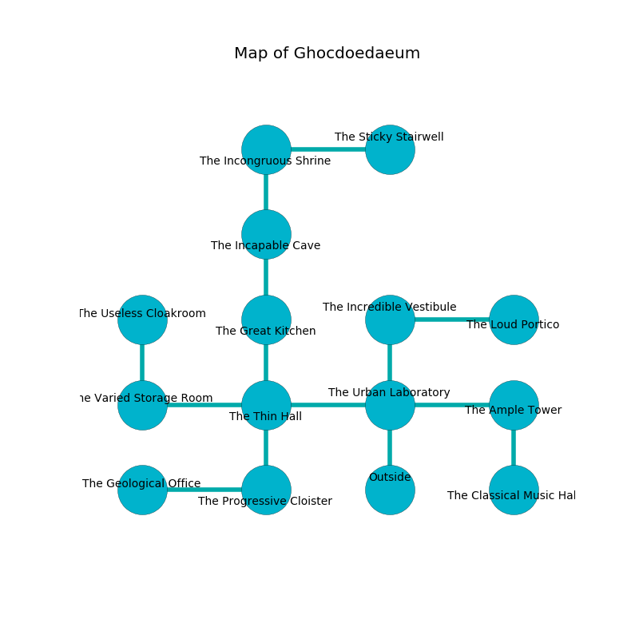

%Ruin Dogs

##Ghocdoedaeum
###Overview
Ghocdoedaeum is located in a haunted plain. Parts of Ghocdoedaeum are unbearably cold. The ruin is flooding. It is occupied by Yuan-Ti. Bert Barba The Grumpy, a Kuo-Toa Monitor is here. The Yuan-Ti worship Bert Barba The Grumpy. He  is trying to understand [Fabalwi](#Fabalwi). 

###Artifact
####Fabalwi

Fabalwi has the form of a mushy doll. It is a bright black color. When worn it changes probabilities. 

###Locations

####the urban laboratory
The floor is glossy. The air smells like absinthe here. Blue moss is swaying from the walls. 

* To the west a torchlit threshold opens to [the thin hall](#the-thin-hall).
* To the east a dark hallway connects to [the ample tower](#the-ample-tower).
* To the north a flooded walkway opens to [the incredible vestibule](#the-incredible-vestibule).
* To the south is the entrance.

####the ample tower
The floor is sticky. 

* To the west a dark hallway leads to [the urban laboratory](#the-urban-laboratory).
* To the south a dark hallway opens to [the classical music hall](#the-classical-music-hall).

####the thin hall

* There is a head here.
* To the west a small hall connects to [the varied storage room](#the-varied-storage-room).
* To the east a torchlit threshold connects to [the urban laboratory](#the-urban-laboratory).
* To the north a dripping corridor connects to [the great kitchen](#the-great-kitchen).
* To the south a narrow pathway leads to [the progressive cloister](#the-progressive-cloister).

####the incredible vestibule
The metallic walls are ruined. White razorgrass is growing in broken urns. 

* There is a scissors here.
* To the east a narrow path connects to [the loud portico](#the-loud-portico).
* To the south a flooded walkway connects to [the urban laboratory](#the-urban-laboratory).

####the classical music hall
The floor is cluttered with ashes. The air smells like myrrh here. 

There is an engraving on the ceiling written in common. 

> I am lost in Ghocdoedaeum.
>
> I tried running.
>

* To the north a dark hallway opens to [the ample tower](#the-ample-tower).

####the great kitchen
The concrete walls are bloodstained. Red moss is decaying in cracks in the floor. The air smells like cornmint here. There are a Sprite, a Veteran, a Flying Sword, and a Tridrone here. 

There is an engraving on a stone written in Yuan-Ti Script. 

> An ant is an unrest
>
> constructive, competitive, able
>
> you must be crystalized
>

* To the north a windy corridor leads to [the incapable cave](#the-incapable-cave).
* To the south a dripping corridor opens to [the thin hall](#the-thin-hall).

####the incapable cave
There is a trap here. When activated, a magical proximity detector will launch a blade. Green moss is decaying in a patch on the floor. 

* There is a plate here.
* To the north a small path leads to [the incongruous shrine](#the-incongruous-shrine).
* To the south a windy corridor leads to [the great kitchen](#the-great-kitchen).

####the progressive cloister
The floor is cluttered with bones. 

* There is a pendant here.
* To the west a hazy threshold opens to [the geological office](#the-geological-office).
* To the north a narrow pathway opens to [the thin hall](#the-thin-hall).

####the geological office
Blue mushrooms are decaying in a patch on the floor. The floor is sticky. The concrete walls are bloodstained. There is a Helmed Horror here. 

* To the east a hazy threshold leads to [the progressive cloister](#the-progressive-cloister).

####the varied storage room
There are two Yuan-Ti Malisons here. The obsidion walls are ruined. Blue mushrooms are growing in a patch on the floor. If the Yuan-Ti notice the Ruin Dogs, one of them will retreat and alert [Bert Barba](#Bert-Barba). 

* To the east a small hall opens to [the thin hall](#the-thin-hall).
* To the north a hazy cavern opens to [the useless cloakroom](#the-useless-cloakroom).

####the useless cloakroom
The mirrored walls are caving in. 

* To the south a hazy cavern connects to [the varied storage room](#the-varied-storage-room).

####the incongruous shrine
There are a Black Bear, a Spectator, a Swarm of Poisonous Snakes, and a Crab here. The floor is glossy. The air tastes like autumn here. 

* [Fabalwi](#Fabalwi) is here.
* [Bert Barba The Grumpy](#Bert-Barba-The-Grumpy) is here.
* To the east a twisted corridor connects to [the sticky stairwell](#the-sticky-stairwell).
* To the south a small path leads to [the incapable cave](#the-incapable-cave).

####the loud portico
There are a Plesiosaurus, a Silver Dragon Wyrmling, and a Jackalwere here. 

* To the west a narrow path leads to [the incredible vestibule](#the-incredible-vestibule).

####the sticky stairwell
The floor is flooded with one inch deep cold water. Yellow razorgrass is growing from the walls. 

* To the west a twisted corridor connects to [the incongruous shrine](#the-incongruous-shrine).

