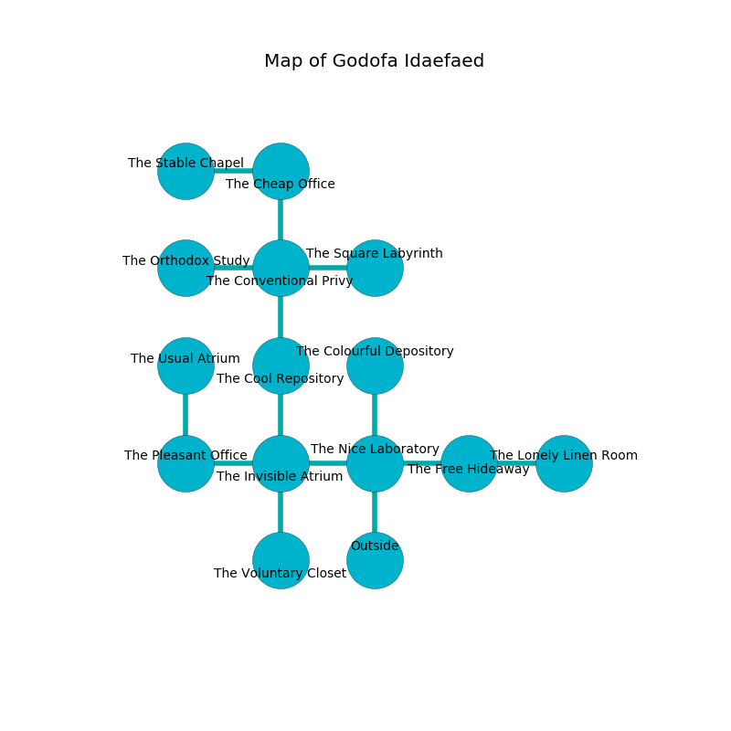

%Ruin Dogs

##Godofa Idaefaed
###Overview
Godofa Idaefaed is constructed on a volcanic rift. Some areas of it are incredibly hot. The ruin is burning. It is occupied by Sprites. Delcie Monk The Possessive, a Stone Giant is here. The Sprites are battling Delcie Monk The Possessive. She  is founding a new religion. 

###Artifact
####Bamo

Bamo is a powerful artifact in the shape of a broken spear. It is a bright red color. When worn it burns the mind. 

###Locations

####the nice laboratory
The air tastes like mimosa here. The floor is glossy. The stone walls are covered in mold. 

* To the west a narrow walkway leads to [the invisible atrium](#the-invisible-atrium).
* To the east a windy threshold leads to [the free hideaway](#the-free-hideaway).
* To the north a dripping hallway connects to [the colourful depository](#the-colourful-depository).
* To the south is the entrance.

####the colourful depository
There is a trap here. When activated, a magical proximity detector will launch a poison dart. Yellow ferns are swaying in broken urns. 

* There is a goat here.
* To the south a dripping hallway connects to [the nice laboratory](#the-nice-laboratory).

####the invisible atrium
The air smells like chicken here. Green moss is growing in broken urns. The floor is smooth. There is a trap here. When activated, a magical proximity detector will launch stone blocks from the ceiling. 

* To the west a dripping path leads to [the pleasant office](#the-pleasant-office).
* To the east a narrow walkway connects to [the nice laboratory](#the-nice-laboratory).
* To the north a dripping passageway opens to [the cool repository](#the-cool-repository).
* To the south a windy threshold leads to [the voluntary closet](#the-voluntary-closet).

####the cool repository
The air smells like elderberry here. The floor is sticky. White ferns are growing from the ceiling. 

* There is a chainmail here.
* There is a brooch here.
* To the north a dark passageway opens to [the conventional privy](#the-conventional-privy).
* To the south a dripping passageway leads to [the invisible atrium](#the-invisible-atrium).

####the pleasant office
There are a Giant Rat, a Plesiosaurus, a Monodrone, a Giant Owl, a Panther, a Slaad Tadpole, a Hobgoblin, a Troll, and a Bugbear Chief here. The air tastes like marzipan here. White moss is growing in a patch on the floor. The floor is sticky. 

* To the east a dripping path leads to [the invisible atrium](#the-invisible-atrium).
* To the north a small hallway connects to [the usual atrium](#the-usual-atrium).

####the conventional privy
The wooden walls are unsettled. Blue ferns are swaying in a patch on the floor. 

* [Bamo](#Bamo) is here.
* To the west a dark hall leads to [the orthodox study](#the-orthodox-study).
* To the east a small gap opens to [the square labyrinth](#the-square-labyrinth).
* To the north a dark opening opens to [the cheap office](#the-cheap-office).
* To the south a dark passageway connects to [the cool repository](#the-cool-repository).

####the orthodox study
The floor is sticky. There are a Centaur, a Cyclops, and a Jackalwere here. 

* To the east a dark hall leads to [the conventional privy](#the-conventional-privy).

####the voluntary closet
There are a Zombie, a Myconid Sprout, a Dire Wolf, a Ghast, an Ettin, and a Manes here. 

There is an engraving on the ceiling written in common. 

> Oh death is sadistic
>
> strange, confident, middle-class
>
> ever optimistic
>
> the world is last
>

* To the north a windy threshold connects to [the invisible atrium](#the-invisible-atrium).

####the cheap office
The metallic walls are scratched. The floor is flooded with two inch deep hot water. Green ferns are growing from the walls. The air smells like papaya here. There are a Doppelganger, an Incubus, a Giant Owl, a Druid, a Giant Hyena, and a Piercer here. 

* There is a bell here.
* To the west a twisted passageway leads to [the stable chapel](#the-stable-chapel).
* To the south a dark opening connects to [the conventional privy](#the-conventional-privy).

####the usual atrium
The air smells like mold here. The floor is bloodstained. There are a Scarecrow, a Myconid Sovereign, a Cultist, a Succubus, and an Animated Armor here. Gray razorgrass is decaying in broken urns. 

* To the south a small hallway opens to [the pleasant office](#the-pleasant-office).

####the free hideaway
Green moss is decaying in broken urns. 

* There is a salamander here.
* To the west a windy threshold connects to [the nice laboratory](#the-nice-laboratory).
* To the east a small cavern leads to [the lonely linen room](#the-lonely-linen-room).

####the stable chapel
The floor is smooth. The glass walls are caving in. 

There is an engraving on a monolith written in common. 

> O sorry we
>
> it is always cute
>
> hostile, privileged, free
>
> the world is acute
>

* To the east a twisted passageway opens to [the cheap office](#the-cheap-office).

####the lonely linen room
The floor is bloodstained. Yellow lichens are growing in cracks in the floor. 

* To the west a small cavern connects to [the free hideaway](#the-free-hideaway).

####the square labyrinth
The floor is flooded with seven inch deep cool water. The glass walls are unsettled. 

* [Delcie Monk The Possessive](#Delcie-Monk-The-Possessive) is here.
* To the west a small gap connects to [the conventional privy](#the-conventional-privy).

