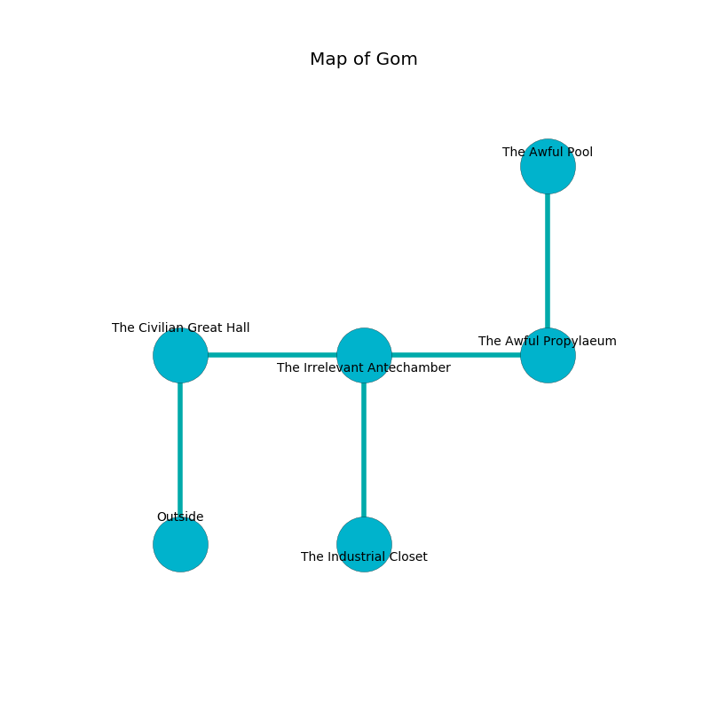

%Ruin Dogs

##Gom
###Overview
Gom is located on a broken city. Some areas of it are flooded. A blizzard is happening outside. It is occupied by Drows. Marlyn Bouchard The Inconsistent, a Priest is here. The Drows are ruled by Marlyn Bouchard The Inconsistent. She  is trying to hide [Foaem Omaedwi](#Foaem-Omaedwi). 

###Artifact
####Foaem Omaedwi

Foaem Omaedwi looks like a mushy blade. Power incinerates away from it. When picked up it turns surrounding objects to ashes. 

###Locations

####the civilian great hall
The metallic walls are caving in. 

There is an engraving on a monolith written in Drows Script. 

> I discovered [Foaem Omaedwi](#Foaem-Omaedwi).
>

* There is a spring here.
* [Marlyn Bouchard The Inconsistent](#Marlyn-Bouchard-The-Inconsistent) is here.
* To the east a long corridor connects to [the irrelevant antechamber](#the-irrelevant-antechamber).
* To the south is the entrance.

####the irrelevant antechamber
There are eight Drows here. The air smells like bell pepper here. Blue razorgrass is sprouting in a patch on the floor. The Drows are berserk with rage. 

* [Foaem Omaedwi](#Foaem-Omaedwi) is here.
* To the west a long corridor opens to [the civilian great hall](#the-civilian-great-hall).
* To the east a twisted threshold leads to [the awful propylaeum](#the-awful-propylaeum).
* To the south a torchlit passageway connects to [the industrial closet](#the-industrial-closet).

####the awful propylaeum
The air smells like currant here. The obsidion walls are ruined. Blue ferns are decaying in cracks in the floor. 

* To the west a twisted threshold connects to [the irrelevant antechamber](#the-irrelevant-antechamber).
* To the north a narrow gap leads to [the awful pool](#the-awful-pool).

####the awful pool
There are eight Drows here. If the Drows notice the Ruin Dogs, one of them will retreat and alert [Marlyn Bouchard](#Marlyn-Bouchard). 

There is an engraving on a monolith written in common. 

> Poor me! my fate is woe
>
> dependent, profound, retired
>
> tidy and slow
>
> sadness is tired
>

* There is a net here.
* To the south a narrow gap leads to [the awful propylaeum](#the-awful-propylaeum).

####the industrial closet
There are eight Drows here. The Drows are willing to negotiate. 

* There is a pot here.
* To the north a torchlit passageway connects to [the irrelevant antechamber](#the-irrelevant-antechamber).

