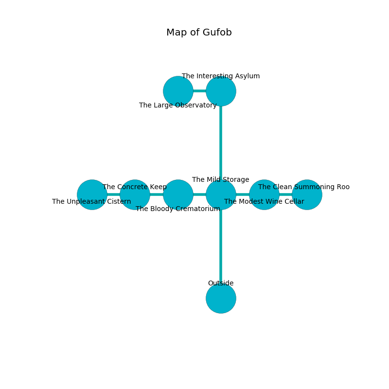

%Ruin Dogs

##Gufob
###Overview
Gufob is located on a giant tree. Regions of it are unbearably hot. A solar eclipse is happening outside. It is occupied by Dryads. Shanna Bullard The Vain, a Kuo-Toa Whip is here. The Dryads worship Shanna Bullard The Vain. She  is founding a new religion. 

###Artifact
####Cfaia

Cfaia is a powerful artifact in the shape of a cold meteorite. It is a dark purple color. It smells like absinthe. Water slides from it. When cradled it shows an image of the future. 

###Locations

####the mild storage
The concrete walls are covered in mold. The floor is glossy. The air tastes like powder here. 

There is an engraving on a tablet written in Dryads Script. 

> Leave now.
>

* To the west a narrow passageway opens to [the bloody crematorium](#the-bloody-crematorium).
* To the east a narrow cavern leads to [the modest wine cellar](#the-modest-wine-cellar).
* To the north a dark threshold leads to [the interesting asylum](#the-interesting-asylum).
* To the south is the entrance.

####the modest wine cellar
The floor is bloodstained. Green razorgrass is swaying from the walls. There are a Thug, a Tribal Warrior, and a Githzerai Monk here. The air tastes like tamarind here. 

There is an engraving on the ceiling written in common. 

> I could not try giving up.
>

* To the west a narrow cavern opens to [the mild storage](#the-mild-storage).
* To the east a torchlit passageway connects to [the clean summoning room](#the-clean-summoning-room).

####the interesting asylum
There are two Dryads here. Yellow mushrooms are decaying in cracks in the floor. The glass walls are pristine. One of the Dryads is on watch, the rest are caring for babies. 

There is an engraving on the ceiling written in common. 

> I thought about giving up.
>

* There is a triptych here.
* There is a kettle here.
* To the west a dripping pathway leads to [the large observatory](#the-large-observatory).
* To the south a dark threshold opens to [the mild storage](#the-mild-storage).

####the clean summoning room
The air smells like bread crust here. The wooden walls are ruined. 

* There is a wall here.
* To the west a torchlit passageway opens to [the modest wine cellar](#the-modest-wine-cellar).

####the large observatory
There are a Swarm of Rats, a Mimic, and a Magmin here. The air smells like avocado here. The stone walls are bloodstained. White moss is decaying in cracks in the floor. 

* There is a cart here.
* To the east a dripping pathway leads to [the interesting asylum](#the-interesting-asylum).

####the bloody crematorium
The air tastes like cocoa here. There are two Dryads here. The floor is sticky. If the Dryads notice the Ruin Dogs, one of them will retreat and alert the others. 

* To the west a torchlit walkway leads to [the concrete keep](#the-concrete-keep).
* To the east a narrow passageway connects to [the mild storage](#the-mild-storage).

####the concrete keep
Yellow mushrooms are sprouting in broken urns. The air tastes like lily of the valley here. The floor is smooth. The crystal walls are covered in mold. 

* [Cfaia](#Cfaia) is here.
* To the west a narrow corridor leads to [the unpleasant cistern](#the-unpleasant-cistern).
* To the east a torchlit walkway leads to [the bloody crematorium](#the-bloody-crematorium).

####the unpleasant cistern
The stone walls are ruined. Gray lichens are sprouting in cracks in the floor. 

* There is a map here.
* [Shanna Bullard The Vain](#Shanna-Bullard-The-Vain) is here.
* To the east a narrow corridor opens to [the concrete keep](#the-concrete-keep).

