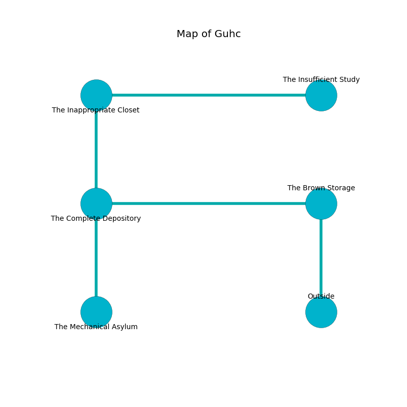

%Ruin Dogs

##Guhc
###Overview
Guhc is located in a crystal plain. Parts of it are frozen. The ruin is collapsing slowly. It is occupied by Kobolds. Jae Ferguson The Untidy, a Githyanki Warrior is here. The Kobolds have been charmed by Jae Ferguson The Untidy. He  is trying to steal [The Physical Disease](#The-Physical-Disease). 

###Artifact
####The Physical Disease

The Physical Disease has the form of an opaque gem. It is a shifting white color. Magic bends near it. When worn it ignites its surrroundings. 

###Locations

####the brown storage
White lichens are growing in cracks in the floor. There are a Banshee and a Giant Spider here. 

* To the west a dark artery leads to [the complete depository](#the-complete-depository).
* To the south is the entrance.

####the complete depository
There is a trap here. When activated, a pressure plate will make the walls close in. The air smells like lily of the valley here. 

* To the east a dark artery connects to [the brown storage](#the-brown-storage).
* To the north a torchlit opening opens to [the inappropriate closet](#the-inappropriate-closet).
* To the south a dark threshold leads to [the mechanical asylum](#the-mechanical-asylum).

####the inappropriate closet
The stone walls are scratched. Blue moss is decaying in cracks in the floor. 

* [The Physical Disease](#The-Physical-Disease) is here.
* To the east a twisted cave connects to [the insufficient study](#the-insufficient-study).
* To the south a torchlit opening opens to [the complete depository](#the-complete-depository).

####the mechanical asylum
Blue mushrooms are decaying from the walls. 

* To the north a dark threshold opens to [the complete depository](#the-complete-depository).

####the insufficient study
White moss is swaying from the walls. There are ten Winged Kobolds and twelve Kobolds here. If the Kobolds notice the Ruin Dogs, one of them will retreat and alert [Jae Ferguson](#Jae-Ferguson). 

* [Jae Ferguson The Untidy](#Jae-Ferguson-The-Untidy) is here.
* To the west a twisted cave leads to [the inappropriate closet](#the-inappropriate-closet).

