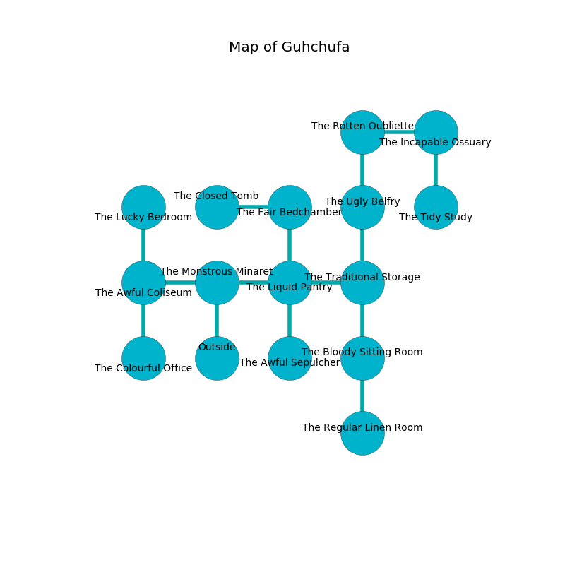

%Ruin Dogs

##Guhchufa
###Overview
Guhchufa is located in a crystal mountain. Regions of it are cursed. A lunar eclipse is happening outside. It is occupied by Satyrs. Pablo Herzog The Secretive, a Succubus is here. The Satyrs have been charmed by Pablo Herzog The Secretive. He  is trying to exploit [The Lively Course](#The-Lively-Course). 

###Artifact
####The Lively Course

The Lively Course is a powerful artifact in the shape of a transparent blade. It is a dark yellow color. It smells like animal. Water bends towards it. When worn it flies into the air. 

###Locations

####the monstrous minaret
Blue lichens are sprouting from the ceiling. The metallic walls are scratched. There is a Triceratops here. 

* To the west a dripping artery leads to [the awful coliseum](#the-awful-coliseum).
* To the east a flooded opening opens to [the liquid pantry](#the-liquid-pantry).
* To the south is the entrance.

####the liquid pantry
The glass walls are scratched. The air smells like truffle here. 

There is an engraving on the ceiling written in Satyrs Script. 

> A cushion is a carpet
>
> inner and solar
>
> but never mild
>
> [The Lively Course](#The-Lively-Course)
>
> sour, ready, typical
>
> ever superior
>
> you will be remembered
>

* There is a table here.
* There is a cow here.
* To the west a flooded opening leads to [the monstrous minaret](#the-monstrous-minaret).
* To the east a hazy hall connects to [the traditional storage](#the-traditional-storage).
* To the north a flooded cavern connects to [the fair bedchamber](#the-fair-bedchamber).
* To the south a dark cavern leads to [the awful sepulcher](#the-awful-sepulcher).

####the traditional storage
The floor is bloodstained. The brick walls are unsettled. There are a Duodrone, a Peryton, a Tiger, and a Troll here. The air tastes like allspice here. 

* [Pablo Herzog The Secretive](#Pablo-Herzog-The-Secretive) is here.
* To the west a hazy hall leads to [the liquid pantry](#the-liquid-pantry).
* To the north a narrow threshold leads to [the ugly belfry](#the-ugly-belfry).
* To the south a dark pathway opens to [the bloody sitting Room](#the-bloody-sitting-Room).

####the awful sepulcher
The floor is cluttered with broken glass. Yellow ferns are growing from the walls. The air tastes like old wood here. 

* There is a hook here.
* To the north a dark cavern connects to [the liquid pantry](#the-liquid-pantry).

####the bloody sitting Room
The floor is bloodstained. The air tastes like flesh here. There are a Hook Horror and a Gold Dragon Wyrmling here. 

There is an engraving on the wall written in Satyrs Script. 

> I discovered this place.
>
> I could not try jumping.
>

* To the north a dark pathway opens to [the traditional storage](#the-traditional-storage).
* To the south a long corridor leads to [the regular linen room](#the-regular-linen-room).

####the awful coliseum
The air smells like red apple here. The floor is bloodstained. 

* There is a lock here.
* To the east a dripping artery connects to [the monstrous minaret](#the-monstrous-minaret).
* To the north a flooded gap leads to [the lucky bedroom](#the-lucky-bedroom).
* To the south a long gap opens to [the colourful office](#the-colourful-office).

####the ugly belfry
There are ten Satyrs here. The air tastes like moss here. One of the Satyrs is pointing a ballista at the entrance. 

There is an engraving on the ceiling written in Satyrs Script. 

> I am worshipping Guhchufa.
>
> Leave now.
>

* To the north a small cave leads to [the rotten oubliette](#the-rotten-oubliette).
* To the south a narrow threshold leads to [the traditional storage](#the-traditional-storage).

####the regular linen room
There are ten Satyrs here. The metallic walls are scratched. The air smells like chemicals here. The Satyrs are sleeping. 

* There is a tome here.
* To the north a long corridor leads to [the bloody sitting Room](#the-bloody-sitting-Room).

####the fair bedchamber
The wooden walls are ruined. 

There is an engraving on the floor written in Satyrs Script. 

> A pump is a powder
>
> slow and talented
>

* To the west a windy gap opens to [the closed tomb](#the-closed-tomb).
* To the south a flooded cavern leads to [the liquid pantry](#the-liquid-pantry).

####the rotten oubliette
The air tastes like grapefruit here. Yellow lichens are decaying in broken urns. The floor is bloodstained. The mirrored walls are unsettled. 

* To the east a hazy pathway connects to [the incapable ossuary](#the-incapable-ossuary).
* To the south a small cave leads to [the ugly belfry](#the-ugly-belfry).

####the lucky bedroom

* To the south a flooded gap leads to [the awful coliseum](#the-awful-coliseum).

####the incapable ossuary
Red lichens are decaying from the walls. There are ten Satyrs here. The mirrored walls are pristine. The air tastes like cherry here. The Satyrs are willing to negotiate. 

* [The Lively Course](#The-Lively-Course) is here.
* To the west a hazy pathway connects to [the rotten oubliette](#the-rotten-oubliette).
* To the south a long hall opens to [the tidy study](#the-tidy-study).

####the closed tomb
There are ten Satyrs here. The stone walls are covered in mold. Green mushrooms are swaying in cracks in the floor. The Satyrs are willing to negotiate. 

There is an engraving on a tablet written in Satyrs Script. 

> I tried digging.
>

* To the east a windy gap connects to [the fair bedchamber](#the-fair-bedchamber).

####the colourful office
Red mushrooms are decaying from the ceiling. The floor is smooth. The air tastes like barley here. The mirrored walls are bloodstained. There are a Mud Mephit, a Ghast, a Minotaur, a Noble, a Jackalwere, a Panther, an Axe Beak, and a Brass Dragon Wyrmling here. 

* To the north a long gap connects to [the awful coliseum](#the-awful-coliseum).

####the tidy study
The floor is sticky. The stone walls are covered in mold. 

There is an engraving on the floor written in common. 

> I am lost in Guhchufa.
>

* To the north a long hall opens to [the incapable ossuary](#the-incapable-ossuary).

