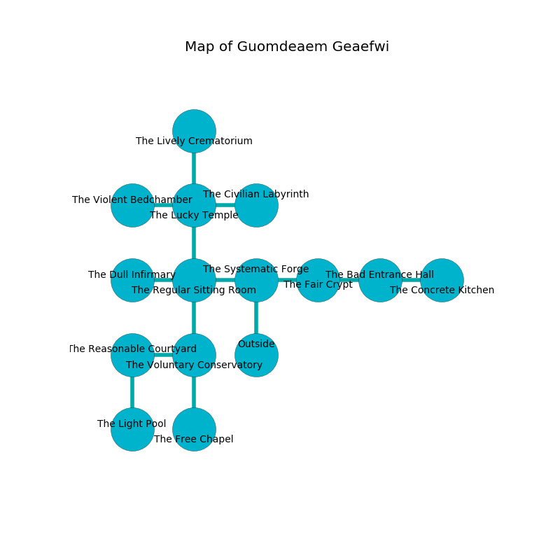

%Ruin Dogs

##Guomdeaem Geaefwi
###Overview
Guomdeaem Geaefwi is constructed on a cursed rift. Some rooms of it are incredibly hot. A blizzard is happening outside. It is occupied by Kenku. Cherly Winfrey The Possessive, a Cloud Giant is here. The Kenku have been charmed by Cherly Winfrey The Possessive. She  is founding a new religion. 

###Artifact
####Eluafdaeiaemh Eolaeamca

Eluafdaeiaemh Eolaeamca looks like a hard amulet. It smells like fennel. Water slips from it. When eaten it becomes hot. 

###Locations

####the systematic forge
There is a trap here. When activated, a tripwire will collapse a wall. The floor is sticky. 

* There is a drawer here.
* There is a stocking here.
* To the west a long path connects to [the regular sitting Room](#the-regular-sitting-Room).
* To the east a dark passageway connects to [the fair crypt](#the-fair-crypt).
* To the south is the entrance.

####the regular sitting Room
The floor is sticky. The air smells like bacon here. The brick walls are scratched. 

* There is a breastplate here.
* To the west a narrow opening opens to [the dull infirmary](#the-dull-infirmary).
* To the east a long path opens to [the systematic forge](#the-systematic-forge).
* To the north a hazy corridor connects to [the lucky temple](#the-lucky-temple).
* To the south a dark pathway leads to [the voluntary conservatory](#the-voluntary-conservatory).

####the lucky temple
The mirrored walls are bloodstained. The floor is bloodstained. 

There is an engraving on a stone written in common. 

> Poor me! the world is sadistic
>
> critical and bare
>
> it is never characteristic
>
> the world is fair
>

* There is a horse here.
* There is a fly here.
* To the west a small cavern leads to [the violent bedchamber](#the-violent-bedchamber).
* To the east a small threshold connects to [the civilian labyrinth](#the-civilian-labyrinth).
* To the north a flooded passageway leads to [the lively crematorium](#the-lively-crematorium).
* To the south a hazy corridor connects to [the regular sitting Room](#the-regular-sitting-Room).

####the voluntary conservatory
Blue razorgrass is sprouting in a patch on the floor. The floor is flooded with six inch deep lukewarm water. The air smells like capers here. There are a Lion, a Noble, a Kenku, a Twig Blight, a Steam Mephit, a Quadrone, and a Mind Flayer here. The obsidion walls are caving in. 

* [Eluafdaeiaemh Eolaeamca](#Eluafdaeiaemh-Eolaeamca) is here.
* [Cherly Winfrey The Possessive](#Cherly-Winfrey-The-Possessive) is here.
* To the west a long walkway leads to [the reasonable courtyard](#the-reasonable-courtyard).
* To the north a dark pathway opens to [the regular sitting Room](#the-regular-sitting-Room).
* To the south a small cavern opens to [the free chapel](#the-free-chapel).

####the civilian labyrinth
There is a trap here. When activated, a tripwire will fire an acid arrow. There are a Half-Ogre and a Young Bronze Dragon here. The air smells like roasted hazelnut here. White mushrooms are decaying from the walls. 

* To the west a small threshold opens to [the lucky temple](#the-lucky-temple).

####the fair crypt
The air smells like turmeric here. 

There is an engraving on a stone written in Kenku Script. 

> Dear me! weak you
>
> it is always due
>
> it is always structural
>
> hope is due
>

* To the west a dark passageway leads to [the systematic forge](#the-systematic-forge).
* To the east a dark cave opens to [the bad entrance hall](#the-bad-entrance-hall).

####the lively crematorium
The mirrored walls are ruined. There is a trap here. When activated, a pressure plate will launch stone blocks from the ceiling. 

* To the south a flooded passageway opens to [the lucky temple](#the-lucky-temple).

####the bad entrance hall
The floor is smooth. The crystal walls are pristine. The air smells like tea here. 

* To the west a dark cave opens to [the fair crypt](#the-fair-crypt).
* To the east a dark gap connects to [the concrete kitchen](#the-concrete-kitchen).

####the dull infirmary
Red mushrooms are sprouting from the ceiling. The floor is flooded with five inch deep hot water. The air tastes like curry here. 

* There is a horse here.
* There is a bird here.
* To the east a narrow opening leads to [the regular sitting Room](#the-regular-sitting-Room).

####the concrete kitchen
The floor is sticky. There are a Kuo-Toa Monitor, a Black Dragon Wyrmling, a Kobold, and a Werebear here. The air smells like acrylate here. 

There is an engraving on the ceiling written in common. 

> Maybe try fighting.
>

* There is a casket here.
* To the west a dark gap leads to [the bad entrance hall](#the-bad-entrance-hall).

####the reasonable courtyard
Yellow mushrooms are growing from the walls. The mirrored walls are caving in. The floor is sticky. There is a trap here. When activated, a magical sound detector will make the ceiling slowly lower. 

* There is a leprechaun here.
* To the east a long walkway opens to [the voluntary conservatory](#the-voluntary-conservatory).
* To the south a windy cavern connects to [the light pool](#the-light-pool).

####the light pool
White lichens are growing in cracks in the floor. 

* To the north a windy cavern connects to [the reasonable courtyard](#the-reasonable-courtyard).

####the violent bedchamber
White mushrooms are sprouting from the ceiling. 

* There is a pot here.
* To the east a small cavern connects to [the lucky temple](#the-lucky-temple).

####the free chapel
The air smells like freesia here. There are thirty six Kenkus here. The brick walls are covered in mold. One of the Kenku is on watch, the rest are fighting amongst themselves. 

* To the north a small cavern leads to [the voluntary conservatory](#the-voluntary-conservatory).

