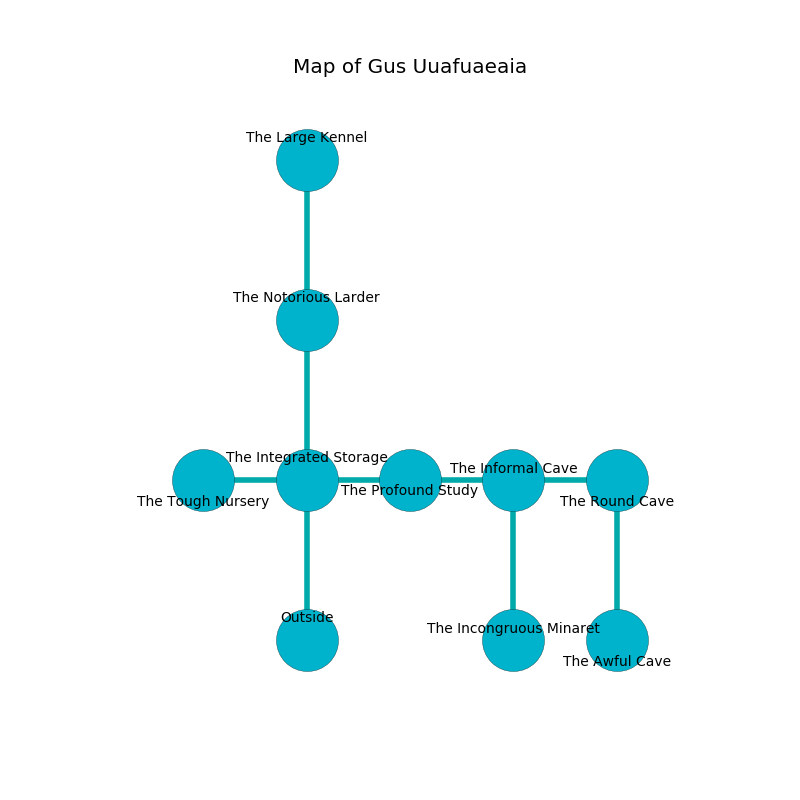

%Ruin Dogs

##Gus Uuafuaeaia
###Overview
Gus Uuafuaeaia is located under a broken mountain. Regions of it are cursed. A windstorm is happening outside. It is occupied by Kenku. Stephan Calvert The Flirtatious, a Fire Giant is here. The Kenku are the soldiers of Stephan Calvert The Flirtatious. He  is founding a new religion. 

###Artifact
####Madmaia

Madmaia is a powerful artifact in the shape of a warm sphere. It is a medium pink color. Magic shifts away from it. When thrown it glows with an eerie light. 

###Locations

####the integrated storage
The air tastes like gravy here. Red lichens are sprouting in cracks in the floor. There are a Fomorian, a Young Green Dragon, and a Flying Snake here. 

* [Madmaia](#Madmaia) is here.
* [Stephan Calvert The Flirtatious](#Stephan-Calvert-The-Flirtatious) is here.
* To the west a windy passageway opens to [the tough nursery](#the-tough-nursery).
* To the east a hazy pathway leads to [the profound study](#the-profound-study).
* To the north a narrow hallway opens to [the notorious larder](#the-notorious-larder).
* To the south is the entrance.

####the notorious larder
The air tastes like petroleum here. There are forty Kenkus here. The floor is sticky. The Kenku are performing a ritual. If not interrupted, a powerful monster will be summoned. 

* To the north a flooded pathway leads to [the large kennel](#the-large-kennel).
* To the south a narrow hallway connects to [the integrated storage](#the-integrated-storage).

####the profound study
There is a trap here. When activated, a tripwire will collapse a column. The floor is cluttered with debris. White lichens are sprouting in broken urns. There are a Werebear, an Awakened Shrub, an Owl, and a Cambion here. The brick walls are ruined. 

* To the west a hazy pathway connects to [the integrated storage](#the-integrated-storage).
* To the east a small artery leads to [the informal cave](#the-informal-cave).

####the informal cave
The floor is smooth. Yellow mushrooms are sprouting from the walls. 

There is an engraving on the ceiling written in Kenku Script. 

> O dire we
>
> brave, satisfied, free
>
> always obscure
>
> cruelty is premature
>

* To the west a small artery connects to [the profound study](#the-profound-study).
* To the east a torchlit gap opens to [the round cave](#the-round-cave).
* To the south a dark gap opens to [the incongruous minaret](#the-incongruous-minaret).

####the incongruous minaret
The floor is bloodstained. 

There is an engraving on a monolith written in Kenku Script. 

> We are maddened
>
> dull and careful
>
> you shall be loved
>

* To the north a dark gap connects to [the informal cave](#the-informal-cave).

####the round cave
The air tastes like egg nog here. There are forty Kenkus here. Yellow lichens are decaying in broken urns. The Kenku are crazy with bloodlust. 

* There is a match here.
* There is a sword here.
* To the west a torchlit gap connects to [the informal cave](#the-informal-cave).
* To the south a dripping passageway leads to [the awful cave](#the-awful-cave).

####the awful cave
The floor is cluttered with ashes. There are a Drow, a Frog, a Mastiff, a Fomorian, a Mummy, a Wolf, an Awakened Shrub, a Giant fire beetle, and a Camel here. The air smells like styrene here. The stone walls are bloodstained. 

* To the north a dripping passageway leads to [the round cave](#the-round-cave).

####the large kennel
The concrete walls are caving in. There are forty Kenkus here. The air smells like huckleberry here. The Kenku are willing to fight to the death. 

* To the south a flooded pathway leads to [the notorious larder](#the-notorious-larder).

####the tough nursery
Yellow moss is swaying in cracks in the floor. The air smells like origanum here. There are a Red Slaad, a Lizard King, a Monodrone, and a Brown Bear here. 

* To the east a windy passageway connects to [the integrated storage](#the-integrated-storage).

