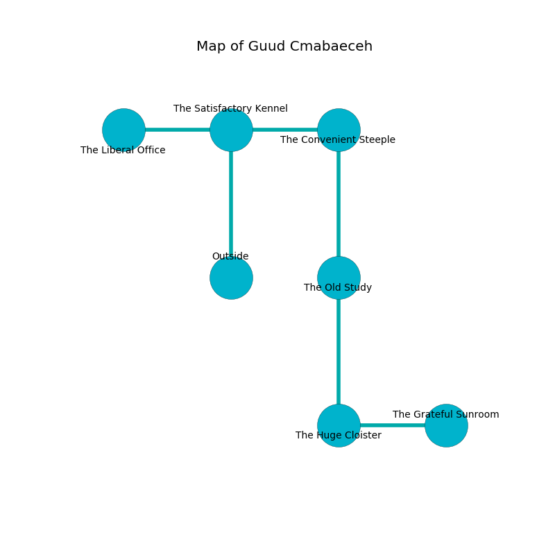

%Ruin Dogs

##Guud Cmabaeceh
###Overview
Guud Cmabaeceh is constructed on a giant mountain. Parts of it are inaccessible. The ruin is collapsing slowly. It is occupied by Sprites. Rob Sperry The Ruthless, a Thri-Kreen is here. The Sprites are the soldiers of Rob Sperry The Ruthless. He  is founding a new religion. 

###Artifact
####The Paralyzed Clearance

The Paralyzed Clearance has the form of a glassy doll. When smelled it levitates surrounding objects. 

###Locations

####the satisfactory kennel
The air tastes like melon here. There are eight Sprites here. The Sprites are defending this room from intruders. 

* To the west a narrow threshold opens to [the liberal office](#the-liberal-office).
* To the east a dark path leads to [the convenient steeple](#the-convenient-steeple).
* To the south is the entrance.

####the liberal office
The floor is glossy. The air smells like herbs here. Yellow ferns are growing in cracks in the floor. There are eight Sprites here. The Sprites are willing to negotiate. 

* [Rob Sperry The Ruthless](#Rob-Sperry-The-Ruthless) is here.
* To the east a narrow threshold opens to [the satisfactory kennel](#the-satisfactory-kennel).

####the convenient steeple
The concrete walls are pristine. There are eight Sprites here. The floor is sticky. The air tastes like tobacco here. One of the Sprites is working a mechanism that can lock the exits. 

* To the west a dark path connects to [the satisfactory kennel](#the-satisfactory-kennel).
* To the south a windy artery connects to [the old study](#the-old-study).

####the old study
There are eight Sprites here. The floor is sticky. The air tastes like nut flesh here. Green lichens are sprouting from the walls. The Sprites are performing a ritual. If not interrupted, the ruin dogs will be weakened. 

* To the north a windy artery opens to [the convenient steeple](#the-convenient-steeple).
* To the south a dark artery connects to [the huge cloister](#the-huge-cloister).

####the huge cloister
The air tastes like dairy here. The floor is flooded with eight inch deep cool water. There are eight Sprites here. The mirrored walls are unsettled. One of the Sprites is on watch, the rest are feasting. 

* [The Paralyzed Clearance](#The-Paralyzed-Clearance) is here.
* To the east a hazy walkway connects to [the grateful sunroom](#the-grateful-sunroom).
* To the north a dark artery opens to [the old study](#the-old-study).

####the grateful sunroom
There are eight Sprites here. The mirrored walls are pristine. The air smells like carrot here. White razorgrass is sprouting in broken urns. The floor is sticky. If the Sprites notice the Ruin Dogs, one of them will retreat and alert the others. 

* To the west a hazy walkway opens to [the huge cloister](#the-huge-cloister).

