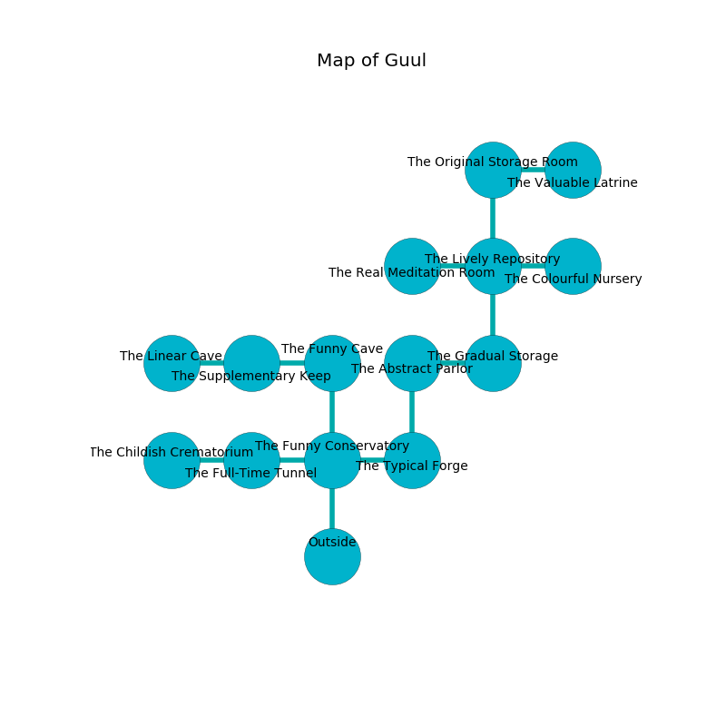

%Ruin Dogs

##Guul
###Overview
Guul is located under a flooded rift. Regions of Guul are foggy. The ruin is larger on the inside than the outside. It is occupied by Sprites. Rosann Andrade The Patronizing, a Duergar is here. The Sprites are battling Rosann Andrade The Patronizing. She  is founding a new religion. 

###Artifact
####The Broken Tension

The Broken Tension is a powerful artifact in the shape of a mushy meteorite. It smells like incense. Light glows from it. When touched it liquifies. 

###Locations

####the funny conservatory
The glass walls are bloodstained. There are a Darkmantle, a Swarm of Bats, a Giant Frog, a Giant Toad, a Smoke Mephit, a Baboon, and a Deer here. Green lichens are sprouting from the walls. 

* To the west a dark cave opens to [the full-time tunnel](#the-full-time-tunnel).
* To the east a dripping passageway connects to [the typical forge](#the-typical-forge).
* To the north a small walkway connects to [the funny cave](#the-funny-cave).
* To the south is the entrance.

####the typical forge
The air smells like cream here. The floor is smooth. The crystal walls are bloodstained. 

* [Rosann Andrade The Patronizing](#Rosann-Andrade-The-Patronizing) is here.
* To the west a dripping passageway opens to [the funny conservatory](#the-funny-conservatory).
* To the north a torchlit pathway leads to [the abstract parlor](#the-abstract-parlor).

####the abstract parlor
Gray lichens are sprouting in broken urns. There are eight Sprites here. The Sprites are performing a ritual. If not interrupted, the Sprites will become more powerful. 

* There is a nut here.
* There is a girl here.
* There is a bird here.
* There is a bowl here.
* There is a ring here.
* To the east a hazy corridor leads to [the gradual storage](#the-gradual-storage).
* To the south a torchlit pathway opens to [the typical forge](#the-typical-forge).

####the funny cave
Gray razorgrass is swaying from the ceiling. 

* To the west a hazy corridor opens to [the supplementary keep](#the-supplementary-keep).
* To the south a small walkway connects to [the funny conservatory](#the-funny-conservatory).

####the full-time tunnel
The mirrored walls are bloodstained. The floor is sticky. There are a Goblin and a Bandit Captain here. 

* To the west a twisted hall opens to [the childish crematorium](#the-childish-crematorium).
* To the east a dark cave leads to [the funny conservatory](#the-funny-conservatory).

####the gradual storage
The brick walls are pristine. There are eight Sprites here. White mushrooms are growing from the ceiling. There is a trap here. When activated, a pressure plate will make the ceiling slowly lower. The Sprites are defending this room from intruders. 

* To the west a hazy corridor opens to [the abstract parlor](#the-abstract-parlor).
* To the north a windy hallway opens to [the lively repository](#the-lively-repository).

####the lively repository
The floor is cluttered with bones. The metallic walls are scratched. 

* To the west a long artery connects to [the real meditation room](#the-real-meditation-room).
* To the east a dark pathway opens to [the colourful nursery](#the-colourful-nursery).
* To the north a torchlit pathway opens to [the original storage room](#the-original-storage-room).
* To the south a windy hallway opens to [the gradual storage](#the-gradual-storage).

####the supplementary keep
Gray razorgrass is swaying from the ceiling. There are an Ape and a Green Dragon Wyrmling here. The floor is flooded with one inch deep scalding water. 

* To the west a small pathway leads to [the linear cave](#the-linear-cave).
* To the east a hazy corridor opens to [the funny cave](#the-funny-cave).

####the original storage room
There is a Priest here. The air smells like black tea here. The floor is bloodstained. The wooden walls are scratched. 

* [The Broken Tension](#The-Broken-Tension) is here.
* To the east a torchlit opening leads to [the valuable latrine](#the-valuable-latrine).
* To the south a torchlit pathway opens to [the lively repository](#the-lively-repository).

####the childish crematorium

* To the east a twisted hall opens to [the full-time tunnel](#the-full-time-tunnel).

####the colourful nursery
The obsidion walls are covered in mold. 

* To the west a dark pathway leads to [the lively repository](#the-lively-repository).

####the linear cave
There is a trap here. When activated, a tripwire will launch a fusillade of darts. There are eight Sprites here. The floor is bloodstained. The Sprites are defending this room from intruders. 

* To the east a small pathway connects to [the supplementary keep](#the-supplementary-keep).

####the real meditation room
The floor is bloodstained. There are a Giant Wolf Spider, a Yuan-Ti Pureblood, a Panther, a Gray Ooze, and an Owl here. Yellow ferns are swaying from the walls. The air smells like moss here. 

* To the east a long artery connects to [the lively repository](#the-lively-repository).

####the valuable latrine
The air smells like macadamia here. There are a Copper Dragon Wyrmling, a Warhorse Skeleton, a Bandit Captain, and a Pixie here. The floor is flooded with nine inch deep cold water. 

* There is a brain here.
* To the west a torchlit opening connects to [the original storage room](#the-original-storage-room).

