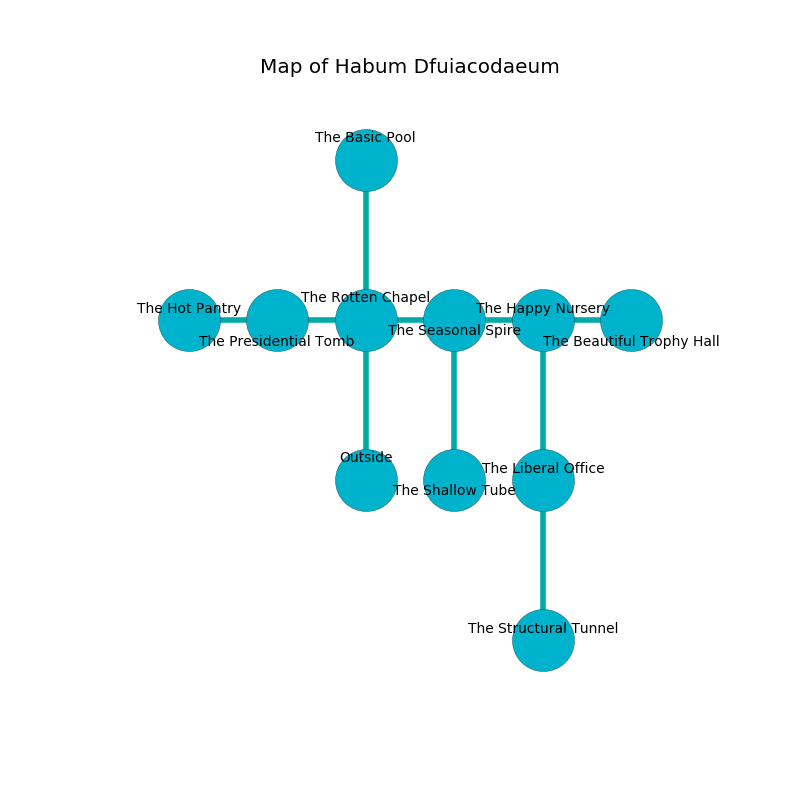

%Ruin Dogs

##Habum Dfuiacodaeum
###Overview
Habum Dfuiacodaeum is located on an alien plain. Regions of it are foggy. The ruin is sinking into the earth. It is occupied by Orcs. Cesar Ochs The Thoughtless, a Mind Flayer Arcanist is here. The Orcs worship Cesar Ochs The Thoughtless. He  is trying to steal [Deddha Babufemlob](#Deddha-Babufemlob). 

###Artifact
####Deddha Babufemlob

Deddha Babufemlob is a powerful artifact in the shape of a transparent gem. Cacophony bends around it. When gazed upon it frightens children. 

###Locations

####the rotten chapel
The air smells like orris here. There are an Orc War Chief and three Orc Eyes of Gruumsh here. The floor is glossy. The Orcs are willing to fight to the death. 

* To the west a dark hall opens to [the presidential tomb](#the-presidential-tomb).
* To the east a long passageway opens to [the seasonal spire](#the-seasonal-spire).
* To the north a long passageway connects to [the basic pool](#the-basic-pool).
* To the south is the entrance.

####the seasonal spire
The glass walls are unsettled. Gray mushrooms are decaying in cracks in the floor. There are an Orc War Chief and three Orc Eyes of Gruumsh here. If the Orcs notice the Ruin Dogs, one of them will retreat and alert the others. 

* To the west a long passageway opens to [the rotten chapel](#the-rotten-chapel).
* To the east a dripping gap leads to [the happy nursery](#the-happy-nursery).
* To the south a twisted threshold leads to [the shallow tube](#the-shallow-tube).

####the shallow tube
There are an Incubus and an Oni here. The air smells like melon here. 

There is an engraving on the floor written in common. 

> Oh my! sad you
>
> visual and direct
>
> considerable, vague, new
>
> everything is perfect
>

* To the north a twisted threshold connects to [the seasonal spire](#the-seasonal-spire).

####the happy nursery
Gray ferns are growing in cracks in the floor. 

* There is a triptych here.
* To the west a dripping gap leads to [the seasonal spire](#the-seasonal-spire).
* To the east a dripping walkway leads to [the beautiful trophy hall](#the-beautiful-trophy-hall).
* To the south a dripping hall connects to [the liberal office](#the-liberal-office).

####the presidential tomb
Gray moss is swaying in cracks in the floor. There are a Grick Alpha and a Wereboar here. The air tastes like violet leaf here. 

* [Deddha Babufemlob](#Deddha-Babufemlob) is here.
* To the west a narrow opening leads to [the hot pantry](#the-hot-pantry).
* To the east a dark hall connects to [the rotten chapel](#the-rotten-chapel).

####the liberal office
Blue lichens are sprouting from the ceiling. 

* To the north a dripping hall leads to [the happy nursery](#the-happy-nursery).
* To the south a long pathway connects to [the structural tunnel](#the-structural-tunnel).

####the structural tunnel
The air smells like spice here. There are a Giant Ape and a Quaggoth here. The floor is cluttered with bones. The brick walls are pristine. 

* [Cesar Ochs The Thoughtless](#Cesar-Ochs-The-Thoughtless) is here.
* To the north a long pathway opens to [the liberal office](#the-liberal-office).

####the basic pool
The floor is smooth. 

* To the south a long passageway connects to [the rotten chapel](#the-rotten-chapel).

####the beautiful trophy hall
The air tastes like corn here. 

* To the west a dripping walkway connects to [the happy nursery](#the-happy-nursery).

####the hot pantry
The air smells like flowers here. 

There is an engraving on a tablet written in common. 

> Poor me! cruel soul
>
> it is never due
>
> ever whole
>
> death is true
>

* There is a bee here.
* To the east a narrow opening leads to [the presidential tomb](#the-presidential-tomb).

