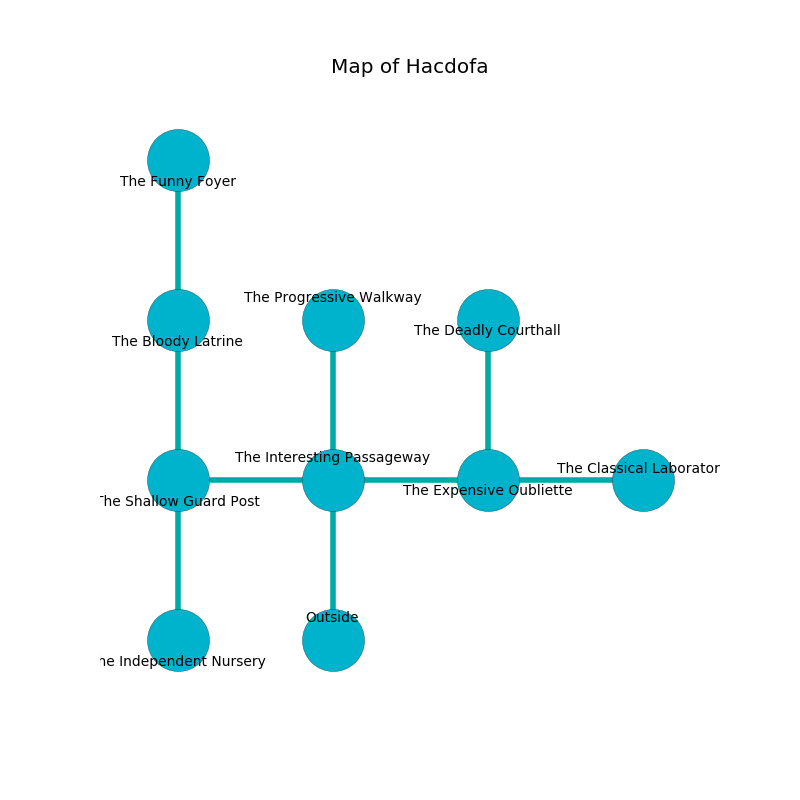

%Ruin Dogs

##Hacdofa
###Overview
Hacdofa is located under a cursed mountain. Some rooms of Hacdofa are cursed. A massive flood is happening outside. It is occupied by Kuo-Toa. Chelsey Sheppard The Bone-Idle, a Kuo-Toa Monitor is here. The Kuo-Toa are battling Chelsey Sheppard The Bone-Idle. She  is founding a new religion. 

###Artifact
####The Hilarious Inflation

The Hilarious Inflation is a powerful artifact in the shape of a transparent amulet. It is a shifting gray color. When touched it floats above the ground. 

###Locations

####the interesting passageway
Red ferns are growing in broken urns. The air tastes like oak wood here. 

* To the west a dripping threshold connects to [the shallow guard post](#the-shallow-guard-post).
* To the east a hazy threshold connects to [the expensive oubliette](#the-expensive-oubliette).
* To the north a dripping artery connects to [the progressive walkway](#the-progressive-walkway).
* To the south is the entrance.

####the expensive oubliette
The mirrored walls are scratched. 

There is an engraving on a stone written in Kuo-Toa Script. 

> I tried praying.
>

* [The Hilarious Inflation](#The-Hilarious-Inflation) is here.
* To the west a hazy threshold leads to [the interesting passageway](#the-interesting-passageway).
* To the east a dripping opening connects to [the classical laboratory](#the-classical-laboratory).
* To the north a windy passageway leads to [the deadly courthall](#the-deadly-courthall).

####the shallow guard post
There are a Sprite, a Gnoll, a Raven, an Old Faerie Dragon, and a Werewolf here. The glass walls are ruined. 

* To the east a dripping threshold leads to [the interesting passageway](#the-interesting-passageway).
* To the north a dripping cavern leads to [the bloody latrine](#the-bloody-latrine).
* To the south a windy gap connects to [the independent nursery](#the-independent-nursery).

####the bloody latrine
The air tastes like basil here. The floor is sticky. 

* To the north a windy walkway opens to [the funny foyer](#the-funny-foyer).
* To the south a dripping cavern opens to [the shallow guard post](#the-shallow-guard-post).

####the independent nursery
The floor is cluttered with rocks. Green moss is sprouting from the ceiling. 

* [Chelsey Sheppard The Bone-Idle](#Chelsey-Sheppard-The-Bone-Idle) is here.
* To the north a windy gap opens to [the shallow guard post](#the-shallow-guard-post).

####the progressive walkway
The crystal walls are ruined. Blue mushrooms are sprouting from the walls. The floor is flooded with four inch deep hot water. 

* To the south a dripping artery connects to [the interesting passageway](#the-interesting-passageway).

####the funny foyer
White ferns are swaying in broken urns. The floor is glossy. The metallic walls are bloodstained. 

* There is a bucket here.
* To the south a windy walkway opens to [the bloody latrine](#the-bloody-latrine).

####the deadly courthall
The air tastes like must here. The crystal walls are caving in. The floor is glossy. Gray ferns are swaying in cracks in the floor. 

* To the south a windy passageway leads to [the expensive oubliette](#the-expensive-oubliette).

####the classical laboratory
The air smells like nasturtium here. 

* To the west a dripping opening connects to [the expensive oubliette](#the-expensive-oubliette).

