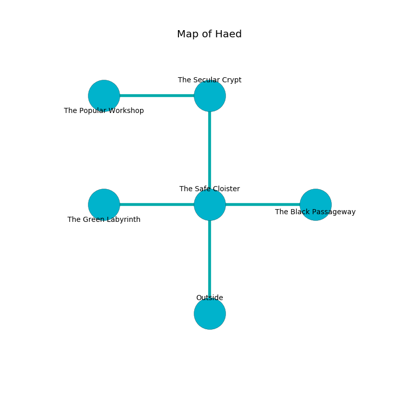

%Ruin Dogs

##Haed
###Overview
Haed is located in a broken mountain. Some rooms of it are corrupted. A lunar eclipse is happening outside. It is occupied by Myconids. Greg Ernst The Mean, a Kuo-Toa Archpriest is here. The Myconids have been charmed by Greg Ernst The Mean. He  is founding a new religion. 

###Artifact
####Daeb Wiaef

Daeb Wiaef looks like an opaque crystal. It is a pale green color. When smelled it floats in the air. 

###Locations

####the safe cloister
The mirrored walls are caving in. The floor is bloodstained. Gray mushrooms are swaying from the walls. 

* [Daeb Wiaef](#Daeb-Wiaef) is here.
* [Greg Ernst The Mean](#Greg-Ernst-The-Mean) is here.
* To the west a small passageway connects to [the green labyrinth](#the-green-labyrinth).
* To the east a small hallway leads to [the black passageway](#the-black-passageway).
* To the north a flooded gap opens to [the secular crypt](#the-secular-crypt).
* To the south is the entrance.

####the secular crypt
Blue moss is growing in a patch on the floor. The air tastes like coriander here. The stone walls are unsettled. 

* To the west a torchlit walkway opens to [the popular workshop](#the-popular-workshop).
* To the south a flooded gap leads to [the safe cloister](#the-safe-cloister).

####the popular workshop
The floor is sticky. Gray ferns are decaying from the walls. There are a Githzerai Zerth, a Lemure, a Bone Naga, and an Owl here. 

* There is a dagger here.
* There is a rowboat here.
* To the east a torchlit walkway connects to [the secular crypt](#the-secular-crypt).

####the black passageway
Green ferns are growing in cracks in the floor. The air smells like starch here. The floor is bloodstained. The metallic walls are bloodstained. 

* To the west a small hallway connects to [the safe cloister](#the-safe-cloister).

####the green labyrinth
There is a trap here. When activated, a pressure plate will collapse a wall. 

* There is a cheese here.
* To the east a small passageway connects to [the safe cloister](#the-safe-cloister).

