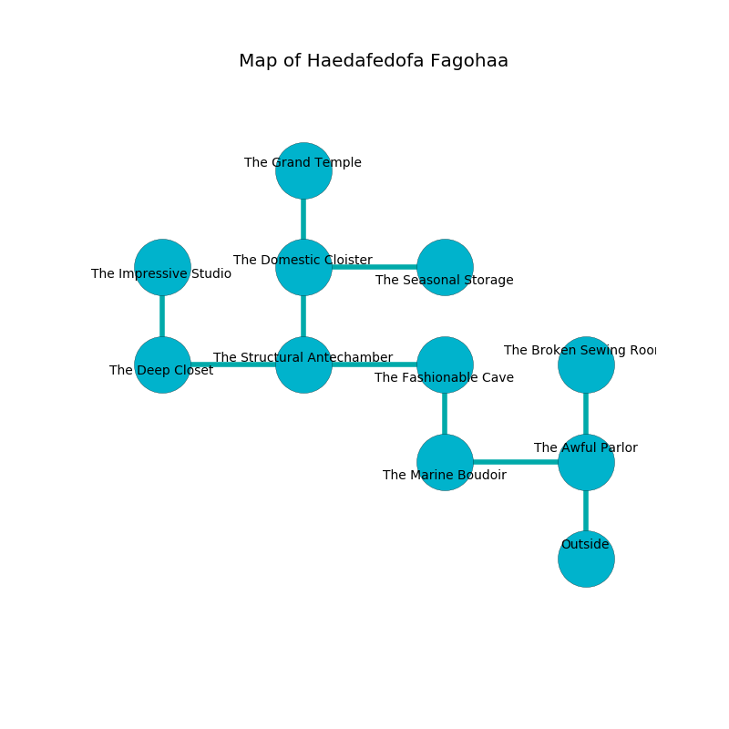

%Ruin Dogs

##Haedafedofa Fagohaa
###Overview
Haedafedofa Fagohaa is located in a cursed city. Some areas of Haedafedofa Fagohaa are flooded. A battle between raiders is happening outside. It is occupied by Goblins. Joe Mcrae The Impulsive, a Bandit is here. The Goblins have been charmed by Joe Mcrae The Impulsive. He  is trying to understand [Dhewiaf](#Dhewiaf). 

###Artifact
####Dhewiaf

Dhewiaf looks like an opaque sphere. It is a bright purple color. It smells like chicken. When thrown it floats above the ground. 

###Locations

####the awful parlor
The air smells like naphthyl here. 

* To the west a torchlit walkway opens to [the marine boudoir](#the-marine-boudoir).
* To the north a flooded cavern opens to [the broken sewing room](#the-broken-sewing-room).
* To the south is the entrance.

####the marine boudoir
Red moss is decaying from the walls. There are three Goblins and three Hobgoblins here. The Goblins are meditating. 

* To the east a torchlit walkway leads to [the awful parlor](#the-awful-parlor).
* To the north a torchlit path leads to [the fashionable cave](#the-fashionable-cave).

####the fashionable cave
The brick walls are scratched. Red moss is growing in a patch on the floor. 

* There is a goat here.
* To the west a narrow pathway leads to [the structural antechamber](#the-structural-antechamber).
* To the south a torchlit path connects to [the marine boudoir](#the-marine-boudoir).

####the structural antechamber
There is a trap here. When activated, a magical rune will flood the room with water. The air smells like juniper here. There are a Giant Octopus, a Hobgoblin, and a Magmin here. Blue lichens are sprouting in cracks in the floor. 

There is an engraving on a tablet written in common. 

> I found [Dhewiaf](#Dhewiaf).
>

* To the west a windy pathway leads to [the deep closet](#the-deep-closet).
* To the east a narrow pathway leads to [the fashionable cave](#the-fashionable-cave).
* To the north a small threshold opens to [the domestic cloister](#the-domestic-cloister).

####the domestic cloister
The air tastes like tagette here. Yellow mushrooms are growing in cracks in the floor. There are a Swarm of Ravens, a Giant Poisonous Snake, a Spider, a Worg, a Gnoll, and a Camel here. The floor is flooded with nine inch deep scalding water. 

* [Joe Mcrae The Impulsive](#Joe-Mcrae-The-Impulsive) is here.
* To the east a windy opening connects to [the seasonal storage](#the-seasonal-storage).
* To the north a twisted cavern connects to [the grand temple](#the-grand-temple).
* To the south a small threshold leads to [the structural antechamber](#the-structural-antechamber).

####the grand temple
The floor is cluttered with debris. The stone walls are pristine. 

* To the south a twisted cavern connects to [the domestic cloister](#the-domestic-cloister).

####the seasonal storage
Yellow lichens are swaying in cracks in the floor. The glass walls are ruined. 

* To the west a windy opening leads to [the domestic cloister](#the-domestic-cloister).

####the broken sewing room
Red ferns are decaying in broken urns. There are four Goblins and two Hobgoblins here. If the Goblins notice the Ruin Dogs, one of them will retreat and alert [Joe Mcrae](#Joe-Mcrae). 

* To the south a flooded cavern leads to [the awful parlor](#the-awful-parlor).

####the deep closet
The floor is smooth. The air smells like saffron here. The obsidion walls are ruined. There are a Darkmantle, a Giant Lizard, a Lizardfolk, a Satyr, and a Silver Dragon Wyrmling here. 

* There is a frame here.
* [Dhewiaf](#Dhewiaf) is here.
* To the east a windy pathway connects to [the structural antechamber](#the-structural-antechamber).
* To the north a dark hallway connects to [the impressive studio](#the-impressive-studio).

####the impressive studio
White mushrooms are sprouting in broken urns. The air tastes like jonquil here. 

* To the south a dark hallway connects to [the deep closet](#the-deep-closet).

