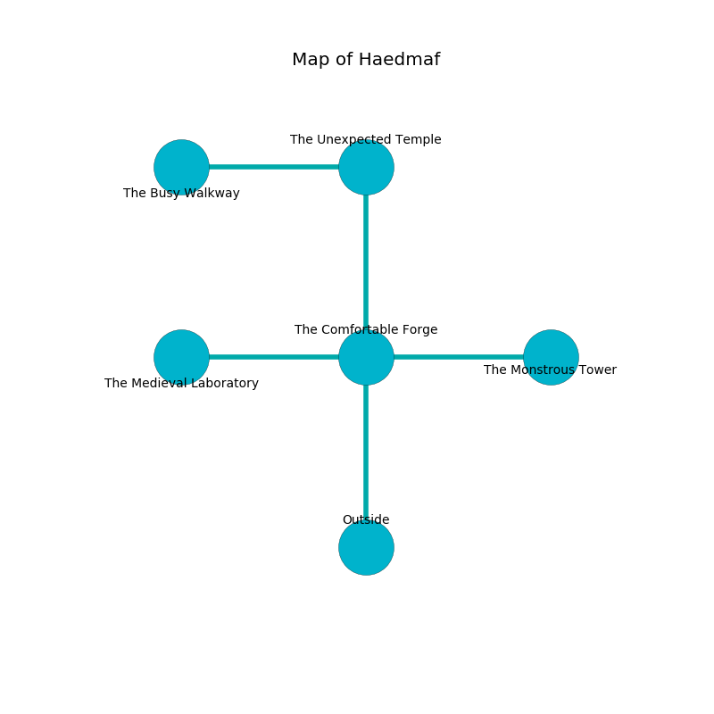

%Ruin Dogs

##Haedmaf
###Overview
Haedmaf is located on a poisoned rift. Some areas of Haedmaf are foggy. The ruin is flooding. It is occupied by Orc. Renaldo Rau The Indecisive, a Drow Elite Warrior is here. The Orc are the minions of Renaldo Rau The Indecisive. He  is founding a new religion. 

###Artifact
####Idufb Ehhuiaemca

Idufb Ehhuiaemca looks like a glassy rock. It smells like paper. When picked up it becomes a shielding force. 

###Locations

####the comfortable forge
The air tastes like lavender here. There is a trap here. When activated, a magical sound detector will make the ceiling slowly lower. Green mushrooms are swaying in cracks in the floor. 

There is an engraving on the wall written in common. 

> I worship [Idufb Ehhuiaemca](#Idufb-Ehhuiaemca).
>
> Try hiding.
>

* To the west a dripping gap leads to [the medieval laboratory](#the-medieval-laboratory).
* To the east a windy opening leads to [the monstrous tower](#the-monstrous-tower).
* To the north a windy corridor leads to [the unexpected temple](#the-unexpected-temple).
* To the south is the entrance.

####the monstrous tower
The air smells like seed here. 

* To the west a windy opening opens to [the comfortable forge](#the-comfortable-forge).

####the medieval laboratory
There are ten Orcs here. The floor is smooth. The air tastes like acetone here. The stone walls are ruined. The Orc are performing a ritual. If not interrupted, [Renaldo Rau](#Renaldo-Rau) will be magically alarmed. 

* To the east a dripping gap connects to [the comfortable forge](#the-comfortable-forge).

####the unexpected temple
The floor is sticky. The air smells like eucalyptus here. Yellow ferns are decaying from the walls. 

* [Idufb Ehhuiaemca](#Idufb-Ehhuiaemca) is here.
* [Renaldo Rau The Indecisive](#Renaldo-Rau-The-Indecisive) is here.
* To the west a torchlit corridor opens to [the busy walkway](#the-busy-walkway).
* To the south a windy corridor opens to [the comfortable forge](#the-comfortable-forge).

####the busy walkway
The floor is smooth. There are a Black Bear and a Giant Shark here. The air tastes like cucumber here. White lichens are decaying from the ceiling. 

* There is a glove here.
* To the east a torchlit corridor connects to [the unexpected temple](#the-unexpected-temple).

