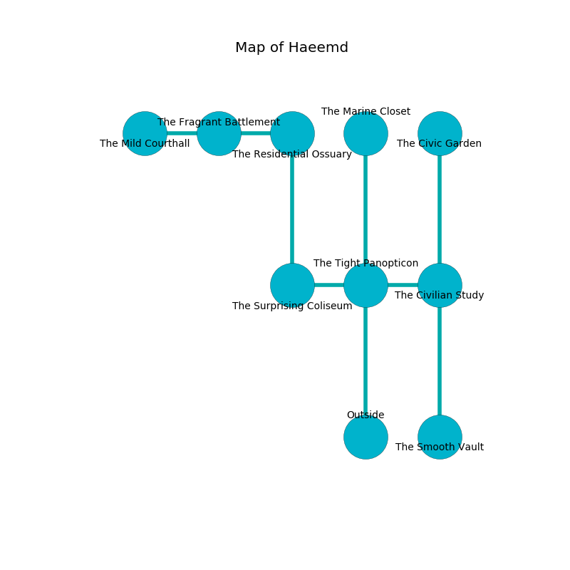

%Ruin Dogs

##Haeemd
###Overview
Haeemd is located under a crystal city. Some rooms of Haeemd are corrupted. The ruin is flooding. It is occupied by Drow. Erich Royal The Flirtatious, a Mind Flayer Arcanist is here. The Drow are the slaves of Erich Royal The Flirtatious. He  is trying to use [Deicad Feddaed](#Deicad-Feddaed). 

###Artifact
####Deicad Feddaed

Deicad Feddaed looks like a transparent blade. Psychic energy bends away from it. When gazed upon it destroys others. 

###Locations

####the tight panopticon
There are a Drow Elite Warrior, a Kuo-Toa, and a Xorn here. The floor is flooded with three inch deep hot water. 

* To the west a small hallway opens to [the surprising coliseum](#the-surprising-coliseum).
* To the east a windy opening opens to [the civilian study](#the-civilian-study).
* To the north a dark gap leads to [the marine closet](#the-marine-closet).
* To the south is the entrance.

####the marine closet
The air tastes like spice here. The floor is smooth. 

There is an engraving on the ceiling written in common. 

> [Deicad Feddaed](#Deicad-Feddaed)
>
> always firsthand
>
> military, difficult, joint
>
> you shall be punished
>

* To the south a dark gap connects to [the tight panopticon](#the-tight-panopticon).

####the surprising coliseum
White lichens are growing from the walls. 

There is an engraving on the ceiling written in Drow Script. 

> I lost [Deicad Feddaed](#Deicad-Feddaed).
>
> Try dying.
>

* To the east a small hallway opens to [the tight panopticon](#the-tight-panopticon).
* To the north a dark hall connects to [the residential ossuary](#the-residential-ossuary).

####the civilian study
The air tastes like kumquat here. There is a Drow Mage here. The concrete walls are bloodstained. Red ferns are swaying in a patch on the floor. One of the Drow Mage is on watch, the rest are fighting amongst themselves. 

* [Erich Royal The Flirtatious](#Erich-Royal-The-Flirtatious) is here.
* To the west a windy opening connects to [the tight panopticon](#the-tight-panopticon).
* To the north a small hall connects to [the civic garden](#the-civic-garden).
* To the south a narrow hall connects to [the smooth vault](#the-smooth-vault).

####the smooth vault
Gray lichens are swaying in cracks in the floor. The glass walls are ruined. 

* To the north a narrow hall opens to [the civilian study](#the-civilian-study).

####the residential ossuary
Blue moss is swaying in cracks in the floor. The air smells like narcissus here. There are a Homunculus, a Red Dragon Wyrmling, a Fire Elemental, and a Swarm of Insects here. 

* There is a snake here.
* To the west a twisted artery connects to [the fragrant battlement](#the-fragrant-battlement).
* To the south a dark hall opens to [the surprising coliseum](#the-surprising-coliseum).

####the fragrant battlement
The metallic walls are caving in. Blue razorgrass is growing in broken urns. There is a trap here. When activated, a magical rune will fire a net. 

* [Deicad Feddaed](#Deicad-Feddaed) is here.
* To the west a long passageway connects to [the mild courthall](#the-mild-courthall).
* To the east a twisted artery leads to [the residential ossuary](#the-residential-ossuary).

####the civic garden
The obsidion walls are pristine. Red mushrooms are swaying in broken urns. 

* To the south a small hall leads to [the civilian study](#the-civilian-study).

####the mild courthall
Gray moss is decaying from the ceiling. The floor is glossy. The metallic walls are caving in. 

There is an engraving on a tablet written in Drow Script. 

> I am lonely.
>
> I thought about hiding.
>

* There is a blade here.
* There is a parcel here.
* To the east a long passageway connects to [the fragrant battlement](#the-fragrant-battlement).

