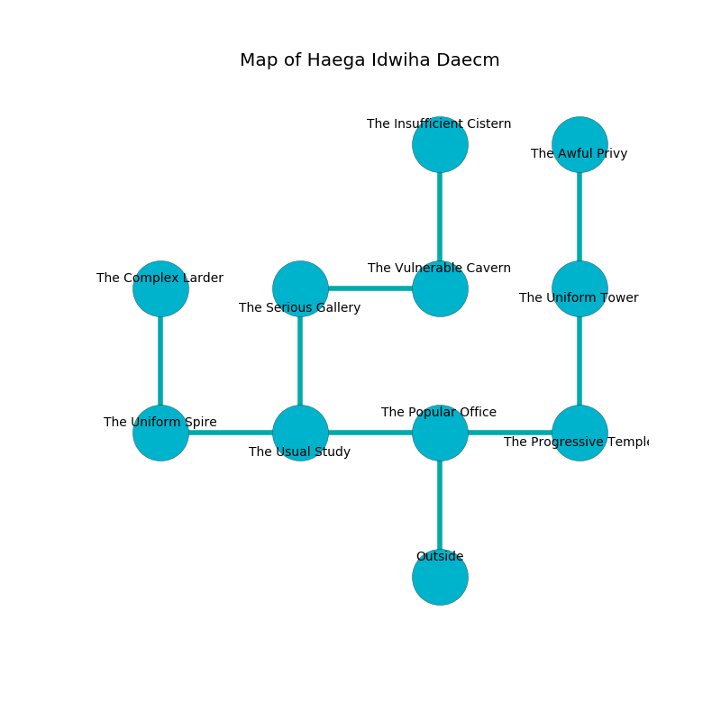

%Ruin Dogs

##Haega Idwiha Daecm
###Overview
Haega Idwiha Daecm is located under a crystal tree. Regions of it are inaccessible. The ruin is sinking into the earth. It is occupied by Quaggoths. Glayds Kearns The Greedy, an Assassin is here. The Quaggoths have been charmed by Glayds Kearns The Greedy. She  is trying to research [Baeluia Baellha](#Baeluia-Baellha). 

###Artifact
####Baeluia Baellha

Baeluia Baellha looks like an opaque blade. It smells like rain. It is a shifting green color. When smelled it floats in the air. 

###Locations

####the popular office
The air smells like beef here. There are three Quaggoth Thonots here. The floor is cluttered with broken glass. The Quaggoths are willing to negotiate. 

* To the west a dark hall connects to [the usual study](#the-usual-study).
* To the east a narrow gap leads to [the progressive temple](#the-progressive-temple).
* To the south is the entrance.

####the usual study
White ferns are swaying in a patch on the floor. The air tastes like roasted meaty here. The crystal walls are ruined. There are a Quaggoth Thonot and two Quaggoths here. The Quaggoths are performing a ritual. If not interrupted, the Quaggoths will become more powerful. 

There is an engraving on a monolith written in Quaggoths Script. 

> Dear me! weak you
>
> unique and unlikely
>
> it is always due
>
> nothing is likely
>

* There is an ant here.
* There is a button here.
* To the west a torchlit path opens to [the uniform spire](#the-uniform-spire).
* To the east a dark hall opens to [the popular office](#the-popular-office).
* To the north a torchlit artery opens to [the serious gallery](#the-serious-gallery).

####the progressive temple
There are a Lion, a Dust Mephit, an Owlbear, a White Dragon Wyrmling, a Worg, a Giant Bat, and a Cloaker here. The floor is smooth. 

* [Glayds Kearns The Greedy](#Glayds-Kearns-The-Greedy) is here.
* To the west a narrow gap opens to [the popular office](#the-popular-office).
* To the north a flooded walkway connects to [the uniform tower](#the-uniform-tower).

####the serious gallery
The air smells like absinthe here. The floor is bloodstained. The obsidion walls are caving in. White razorgrass is growing in cracks in the floor. 

There is an engraving on the ceiling written in common. 

> Oh terrible soul
>
> ambiguous and whole
>
> always just
>
> sadness is socialist
>

* To the east a torchlit pathway opens to [the vulnerable cavern](#the-vulnerable-cavern).
* To the south a torchlit artery opens to [the usual study](#the-usual-study).

####the uniform spire
The wooden walls are bloodstained. Green moss is sprouting in cracks in the floor. 

* [Baeluia Baellha](#Baeluia-Baellha) is here.
* To the east a torchlit path opens to [the usual study](#the-usual-study).
* To the north a narrow gap connects to [the complex larder](#the-complex-larder).

####the vulnerable cavern
The crystal walls are caving in. The air smells like hay here. 

* To the west a torchlit pathway connects to [the serious gallery](#the-serious-gallery).
* To the north a windy pathway opens to [the insufficient cistern](#the-insufficient-cistern).

####the uniform tower
The air smells like pear here. 

* There is a bridge here.
* To the north a windy artery connects to [the awful privy](#the-awful-privy).
* To the south a flooded walkway connects to [the progressive temple](#the-progressive-temple).

####the insufficient cistern
The glass walls are scratched. There are a Kuo-Toa Whip, a Pteranodon, two Nobles, a Bat, a Frost Giant, a Gibbering Mouther, and  here. White lichens are swaying from the ceiling. 

* To the south a windy pathway connects to [the vulnerable cavern](#the-vulnerable-cavern).

####the awful privy
There are a Dretch, a Cat, a Smoke Mephit, a Giant Hyena, a Lemure, a Bandit Captain, and a Flesh Golem here. The air smells like tagette here. 

* There is a bottle here.
* To the south a windy artery opens to [the uniform tower](#the-uniform-tower).

####the complex larder
There are two Quaggoth Thonots and a Quaggoth here. The metallic walls are unsettled. Yellow lichens are sprouting in cracks in the floor. The air tastes like curry here. One of the Quaggoths is pointing a ballista at the entrance. 

* To the south a narrow gap leads to [the uniform spire](#the-uniform-spire).

