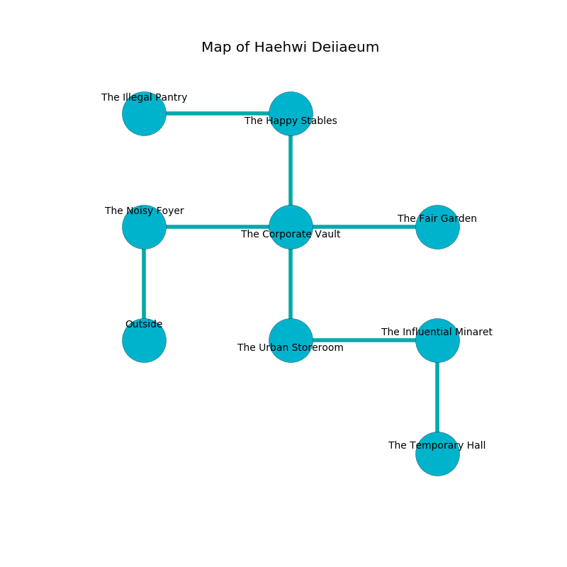

%Ruin Dogs

##Haehwi Deiiaeum
###Overview
Haehwi Deiiaeum is located on a cursed plain. Some areas of Haehwi Deiiaeum are flooded. The ruin is flooding. It is occupied by Humans. Shizuko Usher The Quick-Tempered, a Cloud Giant is here. The Humans are the minions of Shizuko Usher The Quick-Tempered. She  is trying to find [Cumcaddaeum](#Cumcaddaeum). 

###Artifact
####Cumcaddaeum

Cumcaddaeum is a powerful artifact in the shape of a sharp orb. Light glows away from it. It smells like gooseberry. When picked up it become energized with a powerful vibration. 

###Locations

####the noisy foyer
The brick walls are ruined. There are a Bandit, a Triceratops, a Cultist, a Mule, and a Grick Alpha here. The air tastes like resin here. 

* There is a knot here.
* There is a boot here.
* There is a cow here.
* To the east a windy artery connects to [the corporate vault](#the-corporate-vault).
* To the south is the entrance.

####the corporate vault
The crystal walls are bloodstained. 

There is an engraving on a stone written in Humans Script. 

> I am seeking [Cumcaddaeum](#Cumcaddaeum).
>
> Hide here.
>

* To the west a windy artery connects to [the noisy foyer](#the-noisy-foyer).
* To the east a torchlit artery opens to [the fair garden](#the-fair-garden).
* To the north a dripping corridor leads to [the happy stables](#the-happy-stables).
* To the south a windy hall connects to [the urban storeroom](#the-urban-storeroom).

####the urban storeroom
The crystal walls are pristine. Gray moss is growing from the ceiling. 

* To the east a twisted hall connects to [the influential minaret](#the-influential-minaret).
* To the north a windy hall opens to [the corporate vault](#the-corporate-vault).

####the influential minaret
The air smells like ambergris here. Yellow moss is growing from the ceiling. The glass walls are unsettled. 

* To the west a twisted hall opens to [the urban storeroom](#the-urban-storeroom).
* To the south a narrow cave opens to [the temporary hall](#the-temporary-hall).

####the fair garden
White lichens are growing in broken urns. The floor is cluttered with shells. The crystal walls are caving in. There is a trap here. When activated, a magical sound detector will open a trapdoor in the floor. 

* [Shizuko Usher The Quick-Tempered](#Shizuko-Usher-The-Quick-Tempered) is here.
* To the west a torchlit artery connects to [the corporate vault](#the-corporate-vault).

####the happy stables
The air tastes like tamarind here. The floor is cluttered with rocks. 

* [Cumcaddaeum](#Cumcaddaeum) is here.
* To the west a long threshold opens to [the illegal pantry](#the-illegal-pantry).
* To the south a dripping corridor connects to [the corporate vault](#the-corporate-vault).

####the temporary hall
There is a trap here. When activated, a tripwire will launch a swinging block. The metallic walls are caving in. The air tastes like pepper here. 

* To the north a narrow cave leads to [the influential minaret](#the-influential-minaret).

####the illegal pantry
Blue moss is swaying in cracks in the floor. The floor is glossy. There are two Otyughs, a Dryad, a Priest, and  here. 

* To the east a long threshold leads to [the happy stables](#the-happy-stables).

