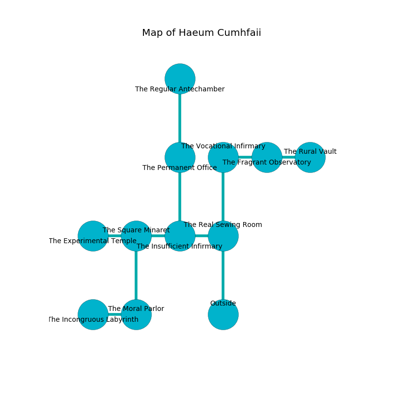

%Ruin Dogs

##Haeum Cumhfaii
###Overview
Haeum Cumhfaii is located in a cursed plain. Some areas of Haeum Cumhfaii are foggy. A blizzard is happening outside. It is occupied by Kuo-Toa. Alexa Brinson The Obsessive, a Stone Giant is here. The Kuo-Toa are the slaves of Alexa Brinson The Obsessive. She  is founding a new religion. 

###Artifact
####Behmaedola

Behmaedola has the form of a glassy sphere. When held it grants power to its owner. 

###Locations

####the real sewing room
Red ferns are decaying from the walls. The air smells like wasabi here. 

* To the west a hazy corridor connects to [the insufficient infirmary](#the-insufficient-infirmary).
* To the north a dark hallway opens to [the vocational infirmary](#the-vocational-infirmary).
* To the south is the entrance.

####the insufficient infirmary
The air smells like dill here. 

There is an engraving on a tablet written in common. 

> Poor me! the memory of you is woe
>
> busy, native, low
>
> established, tolerant, possible
>
> hope is impossible
>

* There is a brick here.
* To the west a flooded passageway connects to [the square minaret](#the-square-minaret).
* To the east a hazy corridor connects to [the real sewing room](#the-real-sewing-room).
* To the north a torchlit artery opens to [the permanent office](#the-permanent-office).

####the vocational infirmary
There are two Kuo-Toa Archpriests here. The mirrored walls are unsettled. The floor is bloodstained. One of the Kuo-Toa is pointing a ballista at the entrance. 

* There is an ant here.
* There is a stick here.
* There is a fly here.
* To the east a long path connects to [the fragrant observatory](#the-fragrant-observatory).
* To the south a dark hallway opens to [the real sewing room](#the-real-sewing-room).

####the square minaret
The brick walls are covered in mold. The floor is flooded with one inch deep scalding water. Red ferns are sprouting from the walls. The air smells like roasted peanut here. 

* [Behmaedola](#Behmaedola) is here.
* To the west a long hallway opens to [the experimental temple](#the-experimental-temple).
* To the east a flooded passageway connects to [the insufficient infirmary](#the-insufficient-infirmary).
* To the south a small cave opens to [the moral parlor](#the-moral-parlor).

####the permanent office
The floor is smooth. The air smells like lobster here. 

* There is a brooch here.
* To the north a windy hallway connects to [the regular antechamber](#the-regular-antechamber).
* To the south a torchlit artery opens to [the insufficient infirmary](#the-insufficient-infirmary).

####the fragrant observatory
The floor is cluttered with ashes. The crystal walls are ruined. There are a Kuo-Toa Whip and two Kuo-Toa Archpriests here. Yellow ferns are growing from the ceiling. The Kuo-Toa are performing a ritual. If not interrupted, the Kuo-Toa will become more powerful. 

* There is an orb here.
* To the west a long path connects to [the vocational infirmary](#the-vocational-infirmary).
* To the east a flooded corridor leads to [the rural vault](#the-rural-vault).

####the moral parlor
The air tastes like fruit here. The floor is bloodstained. 

* To the west a narrow hallway leads to [the incongruous labyrinth](#the-incongruous-labyrinth).
* To the north a small cave opens to [the square minaret](#the-square-minaret).

####the incongruous labyrinth
There are a Quipper, a Gray Ooze, a Werebear, a Phase Spider, and an Owl here. The wooden walls are pristine. The floor is cluttered with shells. 

* To the east a narrow hallway leads to [the moral parlor](#the-moral-parlor).

####the rural vault
There are two Kuo-Toa Whips and a Kuo-Toa Archpriest here. The air smells like garlic here. The Kuo-Toa are berserk with rage. 

* To the west a flooded corridor leads to [the fragrant observatory](#the-fragrant-observatory).

####the regular antechamber
The obsidion walls are unsettled. 

* [Alexa Brinson The Obsessive](#Alexa-Brinson-The-Obsessive) is here.
* To the south a windy hallway opens to [the permanent office](#the-permanent-office).

####the experimental temple
The crystal walls are ruined. The air smells like musk here. Blue ferns are swaying in a patch on the floor. 

There is an engraving on a monolith written in common. 

> I found this place.
>

* To the east a long hallway opens to [the square minaret](#the-square-minaret).

