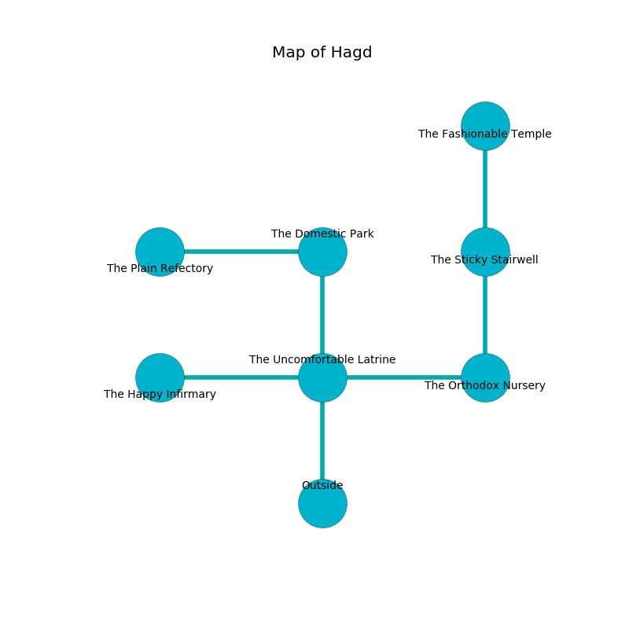

%Ruin Dogs

##Hagd
###Overview
Hagd is located under a giant tree. Parts of it are frozen. A windstorm is happening outside. It is occupied by Orc. Reginald Merrell The Intolerant, a Bulette is here. The Orc worship Reginald Merrell The Intolerant. He  is founding a new religion. 

###Artifact
####The High Revenge

The High Revenge looks like a smooth sphere. It smells like cognac. When touched it tunnels into the earth. 

###Locations

####the uncomfortable latrine
The air tastes like potato here. White razorgrass is decaying from the ceiling. The concrete walls are scratched. 

* There is a brain here.
* [Reginald Merrell The Intolerant](#Reginald-Merrell-The-Intolerant) is here.
* To the west a narrow corridor opens to [the happy infirmary](#the-happy-infirmary).
* To the east a flooded hall opens to [the orthodox nursery](#the-orthodox-nursery).
* To the north a windy hallway leads to [the domestic park](#the-domestic-park).
* To the south is the entrance.

####the orthodox nursery
The floor is bloodstained. The metallic walls are caving in. There are a Peryton, a Night Hag, and a Deer here. 

* To the west a flooded hall opens to [the uncomfortable latrine](#the-uncomfortable-latrine).
* To the north a small cave leads to [the sticky stairwell](#the-sticky-stairwell).

####the domestic park
There are an Incubus and a Mimic here. 

There is an engraving on the wall written in Orc Script. 

> I want to find [The High Revenge](#The-High-Revenge).
>

* [The High Revenge](#The-High-Revenge) is here.
* To the west a twisted cavern opens to [the plain refectory](#the-plain-refectory).
* To the south a windy hallway opens to [the uncomfortable latrine](#the-uncomfortable-latrine).

####the happy infirmary
There are twelve Orcs here. Green ferns are decaying from the ceiling. The Orc are caring for babies. 

There is an engraving on the wall written in common. 

> A plow is a literature
>
> pregnant, awful, formal
>
> exact and accurate
>
> you must never be punished
>

* To the east a narrow corridor opens to [the uncomfortable latrine](#the-uncomfortable-latrine).

####the sticky stairwell
The floor is flooded with four inch deep cold water. There are a Sprite, a Red Slaad, a Twig Blight, a Hill Giant, and a Worg here. The air smells like papaya here. 

There is an engraving on a monolith written in common. 

> Maybe try leaving.
>

* To the north a small path opens to [the fashionable temple](#the-fashionable-temple).
* To the south a small cave connects to [the orthodox nursery](#the-orthodox-nursery).

####the fashionable temple
The air smells like seashore here. Red lichens are decaying from the walls. The floor is flooded with eight inch deep scalding water. 

* To the south a small path connects to [the sticky stairwell](#the-sticky-stairwell).

####the plain refectory
There are twelve Orcs here. The floor is flooded with eight inch deep cool water. The Orc are crazy with bloodlust. 

* To the east a twisted cavern opens to [the domestic park](#the-domestic-park).

