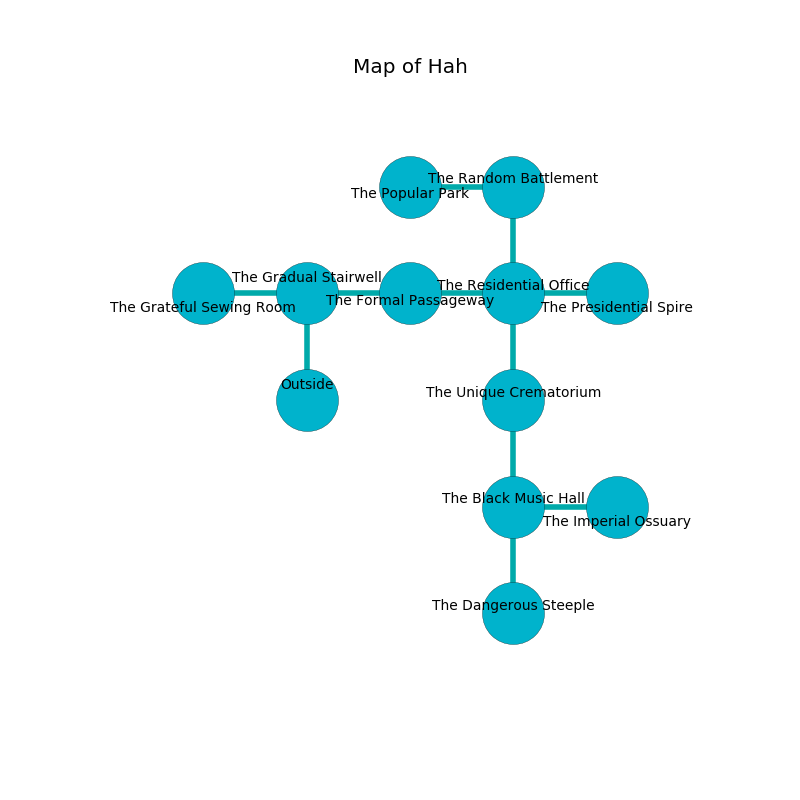

%Ruin Dogs

##Hah
###Overview
Hah is located under a ruined rift. Some rooms of Hah are cursed. A lunar eclipse is happening outside. It is occupied by Quaggoths. Julietta Child The Vengeful, a Cyclops is here. The Quaggoths are battling Julietta Child The Vengeful. She  is trying to exploit [Dhuulimal](#Dhuulimal). 

###Artifact
####Dhuulimal

Dhuulimal is a powerful artifact in the shape of a warm doll. It is a shifting pink color. When picked up it illuminates its surroundings. 

###Locations

####the gradual stairwell
The floor is sticky. The air tastes like hazelnut here. 

There is an engraving on the floor written in Quaggoths Script. 

> Try leaving.
>

* To the west a flooded threshold opens to [the grateful sewing room](#the-grateful-sewing-room).
* To the east a flooded artery connects to [the formal passageway](#the-formal-passageway).
* To the south is the entrance.

####the grateful sewing room
The brick walls are scratched. There are a Bugbear Chief, a Flesh Golem, and a Rat here. 

There is an engraving on the floor written in common. 

> [Dhuulimal](#Dhuulimal)
>
> sharp, senior, regular
>

* To the east a flooded threshold opens to [the gradual stairwell](#the-gradual-stairwell).

####the formal passageway
White moss is decaying from the walls. There is a trap here. When activated, a magical proximity detector will swing a tripping chain. The air tastes like sarsaparilla here. 

* To the west a flooded artery connects to [the gradual stairwell](#the-gradual-stairwell).
* To the east a torchlit gap connects to [the residential office](#the-residential-office).

####the residential office
There are two Quaggoths here. The mirrored walls are ruined. One of the Quaggoths is on watch, the rest are celebrating. 

* To the west a torchlit gap leads to [the formal passageway](#the-formal-passageway).
* To the east a torchlit path opens to [the presidential spire](#the-presidential-spire).
* To the north a long pathway leads to [the random battlement](#the-random-battlement).
* To the south a dark hallway opens to [the unique crematorium](#the-unique-crematorium).

####the unique crematorium
Blue mushrooms are decaying in broken urns. The glass walls are bloodstained. The air smells like verbena here. 

* To the north a dark hallway leads to [the residential office](#the-residential-office).
* To the south a dripping walkway opens to [the black music hall](#the-black-music-hall).

####the presidential spire
There are a Yeti, a Tribal Warrior, and a Githzerai Monk here. Green mushrooms are growing in broken urns. The glass walls are scratched. The air smells like clover here. 

* [Julietta Child The Vengeful](#Julietta-Child-The-Vengeful) is here.
* To the west a torchlit path connects to [the residential office](#the-residential-office).

####the random battlement
The air tastes like grilling here. Blue mushrooms are growing in broken urns. 

* To the west a small cave leads to [the popular park](#the-popular-park).
* To the south a long pathway leads to [the residential office](#the-residential-office).

####the popular park
The brick walls are bloodstained. There are a Hook Horror and a Bandit Captain here. The floor is smooth. 

* To the east a small cave connects to [the random battlement](#the-random-battlement).

####the black music hall
The floor is smooth. Yellow razorgrass is growing in cracks in the floor. There are a Hook Horror, a Giant Rat, a Goat, and a Gold Dragon Wyrmling here. The stone walls are unsettled. 

* [Dhuulimal](#Dhuulimal) is here.
* To the east a dark artery connects to [the imperial ossuary](#the-imperial-ossuary).
* To the north a dripping walkway opens to [the unique crematorium](#the-unique-crematorium).
* To the south a twisted gap opens to [the dangerous steeple](#the-dangerous-steeple).

####the dangerous steeple
The glass walls are scratched. The air smells like char here. There are a Quaggoth Thonot and a Quaggoth here. Red lichens are decaying from the walls. One of the Quaggoths is on watch, the rest are meditating. 

* To the north a twisted gap leads to [the black music hall](#the-black-music-hall).

####the imperial ossuary
There is a Wraith here. The mirrored walls are ruined. 

* There is a frame here.
* To the west a dark artery leads to [the black music hall](#the-black-music-hall).

