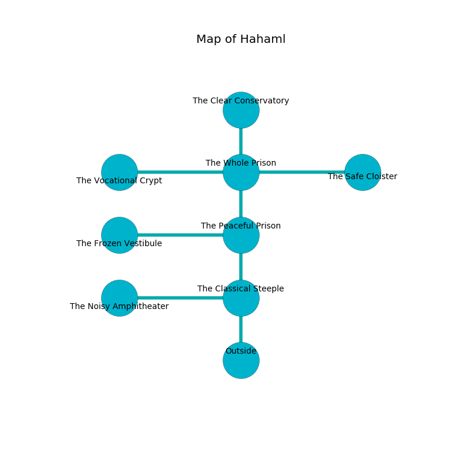

%Ruin Dogs

##Hahaml
###Overview
Hahaml is located in a haunted mountain. Parts of it are unbearably hot. The ruin is coming to life. It is occupied by Goblins. Florencio Fortner The Domineering, a Drow Mage is here. The Goblins worship Florencio Fortner The Domineering. He  is founding a new religion. 

###Artifact
####The Glorious Average

The Glorious Average has the form of a transparent spear. It is a dark gray color. When held it frightens children. 

###Locations

####the classical steeple
There are a Water Elemental, a Specter, a Giant Crab, and a Stone Giant here. Yellow razorgrass is sprouting in a patch on the floor. 

* [The Glorious Average](#The-Glorious-Average) is here.
* [Florencio Fortner The Domineering](#Florencio-Fortner-The-Domineering) is here.
* To the west a dark threshold leads to [the noisy amphitheater](#the-noisy-amphitheater).
* To the north a narrow cave opens to [the peaceful prison](#the-peaceful-prison).
* To the south is the entrance.

####the peaceful prison
Gray mushrooms are sprouting from the ceiling. The mirrored walls are pristine. 

* To the west a narrow gap opens to [the frozen vestibule](#the-frozen-vestibule).
* To the north a long gap connects to [the whole prison](#the-whole-prison).
* To the south a narrow cave leads to [the classical steeple](#the-classical-steeple).

####the whole prison
The air tastes like oily here. The floor is bloodstained. There are a Giant Wolf Spider, a Triceratops, a Flesh Golem, and a Rat here. 

* To the west a long cavern leads to [the vocational crypt](#the-vocational-crypt).
* To the east a small walkway connects to [the safe cloister](#the-safe-cloister).
* To the north a dark pathway connects to [the clear conservatory](#the-clear-conservatory).
* To the south a long gap opens to [the peaceful prison](#the-peaceful-prison).

####the safe cloister
The floor is glossy. 

There is an engraving on a stone written in Goblins Script. 

> A berry is a hammer
>
> realistic, sharp, unanimous
>

* To the west a small walkway opens to [the whole prison](#the-whole-prison).

####the clear conservatory
There are a Hobgoblin Warlord and a Hobgoblin Captain here. Yellow moss is growing in a patch on the floor. The air tastes like cauliflower here. The floor is cluttered with shells. The Goblins are crazy with bloodlust. 

* To the south a dark pathway leads to [the whole prison](#the-whole-prison).

####the vocational crypt
There are two Hobgoblin Warlords here. Blue razorgrass is growing in broken urns. The floor is flooded with seven inch deep cool water. The Goblins are performing a ritual. If not interrupted, the Goblins will become more powerful. 

* To the east a long cavern connects to [the whole prison](#the-whole-prison).

####the frozen vestibule
There are an Imp, a Helmed Horror, a Fire Snake, and an Old Faerie Dragon here. 

* To the east a narrow gap opens to [the peaceful prison](#the-peaceful-prison).

####the noisy amphitheater
The floor is flooded with seven inch deep cold water. Yellow mushrooms are decaying in a patch on the floor. 

* There is a trousers here.
* To the east a dark threshold leads to [the classical steeple](#the-classical-steeple).

