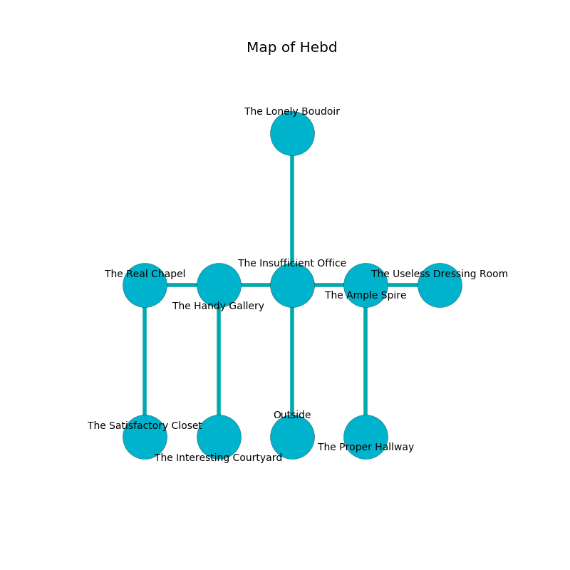

%Ruin Dogs

##Hebd
###Overview
Hebd is constructed on an alien tree. Parts of it are flooded. A lunar eclipse is happening outside. It is occupied by Drow. Rogelio Dodge The Obstinate, a Cyclops is here. The Drow are the minions of Rogelio Dodge The Obstinate. He  is founding a new religion. 

###Artifact
####The Quantitative Speed

The Quantitative Speed looks like a soft sphere. It smells like phenolic. When rubbed it becomes a force of destiny. 

###Locations

####the insufficient office
The mirrored walls are covered in mold. The floor is smooth. The air smells like cream here. 

* There is a table here.
* To the west a small passageway connects to [the handy gallery](#the-handy-gallery).
* To the east a flooded walkway opens to [the ample spire](#the-ample-spire).
* To the north a long pathway leads to [the lonely boudoir](#the-lonely-boudoir).
* To the south is the entrance.

####the lonely boudoir
The crystal walls are scratched. 

* To the south a long pathway leads to [the insufficient office](#the-insufficient-office).

####the handy gallery
The concrete walls are covered in mold. There is a trap here. When activated, a magical proximity detector will make the walls close in. The air smells like berry here. 

* [Rogelio Dodge The Obstinate](#Rogelio-Dodge-The-Obstinate) is here.
* To the west a narrow artery leads to [the real chapel](#the-real-chapel).
* To the east a small passageway opens to [the insufficient office](#the-insufficient-office).
* To the south a twisted artery leads to [the interesting courtyard](#the-interesting-courtyard).

####the ample spire
The glass walls are bloodstained. The floor is smooth. 

* To the west a flooded walkway opens to [the insufficient office](#the-insufficient-office).
* To the east a flooded gap connects to [the useless dressing room](#the-useless-dressing-room).
* To the south a twisted walkway opens to [the proper hallway](#the-proper-hallway).

####the useless dressing room
The air smells like alcohol here. The floor is flooded with three inch deep scalding water. 

* There is a key here.
* To the west a flooded gap leads to [the ample spire](#the-ample-spire).

####the proper hallway
The floor is smooth. 

* To the north a twisted walkway connects to [the ample spire](#the-ample-spire).

####the interesting courtyard
The glass walls are scratched. 

* To the north a twisted artery connects to [the handy gallery](#the-handy-gallery).

####the real chapel
There are two Drow Elite Warriors here. The metallic walls are covered in mold. The air tastes like bouillon here. One of the Drow is pointing a ballista at the entrance. 

* There is a hat here.
* [The Quantitative Speed](#The-Quantitative-Speed) is here.
* To the east a narrow artery leads to [the handy gallery](#the-handy-gallery).
* To the south a hazy threshold leads to [the satisfactory closet](#the-satisfactory-closet).

####the satisfactory closet
There are an Earth Elemental and a Berserker here. The floor is glossy. 

* To the north a hazy threshold connects to [the real chapel](#the-real-chapel).

