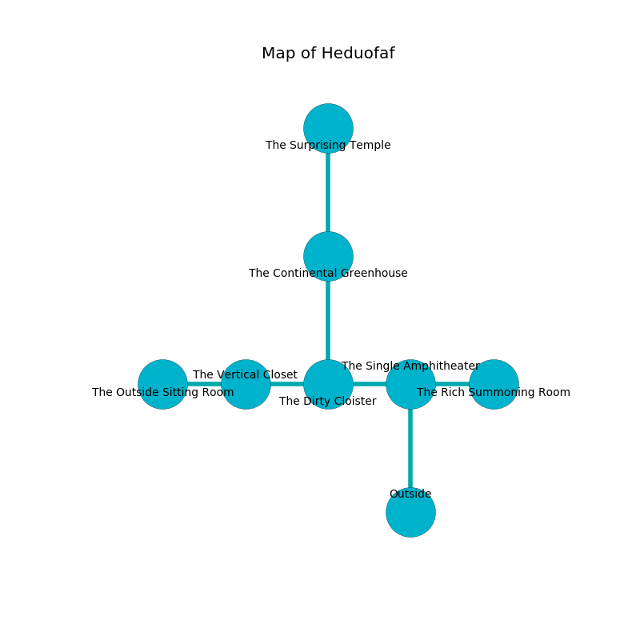

%Ruin Dogs

##Heduofaf
###Overview
Heduofaf is constructed on a flooded mountain. Regions of it are cursed. The ruin is flooding. It is occupied by Githzerai. Ruthanne Shipp The Weak-Willed, a Stone Giant is here. The Githzerai worship Ruthanne Shipp The Weak-Willed. She  is founding a new religion. 

###Artifact
####Ufemha Camdaf

Ufemha Camdaf is a powerful artifact in the shape of a soft prism. It is a medium pink color. It smells like corn. When rubbed it become energized with a powerful vibration. 

###Locations

####the single amphitheater
The floor is sticky. There are a Lizard King, a Dust Mephit, a Silver Dragon Wyrmling, a Giant Frog, a Flameskull, and a Needle Blight here. The stone walls are ruined. 

* To the west a narrow artery connects to [the dirty cloister](#the-dirty-cloister).
* To the east a dark corridor leads to [the rich summoning room](#the-rich-summoning-room).
* To the south is the entrance.

####the dirty cloister
The air smells like cypress here. Blue lichens are growing from the walls. The floor is bloodstained. 

* To the west a small gap leads to [the vertical closet](#the-vertical-closet).
* To the east a narrow artery leads to [the single amphitheater](#the-single-amphitheater).
* To the north a windy threshold connects to [the continental greenhouse](#the-continental-greenhouse).

####the vertical closet
The floor is sticky. Yellow lichens are growing from the ceiling. 

There is an engraving on a monolith written in common. 

> I could not try digging.
>

* There is a treasure here.
* To the west a dripping walkway connects to [the outside sitting Room](#the-outside-sitting-Room).
* To the east a small gap leads to [the dirty cloister](#the-dirty-cloister).

####the rich summoning room

* There is an orb here.
* There is a cheese here.
* There is a brooch here.
* There is a sponge here.
* To the west a dark corridor connects to [the single amphitheater](#the-single-amphitheater).

####the continental greenhouse
There are four Githzerai Monks here. The concrete walls are covered in mold. The floor is glossy. One of the Githzerai is working a mechanism that can engulf the room in a fiery blaze. 

* [Ufemha Camdaf](#Ufemha-Camdaf) is here.
* To the north a flooded passageway connects to [the surprising temple](#the-surprising-temple).
* To the south a windy threshold opens to [the dirty cloister](#the-dirty-cloister).

####the outside sitting Room
The floor is flooded with eight inch deep hot water. Gray lichens are sprouting in cracks in the floor. The air tastes like hazelnut here. 

* To the east a dripping walkway opens to [the vertical closet](#the-vertical-closet).

####the surprising temple
The air smells like gasoline here. The floor is bloodstained. There are four Githzerai Monks here. White ferns are swaying from the ceiling. One of the Githzerai is on watch, the rest are sleeping. 

* [Ruthanne Shipp The Weak-Willed](#Ruthanne-Shipp-The-Weak-Willed) is here.
* To the south a flooded passageway opens to [the continental greenhouse](#the-continental-greenhouse).

