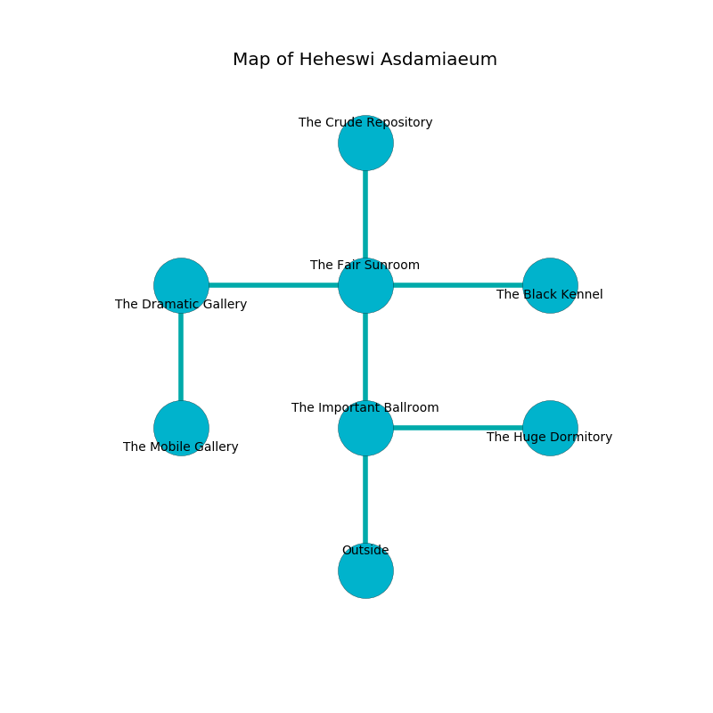

%Ruin Dogs

##Heheswi Asdamiaeum
###Overview
Heheswi Asdamiaeum is constructed on a ruined mountain. Regions of Heheswi Asdamiaeum are flooded. A blizzard is happening outside. It is occupied by Kenku. Sebastian Partridge The Callous, a Hobgoblin Warlord is here. The Kenku are the slaves of Sebastian Partridge The Callous. He  is trying to hide [The Inadequate Green](#The-Inadequate-Green). 

###Artifact
####The Inadequate Green

The Inadequate Green looks like an opaque orb. When gazed upon it floats in the air. 

###Locations

####the important ballroom

* To the east a small cave leads to [the huge dormitory](#the-huge-dormitory).
* To the north a long artery opens to [the fair sunroom](#the-fair-sunroom).
* To the south is the entrance.

####the fair sunroom
The air tastes like asparagus here. The brick walls are pristine. The floor is smooth. 

There is an engraving on a monolith written in Kenku Script. 

> I am sneaky.
>

* There is a book here.
* [Sebastian Partridge The Callous](#Sebastian-Partridge-The-Callous) is here.
* To the west a narrow gap leads to [the dramatic gallery](#the-dramatic-gallery).
* To the east a narrow pathway opens to [the black kennel](#the-black-kennel).
* To the north a small gap connects to [the crude repository](#the-crude-repository).
* To the south a long artery leads to [the important ballroom](#the-important-ballroom).

####the crude repository
The air smells like dried fruit here. There are a Red Slaad and a Giant Toad here. The concrete walls are covered in mold. The floor is smooth. 

* To the south a small gap opens to [the fair sunroom](#the-fair-sunroom).

####the black kennel
The air tastes like bitter orange here. 

* To the west a narrow pathway leads to [the fair sunroom](#the-fair-sunroom).

####the huge dormitory
Green ferns are sprouting in cracks in the floor. The floor is glossy. There are twenty four Kenkus here. The Kenku are fighting amongst themselves. 

* To the west a small cave connects to [the important ballroom](#the-important-ballroom).

####the dramatic gallery
Red mushrooms are decaying in cracks in the floor. The crystal walls are covered in mold. The air smells like petroleum here. 

* There is a crossbow here.
* [The Inadequate Green](#The-Inadequate-Green) is here.
* To the east a narrow gap opens to [the fair sunroom](#the-fair-sunroom).
* To the south a long opening opens to [the mobile gallery](#the-mobile-gallery).

####the mobile gallery
There are twenty four Kenkus here. The brick walls are ruined. The floor is smooth. The Kenku are willing to fight to the death. 

* To the north a long opening leads to [the dramatic gallery](#the-dramatic-gallery).

