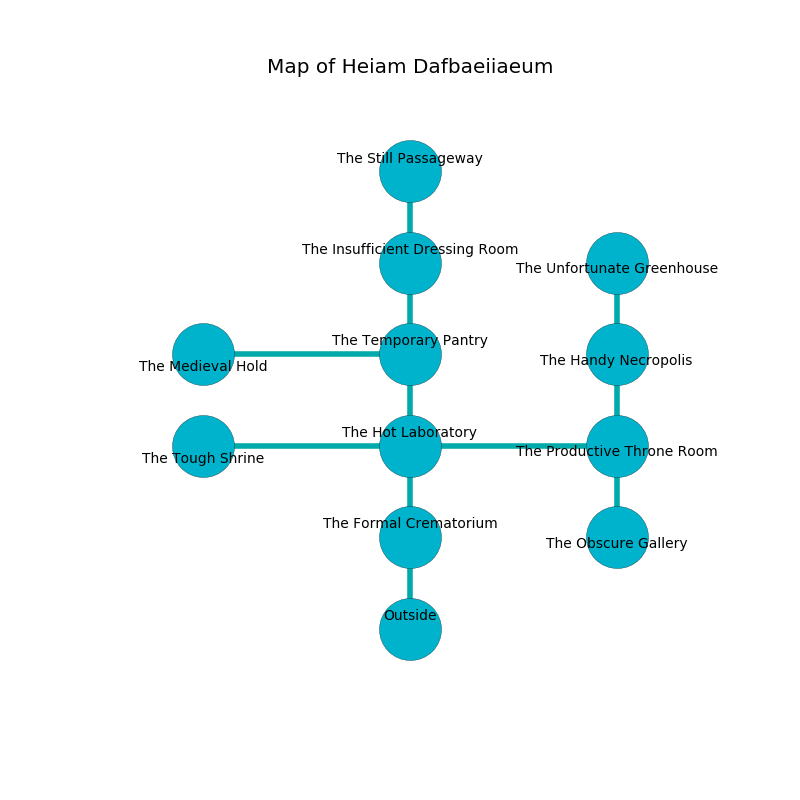

%Ruin Dogs

##Heiam Dafbaeiiaeum
###Overview
Heiam Dafbaeiiaeum is constructed on a poisoned rift. Parts of it are flooded. A massive storm is happening outside. It is occupied by Demons. Edmond Mccrary The Miserly, an Orc War Chief is here. The Demons have been charmed by Edmond Mccrary The Miserly. He  is trying to understand [Haeid](#Haeid). 

###Artifact
####Haeid

Haeid has the form of a transparent rock. Gravity glows near it. When carried it destroys itself. 

###Locations

####the formal crematorium
The floor is flooded with six inch deep hot water. There are an Imp and a Bearded Devil here. The Demons are berserk with rage. 

* There is a leaf here.
* To the north a dripping cavern leads to [the hot laboratory](#the-hot-laboratory).
* To the south is the entrance.

####the hot laboratory
There are an Imp and a Bearded Devil here. The Demons are performing a ritual. If not interrupted, a powerful monster will be summoned. 

* To the west a flooded gap connects to [the tough shrine](#the-tough-shrine).
* To the east a dark cavern opens to [the productive throne room](#the-productive-throne-room).
* To the north a hazy opening opens to [the temporary pantry](#the-temporary-pantry).
* To the south a dripping cavern leads to [the formal crematorium](#the-formal-crematorium).

####the productive throne room
There are a Hobgoblin Captain, a Draft Horse, a Cockatrice, a Cultist, and a Gibbering Mouther here. The floor is bloodstained. Gray razorgrass is swaying in broken urns. The air tastes like pear skin here. The glass walls are covered in mold. 

There is an engraving on the floor written in Demons Script. 

> Oh my! death is woe
>
> yet acute
>
> chronic, pregnant, low
>
> death is cute
>

* There is a finger here.
* To the west a dark cavern leads to [the hot laboratory](#the-hot-laboratory).
* To the north a torchlit cave leads to [the handy necropolis](#the-handy-necropolis).
* To the south a dark path leads to [the obscure gallery](#the-obscure-gallery).

####the temporary pantry
The floor is glossy. There is a trap here. When activated, a magical sound detector will ring a bell. 

* To the west a hazy corridor opens to [the medieval hold](#the-medieval-hold).
* To the north a long corridor opens to [the insufficient dressing room](#the-insufficient-dressing-room).
* To the south a hazy opening leads to [the hot laboratory](#the-hot-laboratory).

####the obscure gallery
The metallic walls are caving in. 

* To the north a dark path opens to [the productive throne room](#the-productive-throne-room).

####the handy necropolis
Yellow moss is decaying in cracks in the floor. There are an Orc War Chief and a Black Dragon Wyrmling here. The floor is smooth. 

* To the north a narrow hall connects to [the unfortunate greenhouse](#the-unfortunate-greenhouse).
* To the south a torchlit cave connects to [the productive throne room](#the-productive-throne-room).

####the tough shrine
The air tastes like carnation here. Gray mushrooms are growing in broken urns. The mirrored walls are unsettled. The floor is flooded with two inch deep cool water. There are an Incubus and a Spined Devil here. If the Demons notice the Ruin Dogs, one of them will retreat and alert the others. 

* [Edmond Mccrary The Miserly](#Edmond-Mccrary-The-Miserly) is here.
* To the east a flooded gap leads to [the hot laboratory](#the-hot-laboratory).

####the unfortunate greenhouse
The floor is flooded with four inch deep lukewarm water. The air smells like white chocolate here. 

There is an engraving on the floor written in common. 

> O sorry you
>
> but due
>
> yet never linear
>
> life is new
>

* To the south a narrow hall leads to [the handy necropolis](#the-handy-necropolis).

####the insufficient dressing room
Green lichens are decaying in a patch on the floor. 

* [Haeid](#Haeid) is here.
* To the north a flooded corridor connects to [the still passageway](#the-still-passageway).
* To the south a long corridor leads to [the temporary pantry](#the-temporary-pantry).

####the medieval hold
There are two Bearded Devils here. The air tastes like gasoline here. The floor is cluttered with shells. The stone walls are scratched. One of the Demons is on watch, the rest are sleeping. 

* To the east a hazy corridor connects to [the temporary pantry](#the-temporary-pantry).

####the still passageway
The obsidion walls are scratched. The floor is sticky. There are an Imp and an Incubus here. The air smells like orange peel here. The Demons are crazy with bloodlust. 

* To the south a flooded corridor connects to [the insufficient dressing room](#the-insufficient-dressing-room).

