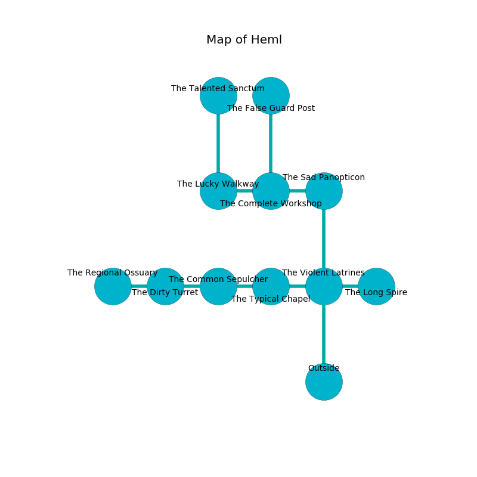

%Ruin Dogs

##Heml
###Overview
Heml is constructed on a crystal plain. Some rooms of Heml are corrupted. The ruin is coming to life. It is occupied by Myconids. Dario Westfall The Foolhardy, a Bandit Captain is here. The Myconids worship Dario Westfall The Foolhardy. He  is trying to hide [Laaf](#Laaf). 

###Artifact
####Laaf

Laaf looks like a hard cube. It is a bright white color. When gazed upon it shows an image of the future. 

###Locations

####the violent latrines
There are a Myconid Sovereign and a Myconid Adult here. The floor is smooth. There is a trap here. When activated, a pressure plate will blast flames. Gray lichens are swaying in cracks in the floor. The metallic walls are pristine. The Myconids are crazy with bloodlust. 

* To the west a twisted threshold opens to [the typical chapel](#the-typical-chapel).
* To the east a dripping hallway connects to [the long spire](#the-long-spire).
* To the north a narrow hall connects to [the sad panopticon](#the-sad-panopticon).
* To the south is the entrance.

####the sad panopticon
The air smells like chive here. Blue lichens are sprouting in broken urns. The obsidion walls are ruined. 

* There is a fowl here.
* There is a ghost here.
* There is a crossbow here.
* There is a button here.
* To the west a dark artery opens to [the complete workshop](#the-complete-workshop).
* To the south a narrow hall opens to [the violent latrines](#the-violent-latrines).

####the typical chapel

* There is an ant here.
* To the west a twisted opening opens to [the common sepulcher](#the-common-sepulcher).
* To the east a twisted threshold connects to [the violent latrines](#the-violent-latrines).

####the long spire
Blue razorgrass is decaying from the walls. There is a Myconid Sovereign here. One of the Myconid Sovereign is on watch, the rest are caring for babies. 

* To the west a dripping hallway leads to [the violent latrines](#the-violent-latrines).

####the common sepulcher
There is an Ogre here. The air tastes like goat here. 

There is an engraving on a stone written in Myconids Script. 

> I tried praying.
>

* To the west a dripping walkway leads to [the dirty turret](#the-dirty-turret).
* To the east a twisted opening connects to [the typical chapel](#the-typical-chapel).

####the complete workshop
The floor is bloodstained. The air smells like burnt butter here. There is a Peryton here. 

There is an engraving on a stone written in common. 

> A trap ahead.
>

* There is a portrait here.
* There is a femur here.
* [Dario Westfall The Foolhardy](#Dario-Westfall-The-Foolhardy) is here.
* To the west a twisted opening opens to [the lucky walkway](#the-lucky-walkway).
* To the east a dark artery leads to [the sad panopticon](#the-sad-panopticon).
* To the north a dripping hallway opens to [the false guard post](#the-false-guard-post).

####the lucky walkway
The stone walls are ruined. There is a Myconid Sovereign here. The air smells like rain here. One of the Myconid Sovereign is on watch, the rest are feasting. 

There is an engraving on the ceiling written in Myconids Script. 

> A hat is a soil
>
> quantitative, fast, sudden
>

* There is a key here.
* There is a glove here.
* There is a rail here.
* To the east a twisted opening connects to [the complete workshop](#the-complete-workshop).
* To the north a flooded path opens to [the talented sanctum](#the-talented-sanctum).

####the dirty turret
The air tastes like naphthyl here. There are a Sahuagin Priestess and a Hippogriff here. The floor is sticky. 

* [Laaf](#Laaf) is here.
* To the west a long path opens to [the regional ossuary](#the-regional-ossuary).
* To the east a dripping walkway connects to [the common sepulcher](#the-common-sepulcher).

####the talented sanctum
There is a trap here. When activated, a magical sound detector will swing a tripping chain. The floor is sticky. 

* To the south a flooded path connects to [the lucky walkway](#the-lucky-walkway).

####the false guard post

There is an engraving on a stone written in common. 

> I am lost in Heml.
>
> Dig here.
>

* To the south a dripping hallway connects to [the complete workshop](#the-complete-workshop).

####the regional ossuary
Gray razorgrass is swaying in cracks in the floor. The floor is bloodstained. The obsidion walls are covered in mold. The air tastes like hawthorn here. There is a Cult Fanatic here. 

* There is a whistle here.
* To the east a long path connects to [the dirty turret](#the-dirty-turret).

