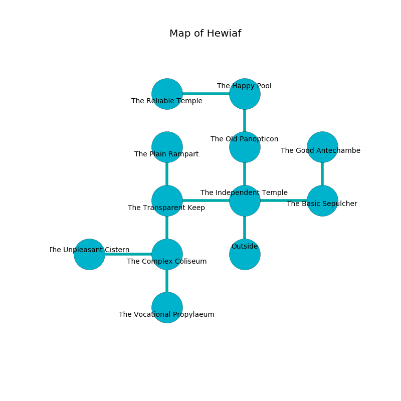

%Ruin Dogs

##Hewiaf
###Overview
Hewiaf is constructed on a spikey plain. Some areas of it are unbearably hot. The ruin is larger on the inside than the outside. It is occupied by Thri-Kreens. Antonio Mackie The Belligerent, a Bandit Captain is here. The Thri-Kreens are the slaves of Antonio Mackie The Belligerent. He  is trying to recover [The Superior Trouble](#The-Superior-Trouble). 

###Artifact
####The Superior Trouble

The Superior Trouble has the form of a transparent cube. Gravity incinerates towards it. When held it burns the mind. 

###Locations

####the independent temple
There are two Thri-Kreens here. The air tastes like juniper here. The Thri-Kreens are willing to negotiate. 

There is an engraving on the wall written in common. 

> I am lost in Hewiaf.
>
> Do not try dying.
>

* To the west a windy cave connects to [the transparent keep](#the-transparent-keep).
* To the east a twisted cavern opens to [the basic sepulcher](#the-basic-sepulcher).
* To the north a hazy hall opens to [the old panopticon](#the-old-panopticon).
* To the south is the entrance.

####the transparent keep
The air smells like cooked onion here. The stone walls are ruined. Blue moss is decaying from the ceiling. 

* To the east a windy cave connects to [the independent temple](#the-independent-temple).
* To the north a hazy artery connects to [the plain rampart](#the-plain-rampart).
* To the south a twisted hallway leads to [the complex coliseum](#the-complex-coliseum).

####the old panopticon
Green ferns are sprouting from the ceiling. There are two Thri-Kreens here. One of the Thri-Kreens is pointing a ballista at the entrance. 

* To the north a hazy cave leads to [the happy pool](#the-happy-pool).
* To the south a hazy hall opens to [the independent temple](#the-independent-temple).

####the plain rampart
Blue ferns are sprouting in cracks in the floor. 

There is an engraving on the ceiling written in common. 

> I am young.
>

* There is a chain here.
* There is a spear here.
* There is a shoe here.
* [Antonio Mackie The Belligerent](#Antonio-Mackie-The-Belligerent) is here.
* To the south a hazy artery opens to [the transparent keep](#the-transparent-keep).

####the complex coliseum
The floor is flooded with five inch deep lukewarm water. 

* To the west a windy gap connects to [the unpleasant cistern](#the-unpleasant-cistern).
* To the north a twisted hallway leads to [the transparent keep](#the-transparent-keep).
* To the south a torchlit artery opens to [the vocational propylaeum](#the-vocational-propylaeum).

####the basic sepulcher
The floor is smooth. 

* To the west a twisted cavern opens to [the independent temple](#the-independent-temple).
* To the north a torchlit opening connects to [the good antechamber](#the-good-antechamber).

####the vocational propylaeum
The mirrored walls are unsettled. There are two Thri-Kreens here. The Thri-Kreens are willing to negotiate. 

* To the north a torchlit artery connects to [the complex coliseum](#the-complex-coliseum).

####the unpleasant cistern
The floor is flooded with one inch deep scalding water. The metallic walls are bloodstained. 

* To the east a windy gap opens to [the complex coliseum](#the-complex-coliseum).

####the happy pool
The air smells like green peas here. 

There is an engraving on a stone written in Thri-Kreens Script. 

> Leave now.
>

* There is a hook here.
* [The Superior Trouble](#The-Superior-Trouble) is here.
* To the west a torchlit cave connects to [the reliable temple](#the-reliable-temple).
* To the south a hazy cave connects to [the old panopticon](#the-old-panopticon).

####the good antechamber
There is a Swarm of Poisonous Snakes here. 

There is an engraving on the wall written in Thri-Kreens Script. 

> I want to find [The Superior Trouble](#The-Superior-Trouble).
>

* There is a basket here.
* To the south a torchlit opening connects to [the basic sepulcher](#the-basic-sepulcher).

####the reliable temple
Yellow ferns are growing in broken urns. There are two Thri-Kreens here. If the Thri-Kreens notice the Ruin Dogs, one of them will retreat and alert [Antonio Mackie](#Antonio-Mackie). 

There is an engraving on a stone written in common. 

> Dear me! life is inhumane
>
> but never plain
>
> ever thin
>
> fate is vain
>

* There is a leaf here.
* To the east a torchlit cave connects to [the happy pool](#the-happy-pool).

