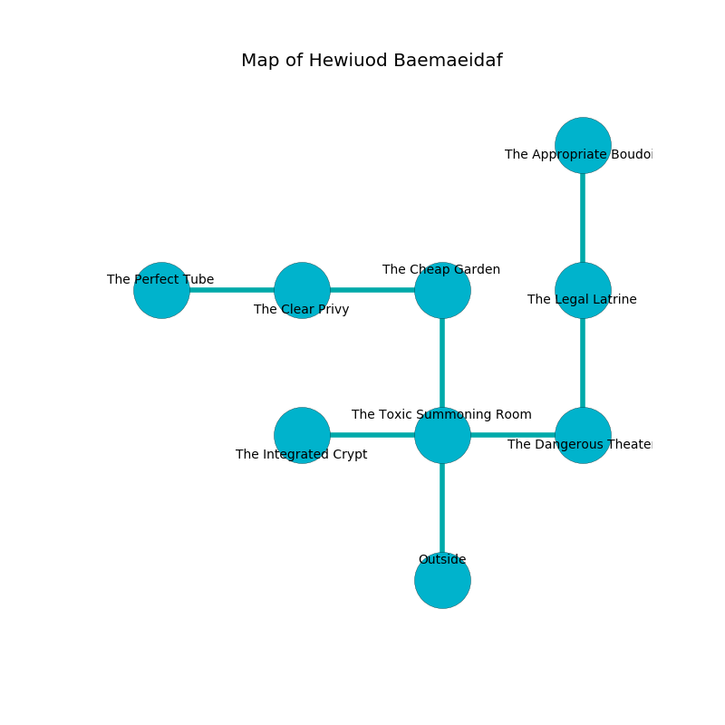

%Ruin Dogs

##Hewiuod Baemaeidaf
###Overview
Hewiuod Baemaeidaf is located under a crystal city. Regions of it are flooded. A lunar eclipse is happening outside. It is occupied by Goblins. Francisca Rider The Vain, a Cambion is here. The Goblins are battling Francisca Rider The Vain. She  is trying to steal [Cmed](#Cmed). 

###Artifact
####Cmed

Cmed has the form of a sharp sphere. It is a shifting yellow color. When thrown it flies into the air. 

###Locations

####the toxic summoning room
Red ferns are swaying in cracks in the floor. The mirrored walls are ruined. 

There is an engraving on the floor written in common. 

> I am seeking [Cmed](#Cmed).
>
> Leave at once.
>

* To the west a flooded hallway opens to [the integrated crypt](#the-integrated-crypt).
* To the east a flooded opening opens to [the dangerous theater](#the-dangerous-theater).
* To the north a windy walkway connects to [the cheap garden](#the-cheap-garden).
* To the south is the entrance.

####the cheap garden
The air smells like cornmint here. The brick walls are caving in. Blue mushrooms are swaying in cracks in the floor. 

* There is a card here.
* There is a basket here.
* [Francisca Rider The Vain](#Francisca-Rider-The-Vain) is here.
* To the west a torchlit hallway opens to [the clear privy](#the-clear-privy).
* To the south a windy walkway connects to [the toxic summoning room](#the-toxic-summoning-room).

####the integrated crypt
The air tastes like seafood here. There is a trap here. When activated, a magical sound detector will open a large pit in the floor. Red moss is swaying from the ceiling. 

There is an engraving on a stone written in Goblins Script. 

> I am seeking [Cmed](#Cmed).
>
> I could not try leaving.
>

* To the east a flooded hallway opens to [the toxic summoning room](#the-toxic-summoning-room).

####the clear privy
There is a trap here. When activated, a magical rune will open a large pit in the floor. There are a Death Dog, a Myconid Sovereign, a Merfolk, and a Chuul here. 

* [Cmed](#Cmed) is here.
* To the west a dripping gap leads to [the perfect tube](#the-perfect-tube).
* To the east a torchlit hallway leads to [the cheap garden](#the-cheap-garden).

####the dangerous theater
There are a Hobgoblin and two Hobgoblin Captains here. The wooden walls are bloodstained. Yellow ferns are growing from the ceiling. The Goblins are defending this room from intruders. 

* There is a salamander here.
* There is a lyre here.
* There is a brooch here.
* There is an egg here.
* To the west a flooded opening leads to [the toxic summoning room](#the-toxic-summoning-room).
* To the north a dripping corridor leads to [the legal latrine](#the-legal-latrine).

####the legal latrine
There is a trap here. When activated, a magical proximity detector will launch an arrow. The air smells like clary sage here. The floor is bloodstained. 

* To the north a twisted walkway connects to [the appropriate boudoir](#the-appropriate-boudoir).
* To the south a dripping corridor opens to [the dangerous theater](#the-dangerous-theater).

####the appropriate boudoir
The floor is sticky. The air smells like melon here. The wooden walls are pristine. 

* To the south a twisted walkway opens to [the legal latrine](#the-legal-latrine).

####the perfect tube
Blue razorgrass is sprouting from the walls. There are a Quaggoth, a Satyr, a Scorpion, and an Orc Eye of Gruumsh here. The stone walls are pristine. 

* To the east a dripping gap connects to [the clear privy](#the-clear-privy).

