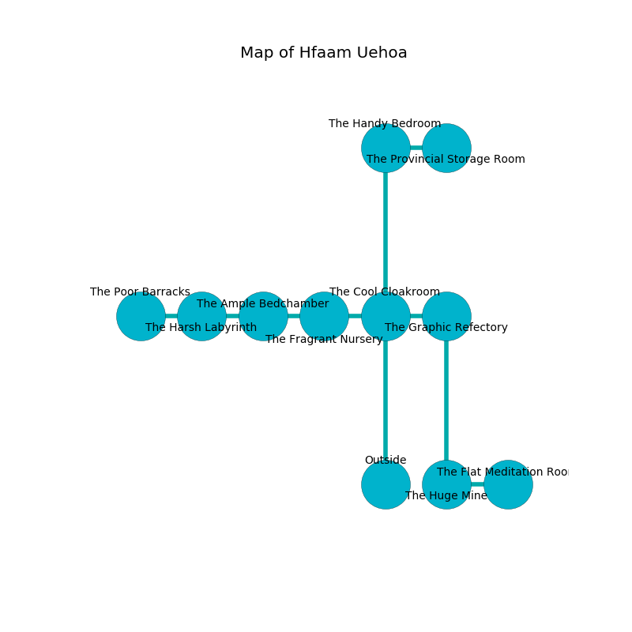

%Ruin Dogs

##Hfaam Uehoa
###Overview
Hfaam Uehoa is located under a broken plain. Some rooms of it are inaccessible. A massive storm is happening outside. It is occupied by Orcs. Roderick Vitale The Thoughtless, a Gnoll Pack Lord is here. The Orcs are the minions of Roderick Vitale The Thoughtless. He  is trying to steal [Gfacoamcwi Fecc](#Gfacoamcwi-Fecc). 

###Artifact
####Gfacoamcwi Fecc

Gfacoamcwi Fecc looks like a warm meteorite. Air shifts from it. It smells like sugar. When worshipped it turns surrounding objects to ashes. 

###Locations

####the cool cloakroom
The floor is smooth. The air smells like hazelnut here. 

There is an engraving on a monolith written in Orcs Script. 

> I worship [Gfacoamcwi Fecc](#Gfacoamcwi-Fecc).
>
> Maybe try cowering.
>

* [Roderick Vitale The Thoughtless](#Roderick-Vitale-The-Thoughtless) is here.
* To the west a long gap opens to [the fragrant nursery](#the-fragrant-nursery).
* To the east a torchlit walkway leads to [the graphic refectory](#the-graphic-refectory).
* To the north a twisted gap opens to [the handy bedroom](#the-handy-bedroom).
* To the south is the entrance.

####the graphic refectory
The air smells like sand here. Yellow ferns are swaying in broken urns. 

* To the west a torchlit walkway leads to [the cool cloakroom](#the-cool-cloakroom).
* To the south a dripping gap connects to [the huge mine](#the-huge-mine).

####the fragrant nursery
The mirrored walls are unsettled. The air tastes like laundered cloth here. The floor is cluttered with rocks. There is a trap here. When activated, a tripwire will collapse a column. 

There is an engraving on the ceiling written in common. 

> Poor me! terrible we
>
> yet free
>
> satisfactory, healthy, sweet
>
> sadness is complete
>

* To the west a dark pathway connects to [the ample bedchamber](#the-ample-bedchamber).
* To the east a long gap connects to [the cool cloakroom](#the-cool-cloakroom).

####the huge mine
There are two Orc Eyes of Gruumsh here. The air smells like sandalwood here. The Orcs are berserk with rage. 

* To the east a windy path leads to [the flat meditation room](#the-flat-meditation-room).
* To the north a dripping gap opens to [the graphic refectory](#the-graphic-refectory).

####the flat meditation room
There are a Troglodyte, a Mastiff, a Swarm of Poisonous Snakes, and a Green Dragon Wyrmling here. The floor is sticky. 

* There is a spoon here.
* To the west a windy path leads to [the huge mine](#the-huge-mine).

####the ample bedchamber
Blue mushrooms are sprouting in broken urns. The metallic walls are pristine. The floor is sticky. 

There is an engraving on the wall written in common. 

> I am lost in Hfaam Uehoa.
>
> Hide here.
>

* To the west a hazy gap connects to [the harsh labyrinth](#the-harsh-labyrinth).
* To the east a dark pathway leads to [the fragrant nursery](#the-fragrant-nursery).

####the handy bedroom
The obsidion walls are unsettled. 

* There is a treasure here.
* There is an ant here.
* To the east a twisted artery connects to [the provincial storage room](#the-provincial-storage-room).
* To the south a twisted gap connects to [the cool cloakroom](#the-cool-cloakroom).

####the harsh labyrinth
There are two Orc Eyes of Gruumsh here. The air tastes like citrus peel here. White ferns are swaying in a patch on the floor. The wooden walls are caving in. The Orcs are defending this room from intruders. 

* There is a boot here.
* [Gfacoamcwi Fecc](#Gfacoamcwi-Fecc) is here.
* To the west a narrow path connects to [the poor barracks](#the-poor-barracks).
* To the east a hazy gap opens to [the ample bedchamber](#the-ample-bedchamber).

####the provincial storage room
Gray razorgrass is growing in cracks in the floor. The air tastes like sugar here. The metallic walls are covered in mold. The floor is glossy. 

* To the west a twisted artery opens to [the handy bedroom](#the-handy-bedroom).

####the poor barracks
There are a Plesiosaurus, an Axe Beak, a Veteran, and a Giant Owl here. The air smells like mastic here. 

There is an engraving on a monolith written in common. 

> Leave at once.
>

* To the east a narrow path connects to [the harsh labyrinth](#the-harsh-labyrinth).

