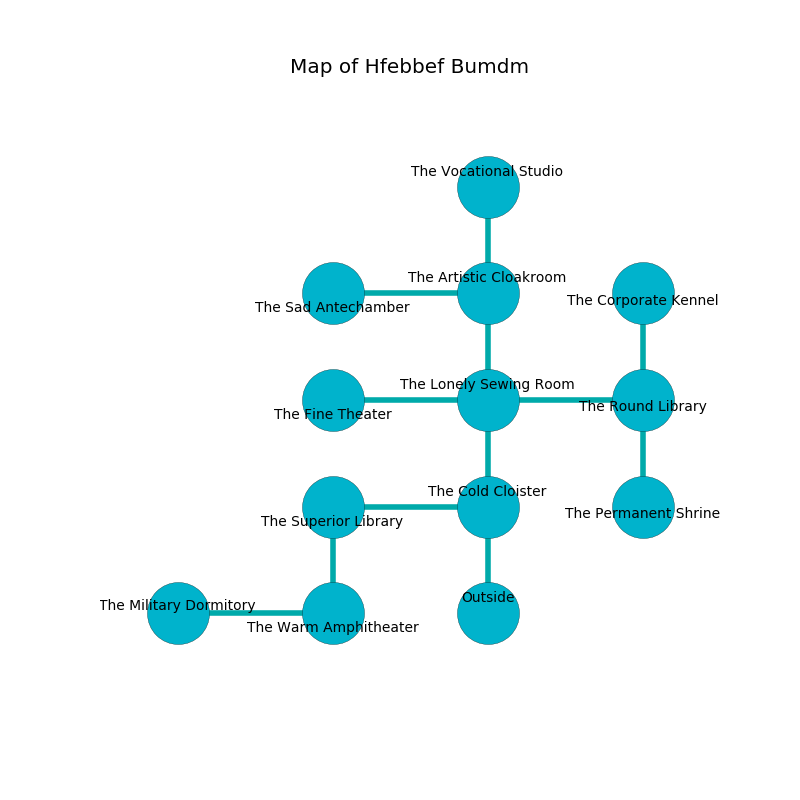

%Ruin Dogs

##Hfebbef Bumdm
###Overview
Hfebbef Bumdm is located on a ruined mountain. Parts of Hfebbef Bumdm are cursed. A blizzard is happening outside. It is occupied by Quaggoths. Jule Adamson The Interfering, a Mind Flayer Arcanist is here. The Quaggoths are battling Jule Adamson The Interfering. She  is trying to understand [Imaeahl](#Imaeahl). 

###Artifact
####Imaeahl

Imaeahl looks like a sharp cube. It smells like the fresh outdoors. When eaten it curses all nearby. 

###Locations

####the cold cloister
The floor is cluttered with bones. 

There is an engraving on the ceiling written in common. 

> Oh cruel we
>
> it is always free
>
> but insufficient
>
> all is free
>

* There is a lyre here.
* There is an eye here.
* To the west a long artery connects to [the superior library](#the-superior-library).
* To the north a torchlit cavern opens to [the lonely sewing room](#the-lonely-sewing-room).
* To the south is the entrance.

####the lonely sewing room
The floor is cluttered with debris. The wooden walls are bloodstained. The air tastes like sarsaparilla here. 

* To the west a flooded threshold connects to [the fine theater](#the-fine-theater).
* To the east a dark cavern opens to [the round library](#the-round-library).
* To the north a flooded walkway leads to [the artistic cloakroom](#the-artistic-cloakroom).
* To the south a torchlit cavern opens to [the cold cloister](#the-cold-cloister).

####the round library
There are a Thug, a Blink Dog, an Ochre Jelly, a Barlgura, and a Drow Priestess of Lolth here. The air smells like chicken coup here. The floor is glossy. White razorgrass is growing in cracks in the floor. The stone walls are unsettled. 

* There is a specter here.
* To the west a dark cavern connects to [the lonely sewing room](#the-lonely-sewing-room).
* To the north a dark hall opens to [the corporate kennel](#the-corporate-kennel).
* To the south a hazy gap connects to [the permanent shrine](#the-permanent-shrine).

####the corporate kennel
The air smells like hops here. White lichens are sprouting in broken urns. 

* There is a button here.
* To the south a dark hall connects to [the round library](#the-round-library).

####the superior library
There are two Quaggoth Thonots and a Quaggoth here. The air tastes like dried apple here. The floor is glossy. The Quaggoths are willing to negotiate. 

* There is a board here.
* To the east a long artery leads to [the cold cloister](#the-cold-cloister).
* To the south a narrow hall opens to [the warm amphitheater](#the-warm-amphitheater).

####the artistic cloakroom
The concrete walls are pristine. Red razorgrass is growing from the walls. The floor is flooded with one inch deep lukewarm water. There are a Drow Elite Warrior, a Spectator, a Jackalwere, a Killer Whale, and a Rust Monster here. The air tastes like raw potato here. 

* To the west a small corridor opens to [the sad antechamber](#the-sad-antechamber).
* To the north a torchlit pathway leads to [the vocational studio](#the-vocational-studio).
* To the south a flooded walkway opens to [the lonely sewing room](#the-lonely-sewing-room).

####the fine theater
The air smells like orris here. The crystal walls are unsettled. There are three Quaggoths here. The floor is smooth. One of the Quaggoths is on watch, the rest are caring for babies. 

There is an engraving on a monolith written in Quaggoths Script. 

> Treasure here.
>

* To the east a flooded threshold leads to [the lonely sewing room](#the-lonely-sewing-room).

####the permanent shrine
There are two Quaggoth Thonots and a Quaggoth here. Yellow moss is decaying in broken urns. The glass walls are bloodstained. The Quaggoths are performing a ritual. If not interrupted, [Jule Adamson](#Jule-Adamson) will be magically alarmed. 

* There is a heart here.
* There is a belt here.
* There is a tome here.
* To the north a hazy gap connects to [the round library](#the-round-library).

####the vocational studio
The air smells like peony here. There are a Hydra, a Cultist, and a Mage here. The floor is glossy. Green ferns are sprouting in cracks in the floor. 

There is an engraving on the ceiling written in common. 

> Poor me! dire soul
>
> it is never whole
>
> it is always easy
>
> all is uneasy
>

* [Jule Adamson The Interfering](#Jule-Adamson-The-Interfering) is here.
* To the south a torchlit pathway leads to [the artistic cloakroom](#the-artistic-cloakroom).

####the sad antechamber
The floor is smooth. 

* To the east a small corridor opens to [the artistic cloakroom](#the-artistic-cloakroom).

####the warm amphitheater
The air smells like pepper here. The floor is glossy. 

* [Imaeahl](#Imaeahl) is here.
* To the west a twisted path connects to [the military dormitory](#the-military-dormitory).
* To the north a narrow hall connects to [the superior library](#the-superior-library).

####the military dormitory
Blue mushrooms are growing from the walls. 

There is an engraving on the ceiling written in common. 

> I am worshipping Hfebbef Bumdm.
>
> Leave now.
>

* To the east a twisted path opens to [the warm amphitheater](#the-warm-amphitheater).

