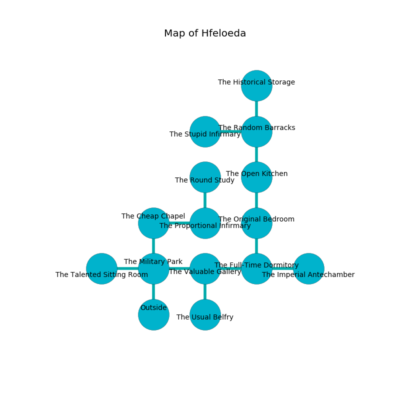

%Ruin Dogs

##Hfeloeda
###Overview
Hfeloeda is located in a poisoned tree. Some areas of it are foggy. The ruin is flooding. It is occupied by Lizardfolk. Neville Hanna The Pompous, a Drow Mage is here. The Lizardfolk worship Neville Hanna The Pompous. He  is founding a new religion. 

###Artifact
####Icmuuh Iafaeai

Icmuuh Iafaeai looks like a broken amulet. Psychic energy incinerates near it. When worn it shows an image of the future. 

###Locations

####the military park
The floor is glossy. The metallic walls are covered in mold. 

* There is a dog here.
* [Icmuuh Iafaeai](#Icmuuh-Iafaeai) is here.
* To the west a twisted pathway connects to [the talented sitting Room](#the-talented-sitting-Room).
* To the east a small gap connects to [the valuable gallery](#the-valuable-gallery).
* To the north a windy pathway connects to [the cheap chapel](#the-cheap-chapel).
* To the south is the entrance.

####the cheap chapel
There are a Cult Fanatic, an Old Faerie Dragon, a Nightmare, a Hyena, a Boar, a Worg, and an Awakened Shrub here. The obsidion walls are bloodstained. The floor is bloodstained. Blue mushrooms are decaying from the ceiling. 

* To the east a dark artery leads to [the proportional infirmary](#the-proportional-infirmary).
* To the south a windy pathway leads to [the military park](#the-military-park).

####the valuable gallery
The mirrored walls are covered in mold. There is a Mage here. 

* There is a casket here.
* To the west a small gap connects to [the military park](#the-military-park).
* To the east a flooded hall leads to [the full-time dormitory](#the-full-time-dormitory).
* To the south a twisted cavern connects to [the usual belfry](#the-usual-belfry).

####the proportional infirmary
Green lichens are sprouting in a patch on the floor. 

* [Neville Hanna The Pompous](#Neville-Hanna-The-Pompous) is here.
* To the west a dark artery leads to [the cheap chapel](#the-cheap-chapel).
* To the north a small artery opens to [the round study](#the-round-study).

####the full-time dormitory

* To the west a flooded hall opens to [the valuable gallery](#the-valuable-gallery).
* To the east a dripping cavern leads to [the imperial antechamber](#the-imperial-antechamber).
* To the north a twisted passageway leads to [the original bedroom](#the-original-bedroom).

####the imperial antechamber
The air smells like nut flesh here. The obsidion walls are bloodstained. There are three Lizardfolk Shamans and three Lizardfolk here. The floor is glossy. The Lizardfolk are willing to negotiate. 

* To the west a dripping cavern opens to [the full-time dormitory](#the-full-time-dormitory).

####the original bedroom

* To the north a torchlit artery connects to [the open kitchen](#the-open-kitchen).
* To the south a twisted passageway connects to [the full-time dormitory](#the-full-time-dormitory).

####the open kitchen
The air tastes like pomegranate here. There are an Animated Armor and a Werebear here. 

* To the north a narrow hall opens to [the random barracks](#the-random-barracks).
* To the south a torchlit artery connects to [the original bedroom](#the-original-bedroom).

####the usual belfry

* To the north a twisted cavern leads to [the valuable gallery](#the-valuable-gallery).

####the round study
Gray razorgrass is sprouting in cracks in the floor. There are a Sahuagin Baron, an Orc War Chief, and a Worg here. 

There is an engraving on a tablet written in Lizardfolk Script. 

> Oh my! meak god
>
> commercial and odd
>
> it is always internal
>
> everything is odd
>

* To the south a small artery leads to [the proportional infirmary](#the-proportional-infirmary).

####the random barracks
White razorgrass is swaying from the walls. 

* To the west a windy walkway connects to [the stupid infirmary](#the-stupid-infirmary).
* To the north a dark gap leads to [the historical storage](#the-historical-storage).
* To the south a narrow hall opens to [the open kitchen](#the-open-kitchen).

####the historical storage
The floor is bloodstained. The air tastes like coffee here. 

There is an engraving on the ceiling written in common. 

> A seed is an orange
>
> always capable
>
> present and visible
>
> exclusive and sympathetic
>
> but never electronic
>
> genetic and honest
>
> ever traditional
>
> always loyal
>
> external and addicted
>
> yet never first
>
> always sexual
>

* To the south a dark gap opens to [the random barracks](#the-random-barracks).

####the stupid infirmary
The floor is flooded with one inch deep cool water. 

* There is a ring here.
* There is a girl here.
* To the east a windy walkway connects to [the random barracks](#the-random-barracks).

####the talented sitting Room
The air tastes like candy here. There are three Lizardfolk Shamans and a Lizardfolk here. Green moss is sprouting in cracks in the floor. One of the Lizardfolk is on watch, the rest are meditating. 

There is an engraving on the ceiling written in common. 

> Dear me! my life is woe
>
> yet low
>
> it is always irrelevant
>
> hope is low
>

* To the east a twisted pathway leads to [the military park](#the-military-park).

