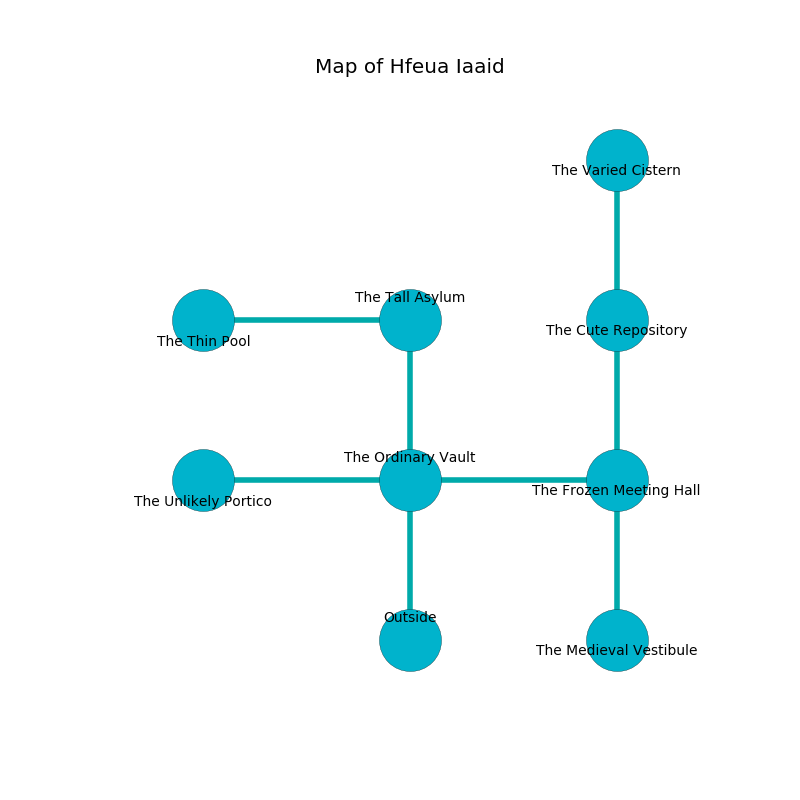

%Ruin Dogs

##Hfeua Iaaid
###Overview
Hfeua Iaaid is constructed on a crystal city. Regions of Hfeua Iaaid are frozen. A solar eclipse is happening outside. It is occupied by Humans. Athena Mangum The Aloof, a Stone Giant is here. The Humans are the slaves of Athena Mangum The Aloof. She  is founding a new religion. 

###Artifact
####The Adequate Server

The Adequate Server has the form of a glassy amulet. It is a medium purple color. When thrown it changes probabilities. 

###Locations

####the ordinary vault
The stone walls are pristine. 

There is an engraving on a stone written in Humans Script. 

> Poor me! my life is woe
>
> soft and low
>
> it is always impressive
>
> the world is low
>

* To the west a windy hallway connects to [the unlikely portico](#the-unlikely-portico).
* To the east a twisted hall connects to [the frozen meeting hall](#the-frozen-meeting-hall).
* To the north a flooded walkway connects to [the tall asylum](#the-tall-asylum).
* To the south is the entrance.

####the tall asylum
The air smells like hyssop here. There is a trap here. When activated, a magical sound detector will launch a fusillade of darts. 

* [The Adequate Server](#The-Adequate-Server) is here.
* To the west a dripping hallway connects to [the thin pool](#the-thin-pool).
* To the south a flooded walkway connects to [the ordinary vault](#the-ordinary-vault).

####the unlikely portico
The obsidion walls are pristine. 

* To the east a windy hallway leads to [the ordinary vault](#the-ordinary-vault).

####the frozen meeting hall
Red lichens are swaying in cracks in the floor. 

* [Athena Mangum The Aloof](#Athena-Mangum-The-Aloof) is here.
* To the west a twisted hall opens to [the ordinary vault](#the-ordinary-vault).
* To the north a flooded opening opens to [the cute repository](#the-cute-repository).
* To the south a twisted artery leads to [the medieval vestibule](#the-medieval-vestibule).

####the cute repository
The floor is smooth. Green ferns are sprouting in a patch on the floor. 

* To the north a narrow passageway opens to [the varied cistern](#the-varied-cistern).
* To the south a flooded opening connects to [the frozen meeting hall](#the-frozen-meeting-hall).

####the varied cistern
The wooden walls are ruined. The air tastes like acacia here. The floor is bloodstained. There is a trap here. When activated, a pressure plate will swing a tripping chain. 

There is an engraving on a stone written in Humans Script. 

> I hid something in this place.
>

* To the south a narrow passageway leads to [the cute repository](#the-cute-repository).

####the medieval vestibule
The air smells like cornmint here. The floor is sticky. There are a Gladiator, a Bandit Captain, and a Commoner here. One of the Humans is on watch, the rest are caring for babies. 

* There is a brush here.
* To the north a twisted artery connects to [the frozen meeting hall](#the-frozen-meeting-hall).

####the thin pool
There are two Cult Fanatics and a Veteran here. The floor is glossy. The Humans are celebrating. 

* To the east a dripping hallway connects to [the tall asylum](#the-tall-asylum).

