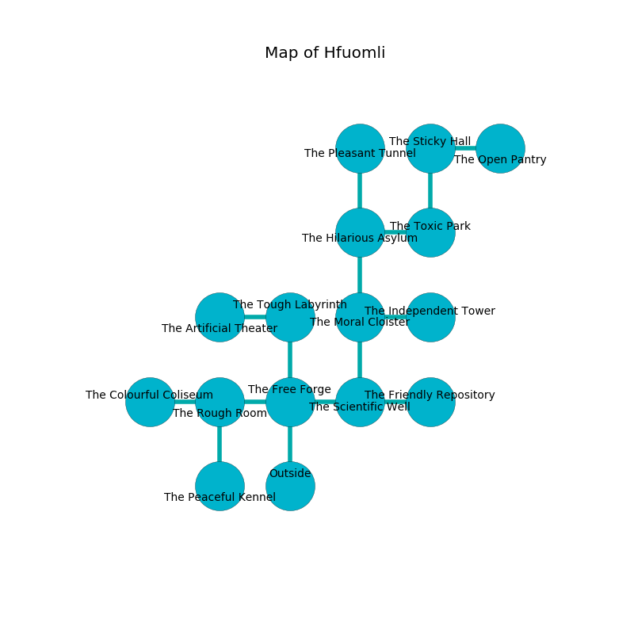

%Ruin Dogs

##Hfuomli
###Overview
Hfuomli is located in a broken mountain. Regions of Hfuomli are frozen. A battle between raiders is happening outside. It is occupied by Pixies. Elvira Wilder The Vague, a Cloud Giant is here. The Pixies worship Elvira Wilder The Vague. She  is trying to use [The Surprising Monastery](#The-Surprising-Monastery). 

###Artifact
####The Surprising Monastery

The Surprising Monastery looks like a warm sphere. Gravity slips from it. It is a sickly blue color. It smells like hops. When rubbed it levitates those nearby. 

###Locations

####the free forge
Blue lichens are growing from the ceiling. The concrete walls are caving in. 

* There is a glove here.
* To the west a long cavern leads to [the rough room](#the-rough-room).
* To the east a hazy gap opens to [the scientific well](#the-scientific-well).
* To the north a long pathway opens to [the tough labyrinth](#the-tough-labyrinth).
* To the south is the entrance.

####the scientific well
The brick walls are bloodstained. Gray lichens are decaying from the ceiling. The air tastes like cooked apple here. 

* To the west a hazy gap leads to [the free forge](#the-free-forge).
* To the east a long threshold opens to [the friendly repository](#the-friendly-repository).
* To the north a windy gap opens to [the moral cloister](#the-moral-cloister).

####the moral cloister
The floor is glossy. The air tastes like red apple here. Green lichens are growing in a patch on the floor. 

* To the east a windy passageway opens to [the independent tower](#the-independent-tower).
* To the north a hazy threshold connects to [the hilarious asylum](#the-hilarious-asylum).
* To the south a windy gap opens to [the scientific well](#the-scientific-well).

####the friendly repository
Blue lichens are decaying in broken urns. The air smells like cumin here. There are thirty six Pixies here. The Pixies are performing a ritual. If not interrupted, a powerful monster will be summoned. 

* To the west a long threshold opens to [the scientific well](#the-scientific-well).

####the rough room
The mirrored walls are pristine. The floor is cluttered with rocks. Green moss is swaying in broken urns. There are thirty six Pixies here. The Pixies are willing to negotiate. 

* To the west a narrow artery leads to [the colourful coliseum](#the-colourful-coliseum).
* To the east a long cavern connects to [the free forge](#the-free-forge).
* To the south a flooded walkway leads to [the peaceful kennel](#the-peaceful-kennel).

####the colourful coliseum
The floor is glossy. The concrete walls are bloodstained. There are thirty six Pixies here. The Pixies are drunk. 

* To the east a narrow artery opens to [the rough room](#the-rough-room).

####the tough labyrinth
There are a Triceratops, a Bulette, and a Githzerai Monk here. The air smells like black tea here. Red razorgrass is decaying in cracks in the floor. 

There is an engraving on the ceiling written in Pixies Script. 

> We are envious
>
> graphic, lazy, ambitious
>
> yet never cooperative
>
> We are envious
>

* There is a bucket here.
* There is a bridge here.
* To the west a hazy hall leads to [the artificial theater](#the-artificial-theater).
* To the south a long pathway opens to [the free forge](#the-free-forge).

####the hilarious asylum
The air tastes like deertongue here. Gray ferns are decaying from the ceiling. 

* To the east a flooded passageway opens to [the toxic park](#the-toxic-park).
* To the north a dark cavern leads to [the pleasant tunnel](#the-pleasant-tunnel).
* To the south a hazy threshold leads to [the moral cloister](#the-moral-cloister).

####the independent tower
Red lichens are growing from the walls. The air smells like petroleum here. 

* To the west a windy passageway connects to [the moral cloister](#the-moral-cloister).

####the artificial theater
The air tastes like fig here. Green mushrooms are growing in cracks in the floor. 

* To the east a hazy hall leads to [the tough labyrinth](#the-tough-labyrinth).

####the pleasant tunnel
The floor is smooth. There are a Centaur, a Warhorse, a Barlgura, and an Air Elemental here. 

* [Elvira Wilder The Vague](#Elvira-Wilder-The-Vague) is here.
* To the south a dark cavern opens to [the hilarious asylum](#the-hilarious-asylum).

####the toxic park
Gray lichens are decaying in a patch on the floor. The air tastes like marshmallow here. The floor is bloodstained. 

* There is a table here.
* To the west a flooded passageway leads to [the hilarious asylum](#the-hilarious-asylum).
* To the north a hazy walkway connects to [the sticky hall](#the-sticky-hall).

####the sticky hall
There are thirty six Pixies here. The Pixies are caring for babies. 

* There is a fork here.
* [The Surprising Monastery](#The-Surprising-Monastery) is here.
* To the east a dark gap leads to [the open pantry](#the-open-pantry).
* To the south a hazy walkway opens to [the toxic park](#the-toxic-park).

####the peaceful kennel
The air smells like wax here. 

* To the north a flooded walkway opens to [the rough room](#the-rough-room).

####the open pantry
The floor is smooth. The air smells like fenugreek here. 

* There is a knot here.
* There is a chainmail here.
* There is a bell here.
* To the west a dark gap opens to [the sticky hall](#the-sticky-hall).

