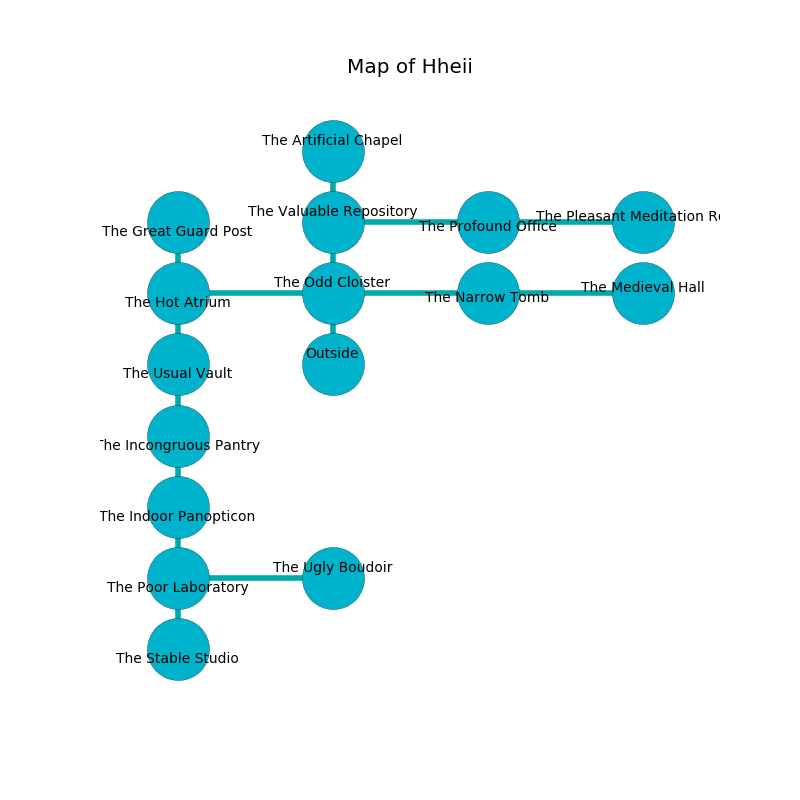

%Ruin Dogs

##Hheii
###Overview
Hheii is located under a flooded mountain. Some rooms of Hheii are incredibly hot. A lunar eclipse is happening outside. It is occupied by Ogres. Cherie Jacobsen The Untrustworthy, a Stone Giant is here. The Ogres are the slaves of Cherie Jacobsen The Untrustworthy. She  is trying to discover [Haehmd](#Haehmd). 

###Artifact
####Haehmd

Haehmd has the form of a hard meteorite. Cacophony slips around it. When rubbed it aids memory. 

###Locations

####the odd cloister
The floor is sticky. The air tastes like sausage here. There is a trap here. When activated, a magical rune will fire a scything blade. 

* There is a stocking here.
* There is a sceptre here.
* To the west a long passageway opens to [the hot atrium](#the-hot-atrium).
* To the east a flooded path connects to [the narrow tomb](#the-narrow-tomb).
* To the north a twisted gap connects to [the valuable repository](#the-valuable-repository).
* To the south is the entrance.

####the hot atrium
White mushrooms are decaying from the walls. The air smells like guava here. The floor is glossy. 

* To the east a long passageway leads to [the odd cloister](#the-odd-cloister).
* To the north a twisted walkway leads to [the great guard post](#the-great-guard-post).
* To the south a twisted hall opens to [the usual vault](#the-usual-vault).

####the usual vault
There are a Kuo-Toa Monitor, a Githyanki Warrior, and a Wraith here. The air smells like huckleberry here. Yellow ferns are growing in broken urns. 

* To the north a twisted hall connects to [the hot atrium](#the-hot-atrium).
* To the south a long cavern connects to [the incongruous pantry](#the-incongruous-pantry).

####the narrow tomb
The floor is cluttered with rocks. Yellow moss is sprouting from the ceiling. 

There is an engraving on a tablet written in Ogres Script. 

> Poor me! sorry you
>
> it is always critical
>
> operational, mature, new
>
> nothing is political
>

* There is a mug here.
* To the west a flooded path connects to [the odd cloister](#the-odd-cloister).
* To the east a windy cave leads to [the medieval hall](#the-medieval-hall).

####the valuable repository
The obsidion walls are bloodstained. The floor is flooded with nine inch deep cold water. There is a trap here. When activated, a tripwire will launch a rolling boulder. 

There is an engraving on a tablet written in Ogres Script. 

> [Haehmd](#Haehmd)
>
> shallow and regular
>
> always convenient
>
> always legislative
>
> statistical, acute, old
>
> yet notorious
>
> yet dangerous
>
> awake and official
>
> diplomatic and talkative
>
> rational, religious, visual
>
> soft, pregnant, old
>
> you must never be captured
>

* [Haehmd](#Haehmd) is here.
* To the east a narrow artery connects to [the profound office](#the-profound-office).
* To the north a dark cavern connects to [the artificial chapel](#the-artificial-chapel).
* To the south a twisted gap leads to [the odd cloister](#the-odd-cloister).

####the incongruous pantry
The air tastes like ripe banana here. There are a Bugbear Chief and a Cambion here. Blue ferns are sprouting from the walls. 

There is an engraving on the floor written in Ogres Script. 

> Dig here.
>

* There is a spirit here.
* To the north a long cavern leads to [the usual vault](#the-usual-vault).
* To the south a hazy hallway opens to [the indoor panopticon](#the-indoor-panopticon).

####the indoor panopticon
There are four Half-Ogres and two Ogres here. The floor is sticky. Green razorgrass is swaying from the ceiling. The Ogres are sleeping. 

* To the north a hazy hallway connects to [the incongruous pantry](#the-incongruous-pantry).
* To the south a dark cave leads to [the poor laboratory](#the-poor-laboratory).

####the poor laboratory
There are a Mummy, a Warhorse Skeleton, a Night Hag, and a Camel here. The floor is sticky. 

* There is a trousers here.
* To the east a hazy hall connects to [the ugly boudoir](#the-ugly-boudoir).
* To the north a dark cave opens to [the indoor panopticon](#the-indoor-panopticon).
* To the south a flooded cavern opens to [the stable studio](#the-stable-studio).

####the profound office
The brick walls are scratched. Blue lichens are decaying in broken urns. There are a Centaur and a Chimera here. 

* To the west a narrow artery connects to [the valuable repository](#the-valuable-repository).
* To the east a narrow passageway opens to [the pleasant meditation room](#the-pleasant-meditation-room).

####the ugly boudoir
The air smells like bell pepper here. There are three Half-Ogres and two Ogres here. The metallic walls are pristine. One of the Ogres is pointing a ballista at the entrance. 

* [Cherie Jacobsen The Untrustworthy](#Cherie-Jacobsen-The-Untrustworthy) is here.
* To the west a hazy hall opens to [the poor laboratory](#the-poor-laboratory).

####the medieval hall
The air smells like tobacco here. The mirrored walls are unsettled. There are a Red Slaad and a Grell here. 

* To the west a windy cave connects to [the narrow tomb](#the-narrow-tomb).

####the stable studio
Gray razorgrass is sprouting from the ceiling. The air smells like roasted barley here. There are two Half-Ogres and three Ogres here. The floor is smooth. The Ogres are performing a ritual. If not interrupted, [Cherie Jacobsen](#Cherie-Jacobsen) will be magically alarmed. 

There is an engraving on the wall written in Ogres Script. 

> Try praying.
>

* There is a knife here.
* To the north a flooded cavern leads to [the poor laboratory](#the-poor-laboratory).

####the great guard post
The air smells like saffron here. Blue ferns are swaying from the walls. The floor is sticky. There are a Giant Wasp, a Merrow, an Ankheg, and a Bone Naga here. 

* To the south a twisted walkway opens to [the hot atrium](#the-hot-atrium).

####the pleasant meditation room
The metallic walls are scratched. 

* To the west a narrow passageway connects to [the profound office](#the-profound-office).

####the artificial chapel
Yellow mushrooms are decaying in cracks in the floor. The concrete walls are covered in mold. 

* To the south a dark cavern opens to [the valuable repository](#the-valuable-repository).

