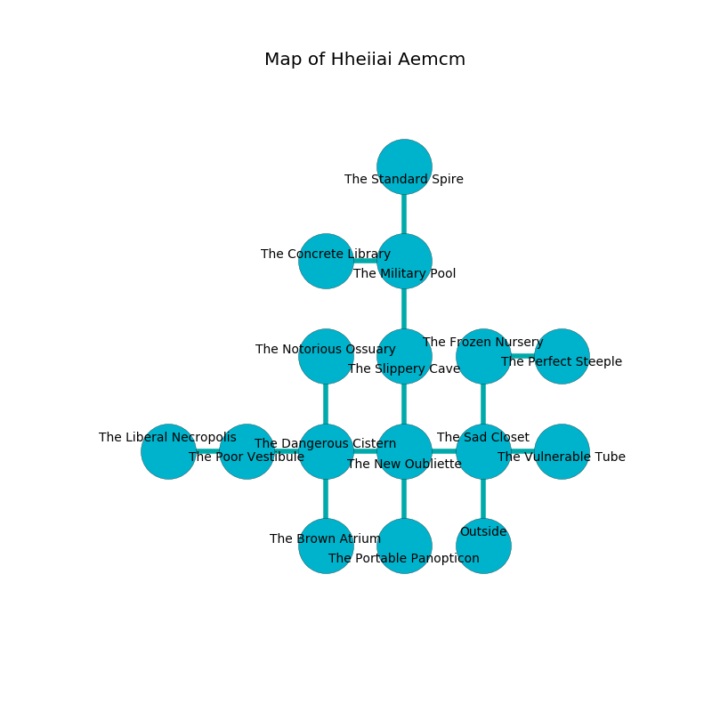

%Ruin Dogs

##Hheiiai Aemcm
###Overview
Hheiiai Aemcm is located on a spikey tree. Some rooms of it are unbearably hot. The ruin is sinking into the earth. It is occupied by Demons. Roseanna Early The Aggressive, a Bulette is here. The Demons are the minions of Roseanna Early The Aggressive. She  is trying to hide [Deffaeaf](#Deffaeaf). 

###Artifact
####Deffaeaf

Deffaeaf has the form of a transparent blade. Psychic energy flows near it. When rubbed it projects energy. 

###Locations

####the sad closet
The obsidion walls are pristine. The air tastes like labdanum here. 

* To the west a dripping hallway leads to [the new oubliette](#the-new-oubliette).
* To the east a twisted gap connects to [the vulnerable tube](#the-vulnerable-tube).
* To the north a dark hallway leads to [the frozen nursery](#the-frozen-nursery).
* To the south is the entrance.

####the vulnerable tube
The air tastes like violet leaf here. Blue lichens are swaying in cracks in the floor. 

There is an engraving on a stone written in common. 

> I tried giving up.
>

* There is a bridge here.
* There is an arch here.
* To the west a twisted gap connects to [the sad closet](#the-sad-closet).

####the frozen nursery
The floor is cluttered with shells. There are a Red Dragon Wyrmling, a Giant Constrictor Snake, a Crawling Claw, and a Deer here. The crystal walls are caving in. 

There is an engraving on the ceiling written in common. 

> You are joyful
>
> medieval, sensitive, interactive
>
> They are frozen
>
> hot, sick, indoor
>
> premature and rich
>
> but never municipal
>
> viable, normal, slow
>
> We are joyful
>
> yet uncomfortable
>

* There is a door here.
* To the east a dark threshold leads to [the perfect steeple](#the-perfect-steeple).
* To the south a dark hallway opens to [the sad closet](#the-sad-closet).

####the new oubliette
The glass walls are ruined. The floor is flooded with eight inch deep cold water. 

* To the west a long path opens to [the dangerous cistern](#the-dangerous-cistern).
* To the east a dripping hallway opens to [the sad closet](#the-sad-closet).
* To the north a narrow corridor leads to [the slippery cave](#the-slippery-cave).
* To the south a torchlit opening leads to [the portable panopticon](#the-portable-panopticon).

####the portable panopticon
The mirrored walls are pristine. There are an Imp and a Cambion here. One of the Demons is on watch, the rest are feasting. 

* To the north a torchlit opening connects to [the new oubliette](#the-new-oubliette).

####the slippery cave
There are a Barbed Devil and a Bulette here. The air tastes like black currant here. Red razorgrass is decaying in broken urns. The mirrored walls are caving in. The Demons are willing to negotiate. 

* To the north a twisted hall leads to [the military pool](#the-military-pool).
* To the south a narrow corridor connects to [the new oubliette](#the-new-oubliette).

####the dangerous cistern
The air tastes like spearmint here. The floor is sticky. Gray mushrooms are decaying in a patch on the floor. There are a Spined Devil and a Bulette here. The Demons are performing a ritual. If not interrupted, [Roseanna Early](#Roseanna-Early) will be magically alarmed. 

* To the west a flooded hallway opens to [the poor vestibule](#the-poor-vestibule).
* To the east a long path opens to [the new oubliette](#the-new-oubliette).
* To the north a twisted opening opens to [the notorious ossuary](#the-notorious-ossuary).
* To the south a small hall leads to [the brown atrium](#the-brown-atrium).

####the poor vestibule
The air smells like ginseng here. The floor is sticky. Blue moss is growing in a patch on the floor. 

There is an engraving on a stone written in common. 

> O! meak you
>
> first and sympathetic
>
> classical, bloody, true
>
> nothing is genetic
>

* To the west a twisted passageway leads to [the liberal necropolis](#the-liberal-necropolis).
* To the east a flooded hallway opens to [the dangerous cistern](#the-dangerous-cistern).

####the perfect steeple
There are an Incubus and a Bulette here. The air smells like sharp here. There is a trap here. When activated, a magical sound detector will fire an acid arrow. The Demons are meditating. 

* To the west a dark threshold opens to [the frozen nursery](#the-frozen-nursery).

####the liberal necropolis
Green mushrooms are decaying in cracks in the floor. 

* [Roseanna Early The Aggressive](#Roseanna-Early-The-Aggressive) is here.
* To the east a twisted passageway leads to [the poor vestibule](#the-poor-vestibule).

####the notorious ossuary
There are a Riding Horse, a Manticore, a Hawk, a Spined Devil, and an Azer here. The floor is cluttered with broken glass. The wooden walls are pristine. 

* There is a spirit here.
* To the south a twisted opening leads to [the dangerous cistern](#the-dangerous-cistern).

####the military pool
The wooden walls are ruined. There are a Slaad Tadpole, a Red Dragon Wyrmling, a Bugbear, and an Ankylosaurus here. 

There is an engraving on the wall written in Demons Script. 

> Do not try swimming.
>

* There is a bridge here.
* [Deffaeaf](#Deffaeaf) is here.
* To the west a twisted threshold connects to [the concrete library](#the-concrete-library).
* To the north a narrow path connects to [the standard spire](#the-standard-spire).
* To the south a twisted hall connects to [the slippery cave](#the-slippery-cave).

####the brown atrium
The floor is glossy. Yellow ferns are growing in a patch on the floor. The crystal walls are ruined. There are a Reef Shark, a Tiger, a Knight, and a Killer Whale here. 

* To the north a small hall leads to [the dangerous cistern](#the-dangerous-cistern).

####the standard spire
The obsidion walls are caving in. The floor is smooth. 

* To the south a narrow path leads to [the military pool](#the-military-pool).

####the concrete library
The wooden walls are caving in. Gray mushrooms are decaying from the walls. The floor is bloodstained. The air tastes like shrimp here. 

There is an engraving on a monolith written in common. 

> Leave now.
>

* To the east a twisted threshold connects to [the military pool](#the-military-pool).

