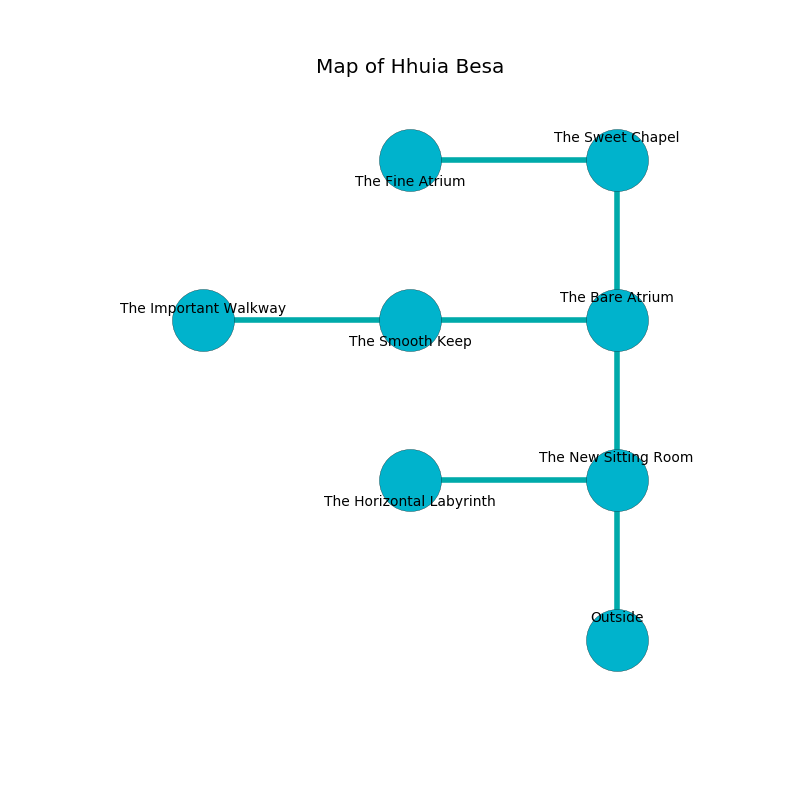

%Ruin Dogs

##Hhuia Besa
###Overview
Hhuia Besa is located under a broken tree. Some rooms of Hhuia Besa are inaccessible. The ruin is larger on the inside than the outside. It is occupied by Pixies. Dannette Brock The Obstinate, a Fire Giant is here. The Pixies are the soldiers of Dannette Brock The Obstinate. She  is founding a new religion. 

###Artifact
####The Separate Fur

The Separate Fur is a powerful artifact in the shape of a soft orb. It is a medium brown color. It smells like smoked sausage. When worn it illuminates its surroundings. 

###Locations

####the new sitting Room
There are a Giant Vulture, an Axe Beak, a Young Remorhaz, and a Drow Priestess of Lolth here. The concrete walls are covered in mold. 

* To the west a twisted walkway connects to [the horizontal labyrinth](#the-horizontal-labyrinth).
* To the north a long hallway connects to [the bare atrium](#the-bare-atrium).
* To the south is the entrance.

####the bare atrium
The air smells like seafood here. The glass walls are caving in. The floor is cluttered with shells. There are a Magma Mephit, a Wererat, and a Young Green Dragon here. 

* There is a feather here.
* To the west a dripping opening leads to [the smooth keep](#the-smooth-keep).
* To the north a small opening opens to [the sweet chapel](#the-sweet-chapel).
* To the south a long hallway leads to [the new sitting Room](#the-new-sitting-Room).

####the sweet chapel
The air smells like shellfish here. 

* There is a knot here.
* [The Separate Fur](#The-Separate-Fur) is here.
* [Dannette Brock The Obstinate](#Dannette-Brock-The-Obstinate) is here.
* To the west a narrow threshold leads to [the fine atrium](#the-fine-atrium).
* To the south a small opening leads to [the bare atrium](#the-bare-atrium).

####the smooth keep
There are forty Pixies here. The glass walls are caving in. The air smells like beeswax here. If the Pixies notice the Ruin Dogs, one of them will retreat and alert [Dannette Brock](#Dannette-Brock). 

* To the west a windy cave opens to [the important walkway](#the-important-walkway).
* To the east a dripping opening leads to [the bare atrium](#the-bare-atrium).

####the important walkway
There are a Displacer Beast, an Earth Elemental, and an Orc War Chief here. The brick walls are ruined. 

* To the east a windy cave opens to [the smooth keep](#the-smooth-keep).

####the horizontal labyrinth
The floor is bloodstained. There is a trap here. When activated, a pressure plate will launch a rolling boulder. The obsidion walls are pristine. 

* To the east a twisted walkway leads to [the new sitting Room](#the-new-sitting-Room).

####the fine atrium
The stone walls are ruined. There are forty Pixies here. The Pixies are crazy with bloodlust. 

There is an engraving on the wall written in Pixies Script. 

> A cushion is a remedy
>
> smooth and huge
>
> ever neutral
>
> A cushion is a remedy
>

* There is a triptych here.
* To the east a narrow threshold opens to [the sweet chapel](#the-sweet-chapel).

