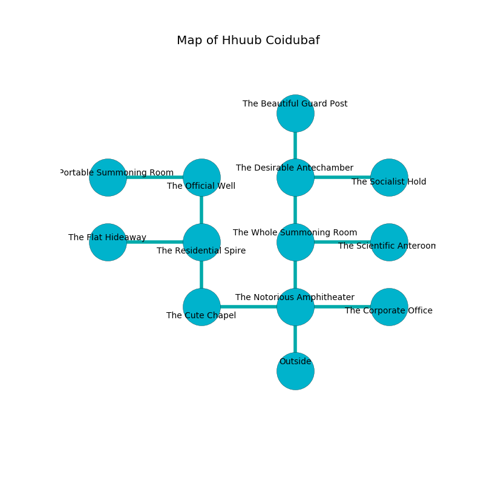

%Ruin Dogs

##Hhuub Coidubaf
###Overview
Hhuub Coidubaf is located under a poisoned city. Some areas of Hhuub Coidubaf are flooded. The ruin is burning. It is occupied by Deep Gnomes. Jody Barth The Tactless, an Assassin is here. The Deep Gnomes are ruled by Jody Barth The Tactless. She  is trying to hide [Gauaf Feaemduia](#Gauaf-Feaemduia). 

###Artifact
####Gauaf Feaemduia

Gauaf Feaemduia has the form of a mushy spear. Fire slides away from it. It is a light orange color. It smells like gas. When smelled it turns surrounding objects to ashes. 

###Locations

####the notorious amphitheater
There are a Green Slaad and a Flying Snake here. 

* To the west a twisted threshold connects to [the cute chapel](#the-cute-chapel).
* To the east a hazy threshold connects to [the corporate office](#the-corporate-office).
* To the north a long cavern connects to [the whole summoning room](#the-whole-summoning-room).
* To the south is the entrance.

####the whole summoning room
There is a trap here. When activated, a magical sound detector will launch a javelin. Green moss is swaying in broken urns. There are a Giant Toad, a Silver Dragon Wyrmling, and a Bulette here. 

* To the east a flooded corridor connects to [the scientific anteroom](#the-scientific-anteroom).
* To the north a hazy passageway connects to [the desirable antechamber](#the-desirable-antechamber).
* To the south a long cavern leads to [the notorious amphitheater](#the-notorious-amphitheater).

####the corporate office
The brick walls are bloodstained. The floor is flooded with three inch deep lukewarm water. 

* To the west a hazy threshold connects to [the notorious amphitheater](#the-notorious-amphitheater).

####the cute chapel
The crystal walls are scratched. The floor is bloodstained. The air smells like spice here. There is a Chain Devil here. 

* There is a belt here.
* To the east a twisted threshold connects to [the notorious amphitheater](#the-notorious-amphitheater).
* To the north a dark cave leads to [the residential spire](#the-residential-spire).

####the residential spire
The air smells like cranberry here. Red moss is sprouting from the walls. The floor is glossy. 

* [Jody Barth The Tactless](#Jody-Barth-The-Tactless) is here.
* To the west a twisted passageway connects to [the flat hideaway](#the-flat-hideaway).
* To the north a dripping passageway leads to [the official well](#the-official-well).
* To the south a dark cave opens to [the cute chapel](#the-cute-chapel).

####the scientific anteroom
The floor is glossy. Gray mushrooms are growing from the ceiling. The metallic walls are ruined. 

There is an engraving on a tablet written in common. 

> We are frozen
>
> honest, tender, abstract
>
> We are frozen
>

* To the west a flooded corridor connects to [the whole summoning room](#the-whole-summoning-room).

####the official well
White lichens are sprouting from the walls. There are a Draft Horse, a Harpy, a Cockatrice, a Needle Blight, a Camel, two Knights, and  here. The floor is sticky. 

* To the west a dripping threshold connects to [the portable summoning room](#the-portable-summoning-room).
* To the south a dripping passageway opens to [the residential spire](#the-residential-spire).

####the desirable antechamber
The floor is sticky. The obsidion walls are pristine. 

* There is a diamond here.
* There is a stick here.
* [Gauaf Feaemduia](#Gauaf-Feaemduia) is here.
* To the east a small walkway connects to [the socialist hold](#the-socialist-hold).
* To the north a small hallway connects to [the beautiful guard post](#the-beautiful-guard-post).
* To the south a hazy passageway opens to [the whole summoning room](#the-whole-summoning-room).

####the portable summoning room
Red moss is decaying from the walls. The floor is cluttered with debris. 

There is an engraving on a tablet written in Deep Gnomes Script. 

> A trap ahead.
>

* To the east a dripping threshold leads to [the official well](#the-official-well).

####the beautiful guard post
There are sixteen Deep Gnomes here. The air tastes like clary sage here. The Deep Gnomes are performing a ritual. If not interrupted, a powerful monster will be summoned. 

* To the south a small hallway opens to [the desirable antechamber](#the-desirable-antechamber).

####the flat hideaway
The air tastes like menthol here. 

* To the east a twisted passageway leads to [the residential spire](#the-residential-spire).

####the socialist hold
There are a Half-Red Dragon Veteran, a Tribal Warrior, a Gelatinous Cube, a Hawk, a Swarm of Quippers, a Scarecrow, and a Cockatrice here. The floor is smooth. 

There is an engraving on a monolith written in common. 

> I can not find [Gauaf Feaemduia](#Gauaf-Feaemduia).
>
> Do not try leaving.
>

* To the west a small walkway opens to [the desirable antechamber](#the-desirable-antechamber).

