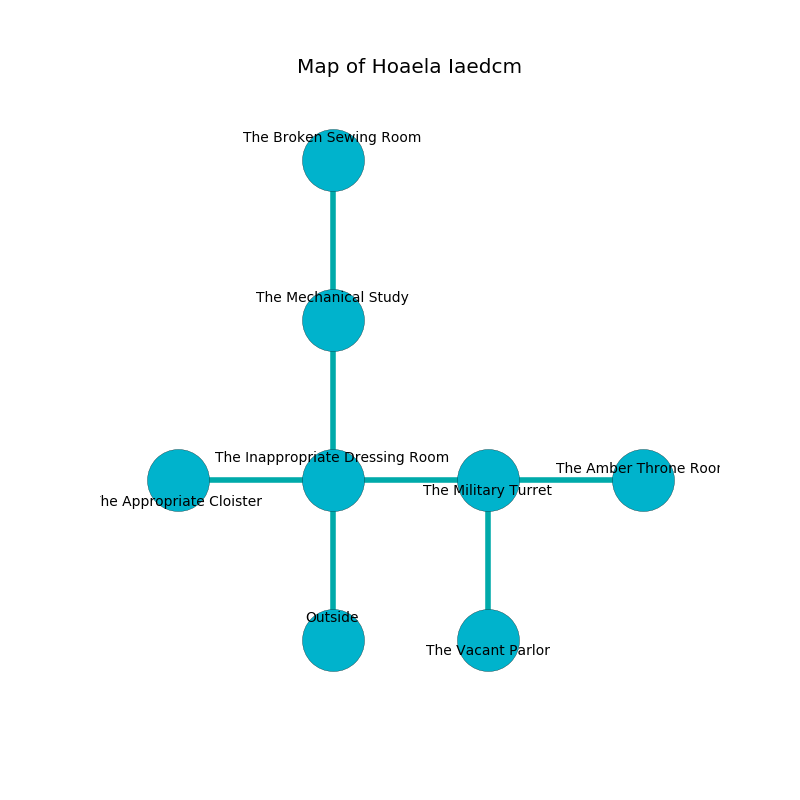

%Ruin Dogs

##Hoaela Iaedcm
###Overview
Hoaela Iaedcm is located under a cursed tree. Some areas of Hoaela Iaedcm are foggy. The ruin is flooding. It is occupied by Demons. Magda Mcginnis The Unpredictable, a Fire Giant is here. The Demons have been charmed by Magda Mcginnis The Unpredictable. She  is founding a new religion. 

###Artifact
####The Complete Tyre

The Complete Tyre has the form of a sharp doll. Fire glows away from it. It smells like roasted almond. It is a medium purple color. When smelled it aids memory. 

###Locations

####the inappropriate dressing room
The air tastes like deertongue here. The floor is sticky. The glass walls are bloodstained. 

* There is a plate here.
* To the west a long gap leads to [the appropriate cloister](#the-appropriate-cloister).
* To the east a twisted walkway connects to [the military turret](#the-military-turret).
* To the north a flooded path leads to [the mechanical study](#the-mechanical-study).
* To the south is the entrance.

####the mechanical study
Yellow lichens are decaying in a patch on the floor. 

* To the north a narrow cave connects to [the broken sewing room](#the-broken-sewing-room).
* To the south a flooded path connects to [the inappropriate dressing room](#the-inappropriate-dressing-room).

####the appropriate cloister
The air smells like bread crust here. White ferns are swaying in a patch on the floor. The floor is bloodstained. 

There is an engraving on a stone written in Demons Script. 

> I am hiding in Hoaela Iaedcm.
>

* To the east a long gap opens to [the inappropriate dressing room](#the-inappropriate-dressing-room).

####the military turret
The floor is flooded with three inch deep scalding water. The glass walls are unsettled. 

* [The Complete Tyre](#The-Complete-Tyre) is here.
* [Magda Mcginnis The Unpredictable](#Magda-Mcginnis-The-Unpredictable) is here.
* To the west a twisted walkway leads to [the inappropriate dressing room](#the-inappropriate-dressing-room).
* To the east a dripping opening connects to [the amber throne room](#the-amber-throne-room).
* To the south a hazy artery opens to [the vacant parlor](#the-vacant-parlor).

####the vacant parlor
The floor is bloodstained. Gray mushrooms are swaying from the ceiling. 

There is an engraving on a monolith written in common. 

> I am lost in Hoaela Iaedcm.
>

* To the north a hazy artery connects to [the military turret](#the-military-turret).

####the broken sewing room
There are an Incubus and two Bearded Devils here. The wooden walls are ruined. Blue razorgrass is sprouting in a patch on the floor. The Demons are willing to negotiate. 

* There is a nail here.
* To the south a narrow cave connects to [the mechanical study](#the-mechanical-study).

####the amber throne room
White lichens are growing in a patch on the floor. The mirrored walls are pristine. There are a Deva and a Lemure here. The floor is bloodstained. 

* To the west a dripping opening connects to [the military turret](#the-military-turret).

