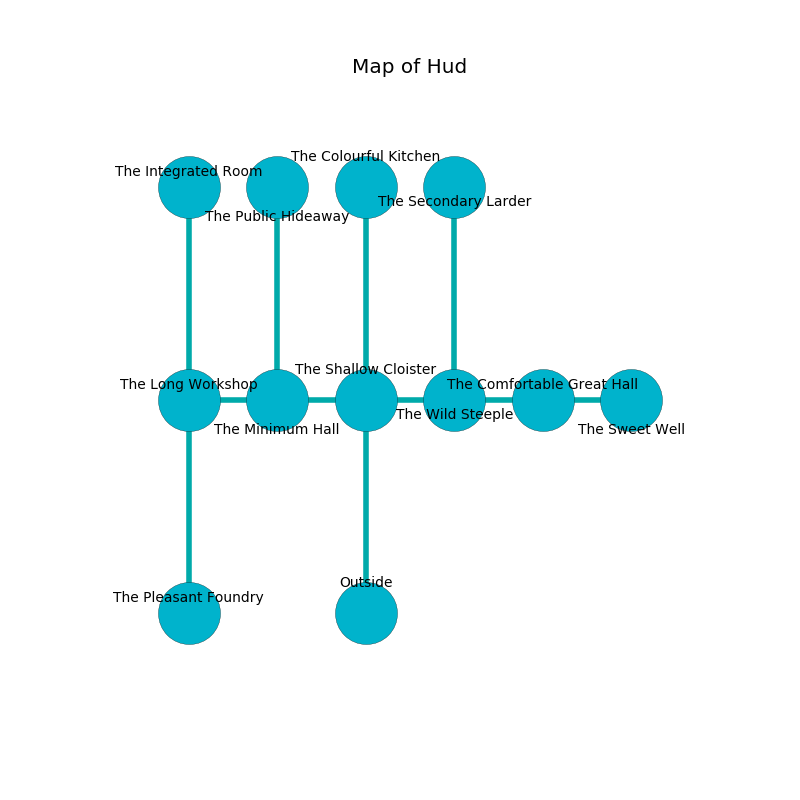

%Ruin Dogs

##Hud
###Overview
Hud is located on a ruined tree. Regions of it are somewhat hot. A solar eclipse is happening outside. It is occupied by Ogres. Octavio Mclaughlin The Perverse, a Kuo-Toa Monitor is here. The Ogres are the slaves of Octavio Mclaughlin The Perverse. He  is founding a new religion. 

###Artifact
####The Mechanical Majority

The Mechanical Majority has the form of a cold rock. When held it liquifies. 

###Locations

####the shallow cloister
The obsidion walls are bloodstained. 

* To the west a dripping hallway opens to [the minimum hall](#the-minimum-hall).
* To the east a dripping path opens to [the wild steeple](#the-wild-steeple).
* To the north a dripping threshold leads to [the colourful kitchen](#the-colourful-kitchen).
* To the south is the entrance.

####the wild steeple
There are a Sprite, a Giant Octopus, a Sahuagin Priestess, and a Giant Boar here. The mirrored walls are caving in. 

* There is an icon here.
* To the west a dripping path opens to [the shallow cloister](#the-shallow-cloister).
* To the east a windy hall opens to [the comfortable great hall](#the-comfortable-great-hall).
* To the north a torchlit hallway leads to [the secondary larder](#the-secondary-larder).

####the comfortable great hall
Gray razorgrass is growing from the ceiling. There is a trap here. When activated, a magical sound detector will fire an acid arrow. The floor is flooded with three inch deep scalding water. There are a Half-Ogre and two Ogres here. One of the Ogres is pointing a ballista at the entrance. 

There is an engraving on the ceiling written in common. 

> [The Mechanical Majority](#The-Mechanical-Majority)
>
> academic, senior, white
>
> you shall be joined
>

* To the west a windy hall leads to [the wild steeple](#the-wild-steeple).
* To the east a dripping opening leads to [the sweet well](#the-sweet-well).

####the colourful kitchen
The air tastes like cauliflower here. Red razorgrass is swaying in a patch on the floor. The floor is smooth. 

* To the south a dripping threshold leads to [the shallow cloister](#the-shallow-cloister).

####the minimum hall
The air smells like oats here. White lichens are growing in broken urns. 

* To the west a flooded pathway opens to [the long workshop](#the-long-workshop).
* To the east a dripping hallway opens to [the shallow cloister](#the-shallow-cloister).
* To the north a twisted passageway opens to [the public hideaway](#the-public-hideaway).

####the sweet well
The air tastes like cranberry here. There are two Half-Ogres and an Ogre here. The Ogres are drunk. 

* There is a picture here.
* There is a shirt here.
* To the west a dripping opening connects to [the comfortable great hall](#the-comfortable-great-hall).

####the public hideaway
The air smells like pineapple here. The mirrored walls are unsettled. 

* To the south a twisted passageway opens to [the minimum hall](#the-minimum-hall).

####the secondary larder
The concrete walls are covered in mold. There are two Ogres here. The floor is sticky. White lichens are swaying in cracks in the floor. The Ogres are willing to negotiate. 

* To the south a torchlit hallway leads to [the wild steeple](#the-wild-steeple).

####the long workshop
There are a Half-Ogre and two Ogres here. The floor is flooded with five inch deep cool water. The stone walls are pristine. Red ferns are decaying in cracks in the floor. The Ogres are caring for babies. 

* There is a bridge here.
* [The Mechanical Majority](#The-Mechanical-Majority) is here.
* [Octavio Mclaughlin The Perverse](#Octavio-Mclaughlin-The-Perverse) is here.
* To the east a flooded pathway opens to [the minimum hall](#the-minimum-hall).
* To the north a dark opening leads to [the integrated room](#the-integrated-room).
* To the south a long hall leads to [the pleasant foundry](#the-pleasant-foundry).

####the integrated room
The floor is sticky. Gray mushrooms are sprouting in a patch on the floor. There are a Kuo-Toa Monitor, a Gnoll, a Shadow Demon, and a Baboon here. The air tastes like garlic here. 

There is an engraving on the floor written in Ogres Script. 

> Dear me! meak you
>
> decorative and due
>
> it is never charismatic
>
> nothing is due
>

* There is a rod here.
* There is a gold coin here.
* To the south a dark opening leads to [the long workshop](#the-long-workshop).

####the pleasant foundry
The floor is glossy. The air smells like dates here. Yellow mushrooms are sprouting in a patch on the floor. 

* To the north a long hall opens to [the long workshop](#the-long-workshop).

