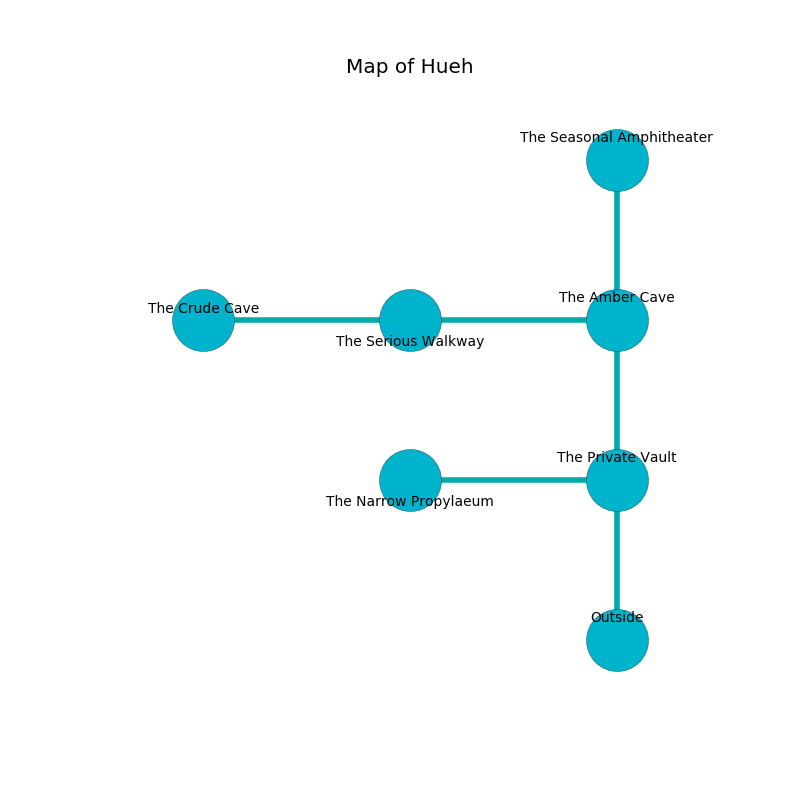

%Ruin Dogs

##Hueh
###Overview
Hueh is located under a spikey city. Some rooms of Hueh are inaccessible. A solar eclipse is happening outside. It is occupied by Drow. Clair Horne The Untrustworthy, a Frost Giant is here. The Drow are battling Clair Horne The Untrustworthy. He  is trying to steal [Dofioaed Doi](#Dofioaed-Doi). 

###Artifact
####Dofioaed Doi

Dofioaed Doi has the form of a broken meteorite. It is a shifting gray color. Air slides away from it. When touched it illuminates its surroundings. 

###Locations

####the private vault
The floor is sticky. Green ferns are growing from the walls. The stone walls are unsettled. 

There is an engraving on the wall written in Drow Script. 

> I am lost in Hueh.
>

* [Dofioaed Doi](#Dofioaed-Doi) is here.
* To the west a hazy threshold leads to [the narrow propylaeum](#the-narrow-propylaeum).
* To the north a dark hallway connects to [the amber cave](#the-amber-cave).
* To the south is the entrance.

####the amber cave
The air smells like tansy here. Red mushrooms are swaying in cracks in the floor. 

* [Clair Horne The Untrustworthy](#Clair-Horne-The-Untrustworthy) is here.
* To the west a dripping cave opens to [the serious walkway](#the-serious-walkway).
* To the north a long pathway leads to [the seasonal amphitheater](#the-seasonal-amphitheater).
* To the south a dark hallway opens to [the private vault](#the-private-vault).

####the serious walkway
The air smells like juice here. The concrete walls are bloodstained. White mushrooms are swaying from the ceiling. There is a trap here. When activated, a tripwire will open a large pit in the floor. 

* To the west a windy hall opens to [the crude cave](#the-crude-cave).
* To the east a dripping cave connects to [the amber cave](#the-amber-cave).

####the crude cave
The stone walls are pristine. The floor is flooded with one inch deep lukewarm water. The air smells like fig here. 

* To the east a windy hall opens to [the serious walkway](#the-serious-walkway).

####the seasonal amphitheater
The brick walls are pristine. White lichens are swaying from the ceiling. The floor is smooth. 

* There is a boot here.
* To the south a long pathway connects to [the amber cave](#the-amber-cave).

####the narrow propylaeum
There are a Triceratops, a Giant Eagle, a Gladiator, and a Quadrone here. Red razorgrass is growing in a patch on the floor. The air smells like bacon here. There is a trap here. When activated, a pressure plate will collapse a wall. 

There is an engraving on a stone written in Drow Script. 

> Oh weak fate
>
> possible and late
>
> last, unlikely, tight
>
> fate is light
>

* To the east a hazy threshold connects to [the private vault](#the-private-vault).

