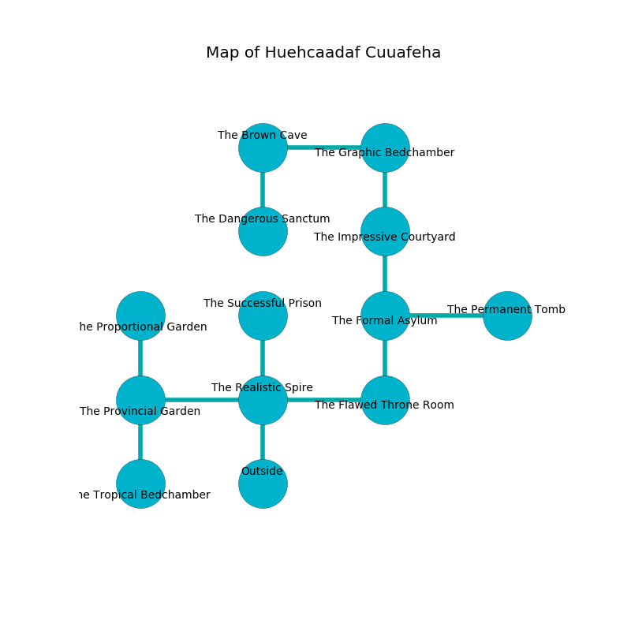

%Ruin Dogs

##Huehcaadaf Cuuafeha
###Overview
Huehcaadaf Cuuafeha is located on a flooded plain. Some areas of it are corrupted. The ruin is larger on the inside than the outside. It is occupied by Thri-Kreens. Vernell Jeter The Weak-Willed, a Cult Fanatic is here. The Thri-Kreens are the soldiers of Vernell Jeter The Weak-Willed. She  is trying to destroy [Icadcm](#Icadcm). 

###Artifact
####Icadcm

Icadcm is a powerful artifact in the shape of a cold amulet. It is a sickly green color. When worn it repels insects. 

###Locations

####the realistic spire
Blue razorgrass is decaying in cracks in the floor. The air tastes like hazelnut here. The floor is sticky. 

* There is a brake here.
* To the west a dripping walkway opens to [the provincial garden](#the-provincial-garden).
* To the east a hazy threshold connects to [the flawed throne room](#the-flawed-throne-room).
* To the north a windy corridor opens to [the successful prison](#the-successful-prison).
* To the south is the entrance.

####the successful prison
The wooden walls are scratched. There are two Thri-Kreens here. The floor is bloodstained. Gray lichens are decaying in broken urns. If the Thri-Kreens notice the Ruin Dogs, one of them will retreat and alert [Vernell Jeter](#Vernell-Jeter). 

* There is a spade here.
* [Vernell Jeter The Weak-Willed](#Vernell-Jeter-The-Weak-Willed) is here.
* To the south a windy corridor leads to [the realistic spire](#the-realistic-spire).

####the flawed throne room
The floor is flooded with seven inch deep lukewarm water. The glass walls are caving in. The air tastes like tobacco here. 

There is an engraving on a monolith written in common. 

> Dear me! the world is sadistic
>
> it is never artistic
>
> but normal
>
> death is informal
>

* There is a crossbow here.
* To the west a hazy threshold opens to [the realistic spire](#the-realistic-spire).
* To the north a hazy path connects to [the formal asylum](#the-formal-asylum).

####the formal asylum
White ferns are decaying in a patch on the floor. The floor is sticky. 

There is an engraving on a stone written in common. 

> Poor me! dire god
>
> brown and odd
>
> yet capable
>
> sadness is incapable
>

* To the east a hazy path leads to [the permanent tomb](#the-permanent-tomb).
* To the north a small cavern leads to [the impressive courtyard](#the-impressive-courtyard).
* To the south a hazy path connects to [the flawed throne room](#the-flawed-throne-room).

####the provincial garden
There is a trap here. When activated, a pressure plate will fire an acid arrow. The floor is bloodstained. 

* There is an orb here.
* To the east a dripping walkway connects to [the realistic spire](#the-realistic-spire).
* To the north a dark threshold leads to [the proportional garden](#the-proportional-garden).
* To the south a dripping walkway leads to [the tropical bedchamber](#the-tropical-bedchamber).

####the permanent tomb
Yellow mushrooms are swaying in a patch on the floor. The air tastes like algae here. There are two Thri-Kreens here. The Thri-Kreens are berserk with rage. 

There is an engraving on a tablet written in Thri-Kreens Script. 

> An arch is a prisoner
>
> far and small
>
> enjoyable, experienced, blank
>
> They are lost
>
> portable, intermediate, presidential
>
> [Icadcm](#Icadcm)
>
> careful, precise, portable
>
> A thread is an origin
>
> yet useful
>

* To the west a hazy path connects to [the formal asylum](#the-formal-asylum).

####the impressive courtyard
There are a Peryton and a Fire Snake here. White lichens are decaying in a patch on the floor. The obsidion walls are covered in mold. 

* To the north a small passageway opens to [the graphic bedchamber](#the-graphic-bedchamber).
* To the south a small cavern leads to [the formal asylum](#the-formal-asylum).

####the graphic bedchamber
The floor is cluttered with rocks. 

* There is a crystal here.
* There is a skull here.
* To the west a hazy cave opens to [the brown cave](#the-brown-cave).
* To the south a small passageway opens to [the impressive courtyard](#the-impressive-courtyard).

####the tropical bedchamber
There are two Thri-Kreens here. One of the Thri-Kreens is on watch, the rest are sleeping. 

* To the north a dripping walkway leads to [the provincial garden](#the-provincial-garden).

####the brown cave
The floor is bloodstained. The air tastes like clover here. There are two Thri-Kreens here. If the Thri-Kreens notice the Ruin Dogs, one of them will retreat and alert the others. 

There is an engraving on a monolith written in common. 

> I am lost in Huehcaadaf Cuuafeha.
>
> Dig here.
>

* There is a girl here.
* [Icadcm](#Icadcm) is here.
* To the east a hazy cave opens to [the graphic bedchamber](#the-graphic-bedchamber).
* To the south a windy gap opens to [the dangerous sanctum](#the-dangerous-sanctum).

####the proportional garden
White lichens are growing in broken urns. The air tastes like neroli here. The floor is sticky. There are a Duergar, a Giant Sea Horse, and a Giant Goat here. The metallic walls are scratched. 

* To the south a dark threshold connects to [the provincial garden](#the-provincial-garden).

####the dangerous sanctum
The crystal walls are ruined. Green lichens are decaying in broken urns. There are two Thri-Kreens here. If the Thri-Kreens notice the Ruin Dogs, one of them will retreat and alert the others. 

* To the north a windy gap opens to [the brown cave](#the-brown-cave).

