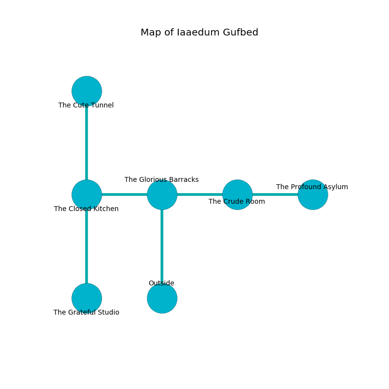

%Ruin Dogs

##Iaaedum Gufbed
###Overview
Iaaedum Gufbed is located under a ruined tree. Some areas of Iaaedum Gufbed are foggy. A blizzard is happening outside. It is occupied by Dryads. Barbar Mcneill The Untidy, a Quaggoth Thonot is here. The Dryads are ruled by Barbar Mcneill The Untidy. She  is founding a new religion. 

###Artifact
####Cmemca Befi

Cmemca Befi looks like a smooth prism. It smells like grape. It is a medium white color. Cacophony shifts around it. When worshipped it levitates those nearby. 

###Locations

####the glorious barracks
There are a Sahuagin, a Carrion Crawler, a Swarm of Bats, a Kuo-Toa, and a Bandit Captain here. Green mushrooms are swaying in broken urns. The wooden walls are ruined. 

There is an engraving on the ceiling written in common. 

> O! sorry soul
>
> ever incapable
>
> always whole
>
> hope is capable
>

* To the west a twisted walkway opens to [the closed kitchen](#the-closed-kitchen).
* To the east a dripping walkway opens to [the crude room](#the-crude-room).
* To the south is the entrance.

####the closed kitchen
The brick walls are ruined. 

* To the east a twisted walkway opens to [the glorious barracks](#the-glorious-barracks).
* To the north a hazy opening opens to [the cute tunnel](#the-cute-tunnel).
* To the south a small passageway opens to [the grateful studio](#the-grateful-studio).

####the grateful studio
The floor is flooded with four inch deep hot water. The wooden walls are pristine. 

There is an engraving on the wall written in Dryads Script. 

> I want to find [Cmemca Befi](#Cmemca-Befi).
>

* [Barbar Mcneill The Untidy](#Barbar-Mcneill-The-Untidy) is here.
* To the north a small passageway leads to [the closed kitchen](#the-closed-kitchen).

####the cute tunnel
The air tastes like blackberry here. The floor is sticky. Red moss is decaying from the ceiling. There are a Giant Constrictor Snake, a Monodrone, and a Killer Whale here. 

* To the south a hazy opening leads to [the closed kitchen](#the-closed-kitchen).

####the crude room
There is a trap here. When activated, a magical proximity detector will open a trapdoor in the floor. 

* [Cmemca Befi](#Cmemca-Befi) is here.
* To the west a dripping walkway connects to [the glorious barracks](#the-glorious-barracks).
* To the east a flooded gap connects to [the profound asylum](#the-profound-asylum).

####the profound asylum
There are a Saber-Toothed Tiger, an Ankylosaurus, and a Rat here. The air smells like tobacco here. The stone walls are covered in mold. 

There is an engraving on the ceiling written in common. 

> [Cmemca Befi](#Cmemca-Befi)
>
> inadequate and free
>
> [Cmemca Befi](#Cmemca-Befi)
>

* There is an arch here.
* To the west a flooded gap opens to [the crude room](#the-crude-room).

