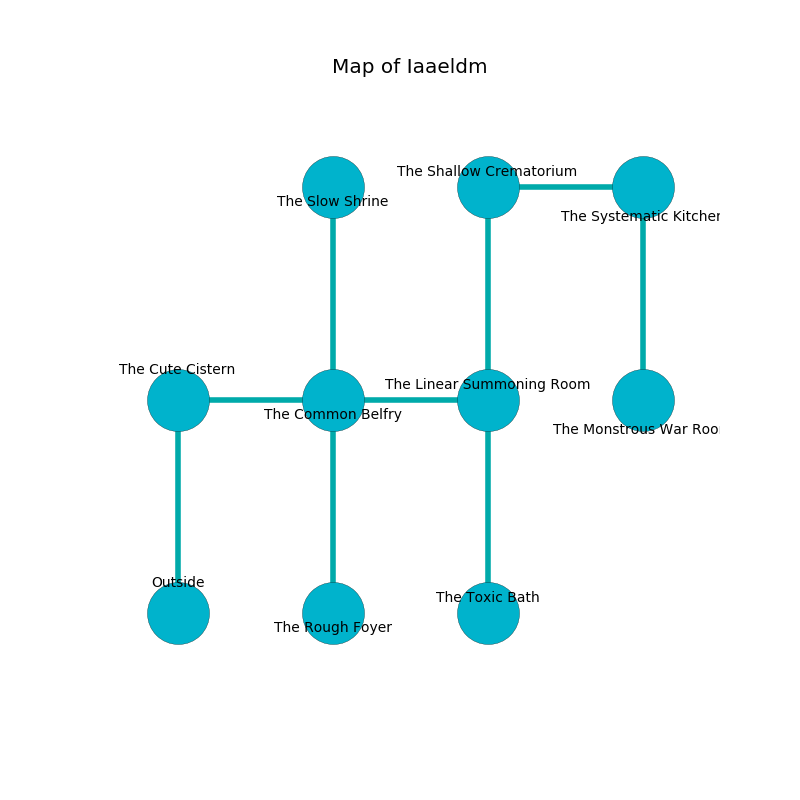

%Ruin Dogs

##Iaaeldm
###Overview
Iaaeldm is located on a cursed tree. Regions of Iaaeldm are foggy. The ruin is flooding. It is occupied by Drows. Nicola Barnhill The Bossy, a Druid is here. The Drows are ruled by Nicola Barnhill The Bossy. She  is founding a new religion. 

###Artifact
####Aggufd

Aggufd is a powerful artifact in the shape of a smooth spear. Magic glows away from it. It is a shifting purple color. When carried it emits dust. 

###Locations

####the cute cistern
The mirrored walls are pristine. The air tastes like cucumber here. 

* To the east a torchlit walkway opens to [the common belfry](#the-common-belfry).
* To the south is the entrance.

####the common belfry
The air smells like leather here. There are a Doppelganger and a Ghast here. Gray razorgrass is growing in broken urns. The floor is glossy. 

* To the west a torchlit walkway connects to [the cute cistern](#the-cute-cistern).
* To the east a narrow walkway leads to [the linear summoning room](#the-linear-summoning-room).
* To the north a twisted artery leads to [the slow shrine](#the-slow-shrine).
* To the south a dripping path leads to [the rough foyer](#the-rough-foyer).

####the rough foyer
The floor is flooded with nine inch deep hot water. The air tastes like privet blossom here. The stone walls are pristine. 

* To the north a dripping path connects to [the common belfry](#the-common-belfry).

####the slow shrine
The air tastes like toast here. The floor is flooded with three inch deep hot water. 

* There is a crossbow here.
* To the south a twisted artery connects to [the common belfry](#the-common-belfry).

####the linear summoning room
The air tastes like narcissus here. The glass walls are covered in mold. The floor is glossy. 

There is an engraving on the ceiling written in Drows Script. 

> Dear me! weak fate
>
> sufficient, vocational, rational
>
> busy, funny, straight
>
> cruelty is national
>

* [Nicola Barnhill The Bossy](#Nicola-Barnhill-The-Bossy) is here.
* To the west a narrow walkway opens to [the common belfry](#the-common-belfry).
* To the north a narrow cave leads to [the shallow crematorium](#the-shallow-crematorium).
* To the south a dark pathway connects to [the toxic bath](#the-toxic-bath).

####the shallow crematorium
Gray lichens are swaying from the ceiling. There is a Green Hag here. 

There is an engraving on a monolith written in common. 

> Run away.
>

* To the east a dripping walkway opens to [the systematic kitchen](#the-systematic-kitchen).
* To the south a narrow cave leads to [the linear summoning room](#the-linear-summoning-room).

####the systematic kitchen
The crystal walls are pristine. 

* [Aggufd](#Aggufd) is here.
* To the west a dripping walkway opens to [the shallow crematorium](#the-shallow-crematorium).
* To the south a windy pathway connects to [the monstrous war Room](#the-monstrous-war-Room).

####the toxic bath
The floor is glossy. The crystal walls are ruined. Gray moss is growing from the ceiling. 

* To the north a dark pathway connects to [the linear summoning room](#the-linear-summoning-room).

####the monstrous war Room
The air tastes like pepper here. There are a Manticore, a Steam Mephit, and a Minotaur Skeleton here. Gray mushrooms are swaying in broken urns. 

* There is an egg here.
* To the north a windy pathway connects to [the systematic kitchen](#the-systematic-kitchen).

