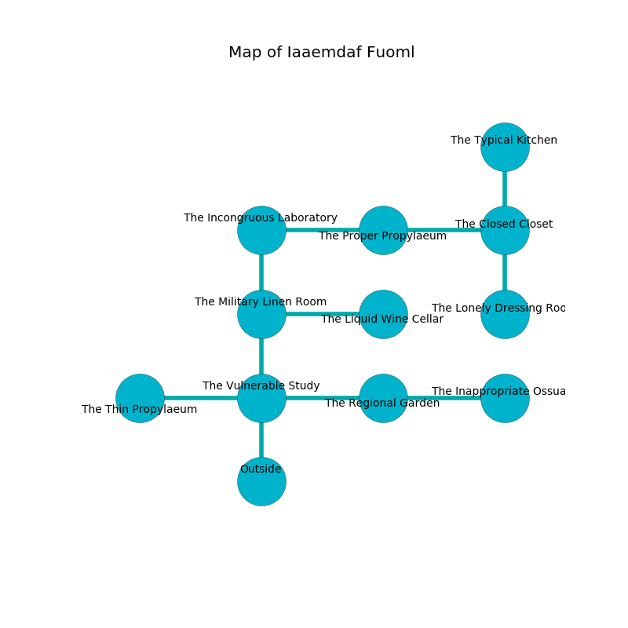

%Ruin Dogs

##Iaaemdaf Fuoml
###Overview
Iaaemdaf Fuoml is located in an alien plain. Some areas of it are frozen. A battle between raiders is happening outside. It is occupied by Pixies. Saundra Nolan The Impatient, a Gladiator is here. The Pixies are the slaves of Saundra Nolan The Impatient. She  is founding a new religion. 

###Artifact
####Laeicuofia

Laeicuofia has the form of a wet blade. Water glows around it. It smells like lemon peel. When worshipped it sings the hymn of the damned. 

###Locations

####the vulnerable study
There are twenty Pixies here. Red razorgrass is swaying in a patch on the floor. The crystal walls are caving in. The air tastes like butterscotch here. The floor is cluttered with ashes. One of the Pixies is working a mechanism that can engulf the room in a fiery blaze. 

* To the west a torchlit passageway connects to [the thin propylaeum](#the-thin-propylaeum).
* To the east a dark gap connects to [the regional garden](#the-regional-garden).
* To the north a hazy artery opens to [the military linen room](#the-military-linen-room).
* To the south is the entrance.

####the military linen room
There is a Wraith here. Yellow razorgrass is decaying in broken urns. The air smells like honey here. 

* To the east a flooded cave opens to [the liquid wine cellar](#the-liquid-wine-cellar).
* To the north a torchlit hall connects to [the incongruous laboratory](#the-incongruous-laboratory).
* To the south a hazy artery opens to [the vulnerable study](#the-vulnerable-study).

####the regional garden
There is a trap here. When activated, a magical proximity detector will launch an arrow. White lichens are swaying in a patch on the floor. The air tastes like cooked onion here. The metallic walls are bloodstained. The floor is bloodstained. 

There is an engraving on the floor written in Pixies Script. 

> All of us are frozen
>
> classical and jealous
>
> but even
>
> funny, broken, shallow
>
> conventional and human
>
> you must never be captured
>

* To the west a dark gap connects to [the vulnerable study](#the-vulnerable-study).
* To the east a torchlit cave opens to [the inappropriate ossuary](#the-inappropriate-ossuary).

####the thin propylaeum
There are twenty Pixies here. The floor is smooth. Gray mushrooms are sprouting in broken urns. The Pixies are willing to fight to the death. 

* To the east a torchlit passageway leads to [the vulnerable study](#the-vulnerable-study).

####the liquid wine cellar
Blue moss is decaying in broken urns. 

* To the west a flooded cave leads to [the military linen room](#the-military-linen-room).

####the incongruous laboratory
White razorgrass is growing in a patch on the floor. There are twenty Pixies here. The Pixies are performing a ritual. If not interrupted, the Pixies will become more powerful. 

* To the east a twisted walkway connects to [the proper propylaeum](#the-proper-propylaeum).
* To the south a torchlit hall opens to [the military linen room](#the-military-linen-room).

####the proper propylaeum
Yellow moss is swaying in a patch on the floor. The floor is cluttered with rocks. 

There is an engraving on a stone written in Pixies Script. 

> Hide here.
>

* To the west a twisted walkway opens to [the incongruous laboratory](#the-incongruous-laboratory).
* To the east a dripping cave opens to [the closed closet](#the-closed-closet).

####the inappropriate ossuary
The floor is glossy. The obsidion walls are unsettled. The air smells like raw	reseda here. Yellow moss is growing from the ceiling. 

* To the west a torchlit cave opens to [the regional garden](#the-regional-garden).

####the closed closet
Blue razorgrass is sprouting in a patch on the floor. The floor is glossy. The air tastes like avocado here. 

There is an engraving on a tablet written in Pixies Script. 

> I am lost in Iaaemdaf Fuoml.
>

* [Laeicuofia](#Laeicuofia) is here.
* [Saundra Nolan The Impatient](#Saundra-Nolan-The-Impatient) is here.
* To the west a dripping cave opens to [the proper propylaeum](#the-proper-propylaeum).
* To the north a small path opens to [the typical kitchen](#the-typical-kitchen).
* To the south a narrow passageway connects to [the lonely dressing room](#the-lonely-dressing-room).

####the lonely dressing room
Green lichens are decaying from the ceiling. The air smells like broccoli here. The floor is glossy. 

There is an engraving on the wall written in Pixies Script. 

> I want to find [Laeicuofia](#Laeicuofia).
>
> Go away.
>

* To the north a narrow passageway connects to [the closed closet](#the-closed-closet).

####the typical kitchen
There are a Riding Horse, a Hill Giant, a Goat, a Constrictor Snake, two Swarms of Insects, and  here. The air tastes like immortelle here. The brick walls are unsettled. The floor is smooth. 

* To the south a small path opens to [the closed closet](#the-closed-closet).

