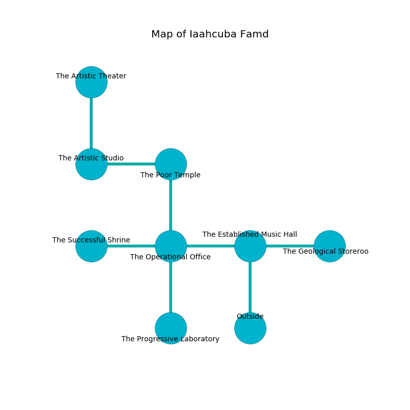

%Ruin Dogs

##Iaahcuba Famd
###Overview
Iaahcuba Famd is constructed on a cursed city. Some rooms of it are flooded. A massive storm is happening outside. It is occupied by Sahuagins. Patti Clem The Boastful, a Githzerai Monk is here. The Sahuagins are battling Patti Clem The Boastful. She  is founding a new religion. 

###Artifact
####Aidaebeda

Aidaebeda looks like a hard prism. Power slides near it. It smells like tomato. It is a pale blue color. When touched it flies into the air. 

###Locations

####the established music hall
The air smells like yeast here. There are a Displacer Beast and an Ape here. The floor is smooth. The concrete walls are covered in mold. Red moss is swaying from the walls. 

* To the west a long hallway connects to [the operational office](#the-operational-office).
* To the east a dripping threshold connects to [the geological storeroom](#the-geological-storeroom).
* To the south is the entrance.

####the geological storeroom
There are a Brown Bear and a Druid here. The mirrored walls are unsettled. 

* To the west a dripping threshold leads to [the established music hall](#the-established-music-hall).

####the operational office
The metallic walls are covered in mold. 

There is an engraving on the wall written in common. 

> We are love
>
> national, permanent, interesting
>
> always valid
>
> yet never comprehensive
>
> [Aidaebeda](#Aidaebeda)
>
> supplementary, digital, clean
>
> respectable and neutral
>
> [Aidaebeda](#Aidaebeda)
>
> but popular
>
> [Aidaebeda](#Aidaebeda)
>
> but central
>
> political and molecular
>
> We are corrupted
>
> permanent and legal
>
> A wing is a rejection
>
> quantitative, common, modern
>
> toxic and sick
>
> plain, awake, unlike
>
> A potato is an edge
>
> sufficient, independent, specified
>
> A coat is an elbow
>
> color-blind, unanimous, different
>

* To the west a narrow hall opens to [the successful shrine](#the-successful-shrine).
* To the east a long hallway connects to [the established music hall](#the-established-music-hall).
* To the north a hazy opening connects to [the poor temple](#the-poor-temple).
* To the south a long pathway leads to [the progressive laboratory](#the-progressive-laboratory).

####the successful shrine
The metallic walls are covered in mold. There is a Grell here. The floor is flooded with one inch deep cool water. 

* [Patti Clem The Boastful](#Patti-Clem-The-Boastful) is here.
* To the east a narrow hall connects to [the operational office](#the-operational-office).

####the poor temple
Red moss is swaying in broken urns. The glass walls are unsettled. 

* There is a basket here.
* To the west a windy opening connects to [the artistic studio](#the-artistic-studio).
* To the south a hazy opening leads to [the operational office](#the-operational-office).

####the progressive laboratory
The floor is glossy. The stone walls are pristine. There are an Azer and an Ettercap here. Gray ferns are growing in cracks in the floor. 

There is an engraving on a tablet written in common. 

> Hide here.
>

* To the north a long pathway connects to [the operational office](#the-operational-office).

####the artistic studio
The air tastes like cilantro here. There are a Stirge, an Imp, a Dire Wolf, a Pixie, a Deep Gnome, and an Acolyte here. 

* [Aidaebeda](#Aidaebeda) is here.
* To the east a windy opening opens to [the poor temple](#the-poor-temple).
* To the north a long passageway connects to [the artistic theater](#the-artistic-theater).

####the artistic theater
There is a trap here. When activated, a tripwire will shoot a lightning bolt. The floor is glossy. Yellow mushrooms are decaying in broken urns. The air smells like valerian root here. 

* To the south a long passageway opens to [the artistic studio](#the-artistic-studio).

