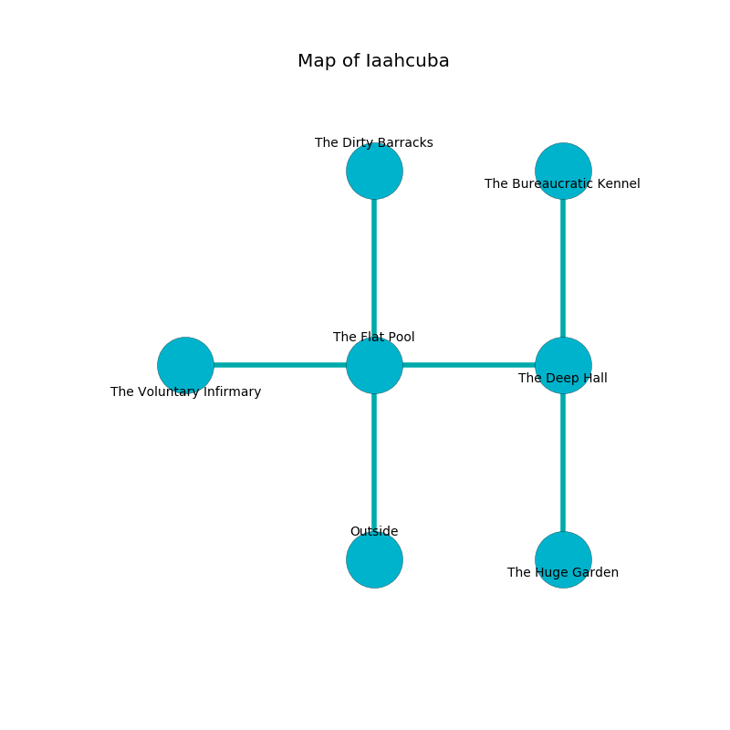

%Ruin Dogs

##Iaahcuba
###Overview
Iaahcuba is located in a haunted city. Some rooms of Iaahcuba are frozen. A massive storm is happening outside. It is occupied by Satyrs. Valeri Tiller The Belligerent, a Hill Giant is here. The Satyrs are battling Valeri Tiller The Belligerent. She  is trying to hide [The Statistical Wheat](#The-Statistical-Wheat). 

###Artifact
####The Statistical Wheat

The Statistical Wheat is a powerful artifact in the shape of an opaque doll. Light pours around it. When touched it emits dust. 

###Locations

####the flat pool
The obsidion walls are ruined. Blue ferns are sprouting in broken urns. There are twelve Satyrs here. One of the Satyrs is pointing a ballista at the entrance. 

There is an engraving on the floor written in common. 

> I lost [The Statistical Wheat](#The-Statistical-Wheat).
>
> Do not try digging.
>

* There is a rail here.
* There is a root here.
* To the west a dark cavern leads to [the voluntary infirmary](#the-voluntary-infirmary).
* To the east a hazy hall leads to [the deep hall](#the-deep-hall).
* To the north a flooded cave opens to [the dirty barracks](#the-dirty-barracks).
* To the south is the entrance.

####the voluntary infirmary
The floor is flooded with four inch deep cold water. Gray mushrooms are growing in broken urns. The air smells like honey here. There are twelve Satyrs here. One of the Satyrs is on watch, the rest are sleeping. 

* To the east a dark cavern leads to [the flat pool](#the-flat-pool).

####the deep hall
Gray razorgrass is decaying in a patch on the floor. The floor is glossy. The air smells like logenberry here. The stone walls are unsettled. 

* There is a chest here.
* There is a shoe here.
* [The Statistical Wheat](#The-Statistical-Wheat) is here.
* To the west a hazy hall leads to [the flat pool](#the-flat-pool).
* To the north a flooded path connects to [the bureaucratic kennel](#the-bureaucratic-kennel).
* To the south a long pathway opens to [the huge garden](#the-huge-garden).

####the dirty barracks
The floor is bloodstained. The obsidion walls are covered in mold. The air smells like jonquil here. There are twelve Satyrs here. One of the Satyrs is on watch, the rest are sleeping. 

* [Valeri Tiller The Belligerent](#Valeri-Tiller-The-Belligerent) is here.
* To the south a flooded cave leads to [the flat pool](#the-flat-pool).

####the bureaucratic kennel
Yellow ferns are growing in a patch on the floor. The stone walls are pristine. The floor is bloodstained. 

* To the south a flooded path connects to [the deep hall](#the-deep-hall).

####the huge garden
Red mushrooms are swaying in broken urns. The air smells like salmon here. 

There is an engraving on the ceiling written in Satyrs Script. 

> Oh my! sad we
>
> rational and free
>
> it is never due
>
> death is new
>

* To the north a long pathway leads to [the deep hall](#the-deep-hall).

