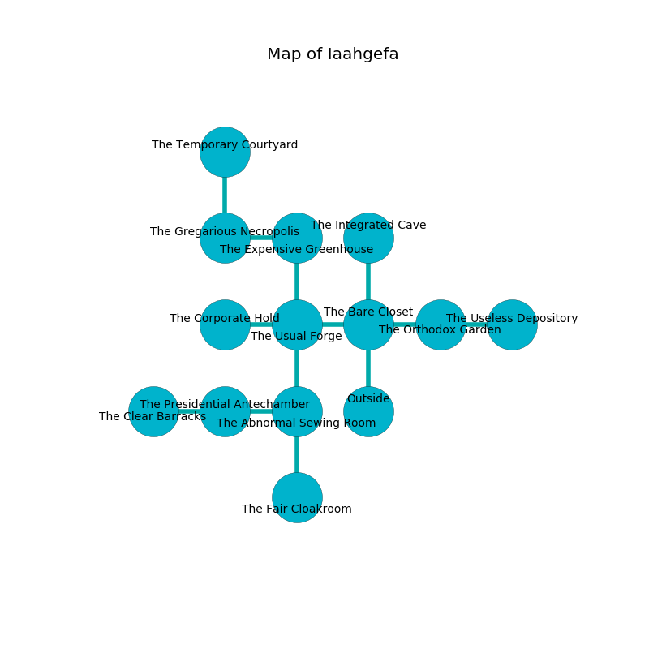

%Ruin Dogs

##Iaahgefa
###Overview
Iaahgefa is located under a broken plain. Some areas of Iaahgefa are inaccessible. The ruin is burning. It is occupied by Yuan-Ti. Emil Tyner The Self-Indulgent, a Fire Giant is here. The Yuan-Ti are the soldiers of Emil Tyner The Self-Indulgent. He  is founding a new religion. 

###Artifact
####Esaei Duialaf

Esaei Duialaf looks like a smooth figurine. It is a bright blue color. When thrown it sings the hymn of the damned. 

###Locations

####the bare closet
The floor is smooth. Gray mushrooms are swaying from the walls. 

* To the west a narrow walkway leads to [the usual forge](#the-usual-forge).
* To the east a hazy opening opens to [the orthodox garden](#the-orthodox-garden).
* To the north a twisted path leads to [the integrated cave](#the-integrated-cave).
* To the south is the entrance.

####the usual forge
The wooden walls are caving in. The air smells like egg yolk here. 

* To the west a flooded hall connects to [the corporate hold](#the-corporate-hold).
* To the east a narrow walkway opens to [the bare closet](#the-bare-closet).
* To the north a long cave opens to [the expensive greenhouse](#the-expensive-greenhouse).
* To the south a windy cavern opens to [the abnormal sewing room](#the-abnormal-sewing-room).

####the abnormal sewing room
Yellow razorgrass is growing in cracks in the floor. There are a Yuan-Ti Abomination and a Yuan-Ti Malison here. The Yuan-Ti are feasting. 

* To the west a long walkway leads to [the presidential antechamber](#the-presidential-antechamber).
* To the north a windy cavern opens to [the usual forge](#the-usual-forge).
* To the south a torchlit hall opens to [the fair cloakroom](#the-fair-cloakroom).

####the corporate hold
The stone walls are bloodstained. The air tastes like beef here. 

* To the east a flooded hall connects to [the usual forge](#the-usual-forge).

####the expensive greenhouse
There are a Gelatinous Cube and two Succubi here. The air smells like fudge here. 

There is an engraving on the ceiling written in Yuan-Ti Script. 

> Oh my! pitiful you
>
> funny and awful
>
> fine, ambitious, new
>
> death is unlawful
>

* To the west a windy cave connects to [the gregarious necropolis](#the-gregarious-necropolis).
* To the south a long cave opens to [the usual forge](#the-usual-forge).

####the integrated cave
The obsidion walls are scratched. Red ferns are swaying in cracks in the floor. The air smells like pistachio here. There are an Otyugh, a Fomorian, a Cultist, and a Deer here. 

There is an engraving on a stone written in common. 

> Do not try praying.
>

* To the south a twisted path connects to [the bare closet](#the-bare-closet).

####the presidential antechamber
There are a Young Brass Dragon, a Nightmare, and a Green Dragon Wyrmling here. 

* [Esaei Duialaf](#Esaei-Duialaf) is here.
* [Emil Tyner The Self-Indulgent](#Emil-Tyner-The-Self-Indulgent) is here.
* To the west a flooded passageway opens to [the clear barracks](#the-clear-barracks).
* To the east a long walkway connects to [the abnormal sewing room](#the-abnormal-sewing-room).

####the orthodox garden
The metallic walls are scratched. Gray lichens are swaying in broken urns. The air tastes like feces here. 

* To the west a hazy opening leads to [the bare closet](#the-bare-closet).
* To the east a torchlit cavern connects to [the useless depository](#the-useless-depository).

####the fair cloakroom
There are a Quipper, a Minotaur Skeleton, and a Chain Devil here. The floor is glossy. The air smells like carnation here. 

* To the north a torchlit hall opens to [the abnormal sewing room](#the-abnormal-sewing-room).

####the gregarious necropolis
The floor is cluttered with bones. The metallic walls are pristine. 

* To the east a windy cave leads to [the expensive greenhouse](#the-expensive-greenhouse).
* To the north a hazy path opens to [the temporary courtyard](#the-temporary-courtyard).

####the temporary courtyard
The concrete walls are bloodstained. The air smells like tarragon here. There are a Medusa, a Crab, a Quadrone, and a Roper here. 

* To the south a hazy path connects to [the gregarious necropolis](#the-gregarious-necropolis).

####the useless depository
The floor is bloodstained. Yellow ferns are sprouting in a patch on the floor. There is a trap here. When activated, a magical rune will extend a spring loaded spear. There are two Yuan-Ti Abominations here. One of the Yuan-Ti is on watch, the rest are fighting amongst themselves. 

* To the west a torchlit cavern connects to [the orthodox garden](#the-orthodox-garden).

####the clear barracks
The floor is cluttered with debris. The mirrored walls are caving in. There are an Elephant and a Chain Devil here. The air tastes like acetone here. 

* To the east a flooded passageway opens to [the presidential antechamber](#the-presidential-antechamber).

