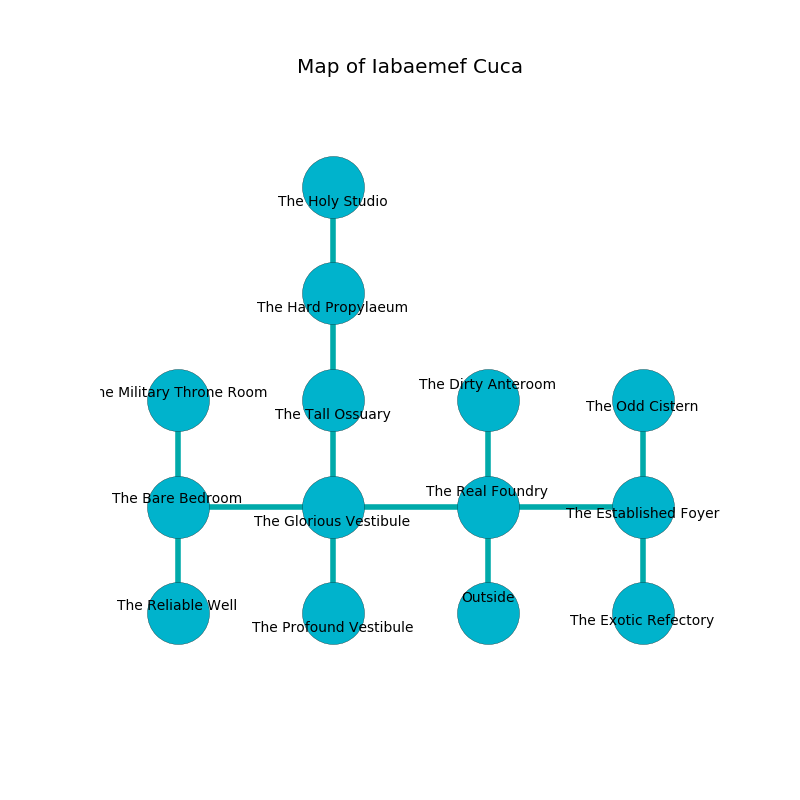

%Ruin Dogs

##Iabaemef Cuca
###Overview
Iabaemef Cuca is located under a giant mountain. Some rooms of Iabaemef Cuca are inaccessible. A battle between raiders is happening outside. It is occupied by Kuo-Toa. Chung Blake The Untrustworthy, a Myconid Sovereign is here. The Kuo-Toa are the soldiers of Chung Blake The Untrustworthy. He  is founding a new religion. 

###Artifact
####Dhemad Cuffoddaeum

Dhemad Cuffoddaeum looks like a glassy cube. It is a shifting brown color. Power shifts from it. When worshipped it levitates surrounding objects. 

###Locations

####the real foundry

* To the west a dark threshold opens to [the glorious vestibule](#the-glorious-vestibule).
* To the east a windy corridor connects to [the established foyer](#the-established-foyer).
* To the north a dark cave leads to [the dirty anteroom](#the-dirty-anteroom).
* To the south is the entrance.

####the glorious vestibule
Blue moss is swaying in cracks in the floor. There are a Kuo-Toa Whip, a Kuo-Toa Monitor, two Kuo-Toa, and  here. The air tastes like bread crust here. The wooden walls are bloodstained. The Kuo-Toa are willing to negotiate. 

* To the west a dripping hallway connects to [the bare bedroom](#the-bare-bedroom).
* To the east a dark threshold opens to [the real foundry](#the-real-foundry).
* To the north a windy artery opens to [the tall ossuary](#the-tall-ossuary).
* To the south a flooded threshold leads to [the profound vestibule](#the-profound-vestibule).

####the tall ossuary
Red moss is decaying in broken urns. There are three Kuo-Toa Whips and two Kuo-Toa here. The Kuo-Toa are berserk with rage. 

* There is a drawer here.
* To the north a dark walkway opens to [the hard propylaeum](#the-hard-propylaeum).
* To the south a windy artery leads to [the glorious vestibule](#the-glorious-vestibule).

####the profound vestibule
The air tastes like milk here. The floor is bloodstained. 

* To the north a flooded threshold leads to [the glorious vestibule](#the-glorious-vestibule).

####the bare bedroom
The air smells like potato here. There are a Kuo-Toa Monitor and a Kuo-Toa here. One of the Kuo-Toa is on watch, the rest are celebrating. 

There is an engraving on a stone written in common. 

> I tried swimming.
>

* To the east a dripping hallway connects to [the glorious vestibule](#the-glorious-vestibule).
* To the north a dripping cavern opens to [the military throne room](#the-military-throne-room).
* To the south a windy pathway opens to [the reliable well](#the-reliable-well).

####the military throne room
The brick walls are covered in mold. The floor is cluttered with ashes. There is a trap here. When activated, a magical proximity detector will open a large pit in the floor. There are a Quaggoth and a Dire Wolf here. 

* There is a jewel here.
* There is a gold coin here.
* To the south a dripping cavern leads to [the bare bedroom](#the-bare-bedroom).

####the established foyer
The air smells like barley here. The metallic walls are unsettled. There is a trap here. When activated, a magical proximity detector will cast a curse. 

* [Chung Blake The Untrustworthy](#Chung-Blake-The-Untrustworthy) is here.
* To the west a windy corridor opens to [the real foundry](#the-real-foundry).
* To the north a dark corridor opens to [the odd cistern](#the-odd-cistern).
* To the south a flooded walkway leads to [the exotic refectory](#the-exotic-refectory).

####the dirty anteroom
The floor is sticky. The air tastes like lettuce here. There are a Grell, a Satyr, a Crocodile, a Guard, a Lemure, a Cultist, and a Brown Bear here. The wooden walls are pristine. 

* To the south a dark cave leads to [the real foundry](#the-real-foundry).

####the odd cistern
The air tastes like seaweed here. The floor is flooded with nine inch deep cold water. 

There is an engraving on a tablet written in Kuo-Toa Script. 

> I am hidden.
>
> Leave now.
>

* There is an eye here.
* To the south a dark corridor opens to [the established foyer](#the-established-foyer).

####the hard propylaeum
Yellow lichens are swaying in a patch on the floor. There are two Kuo-Toa Whips, a Kuo-Toa Monitor, a Kuo-Toa, and  here. The stone walls are caving in. The air tastes like sarsaparilla here. The floor is sticky. The Kuo-Toa are willing to negotiate. 

* [Dhemad Cuffoddaeum](#Dhemad-Cuffoddaeum) is here.
* To the north a narrow gap connects to [the holy studio](#the-holy-studio).
* To the south a dark walkway connects to [the tall ossuary](#the-tall-ossuary).

####the reliable well
The floor is smooth. The air smells like lime here. 

There is an engraving on the floor written in Kuo-Toa Script. 

> I am worshipping this place.
>
> Run away.
>

* To the north a windy pathway opens to [the bare bedroom](#the-bare-bedroom).

####the exotic refectory
There are a Displacer Beast, a Twig Blight, and a Swarm of Bats here. Red moss is sprouting in a patch on the floor. The floor is bloodstained. 

* To the north a flooded walkway connects to [the established foyer](#the-established-foyer).

####the holy studio
The concrete walls are caving in. There are a Hook Horror, a Deep Gnome, and a Brown Bear here. Red lichens are sprouting from the walls. The air tastes like amber here. 

* To the south a narrow gap leads to [the hard propylaeum](#the-hard-propylaeum).

