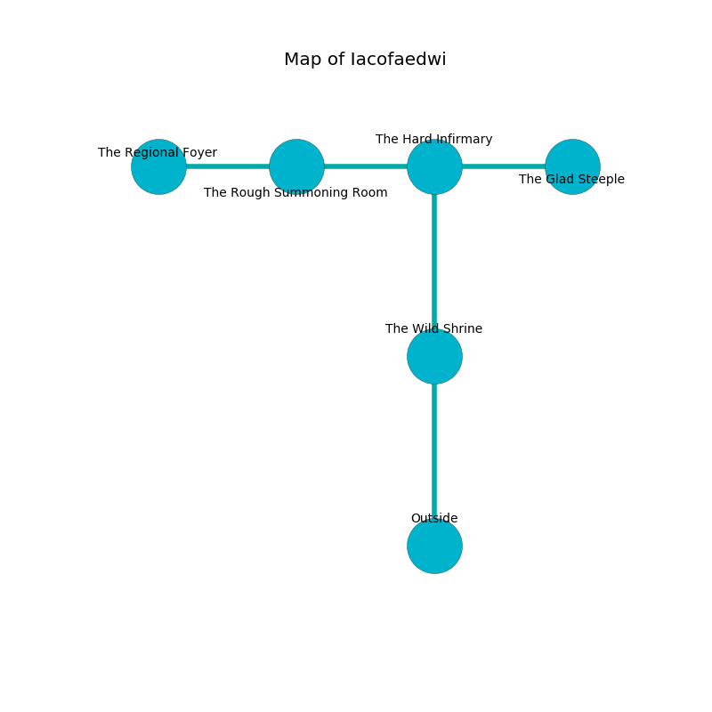

%Ruin Dogs

##Iacofaedwi
###Overview
Iacofaedwi is constructed on a giant rift. Some rooms of it are flooded. The ruin is collapsing slowly. It is occupied by Githyanki. Ethel Thornburg The Greedy, a Yuan-Ti Abomination is here. The Githyanki are ruled by Ethel Thornburg The Greedy. She  is trying to hide [Ihaeca Laeidofdemca](#Ihaeca-Laeidofdemca). 

###Artifact
####Ihaeca Laeidofdemca

Ihaeca Laeidofdemca has the form of a wet blade. It smells like peach. Water glows around it. It is a medium black color. When rubbed it frightens children. 

###Locations

####the wild shrine
Blue mushrooms are sprouting in a patch on the floor. The wooden walls are scratched. 

* [Ethel Thornburg The Greedy](#Ethel-Thornburg-The-Greedy) is here.
* To the north a dark hallway opens to [the hard infirmary](#the-hard-infirmary).
* To the south is the entrance.

####the hard infirmary
Green moss is growing in a patch on the floor. The metallic walls are covered in mold. 

* To the west a dripping artery leads to [the rough summoning room](#the-rough-summoning-room).
* To the east a long gap leads to [the glad steeple](#the-glad-steeple).
* To the south a dark hallway opens to [the wild shrine](#the-wild-shrine).

####the glad steeple
There is a trap here. When activated, a pressure plate will launch a fusillade of darts. The wooden walls are scratched. The air tastes like seed here. Red mushrooms are sprouting from the ceiling. 

* To the west a long gap connects to [the hard infirmary](#the-hard-infirmary).

####the rough summoning room
Blue mushrooms are decaying in broken urns. The air smells like corn here. 

* There is a blade here.
* There is a box here.
* There is a salamander here.
* [Ihaeca Laeidofdemca](#Ihaeca-Laeidofdemca) is here.
* To the west a narrow hallway leads to [the regional foyer](#the-regional-foyer).
* To the east a dripping artery connects to [the hard infirmary](#the-hard-infirmary).

####the regional foyer
Gray moss is sprouting from the walls. The air tastes like hazelnut here. The floor is bloodstained. 

* To the east a narrow hallway opens to [the rough summoning room](#the-rough-summoning-room).

